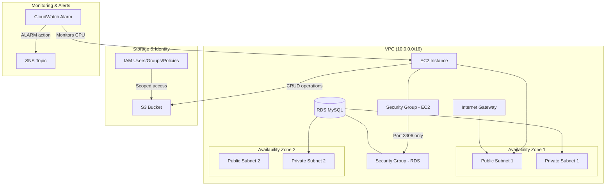

# Design Document: AWS Cloud Practitioner Essentials — Hands-On Lab

## Overview

This project provides a hands-on learning experience covering the core AWS services tested on the AWS Certified Cloud Practitioner (CLF-C02) exam. The learner will provision a simplified cloud architecture using AWS CLI commands and Python scripts: a VPC with public and private subnets, an EC2 instance, an RDS database, an S3 bucket with versioning, IAM users/groups/policies, CloudWatch alarms with SNS notifications, and cost allocation tags — then review the architecture against the Well-Architected Framework.

The approach favors AWS CLI for infrastructure and networking setup (VPC, subnets, security groups, EC2, RDS) because these are infrastructure concepts best learned through direct provisioning. Python boto3 scripts handle S3 data operations, IAM policy configuration, and CloudWatch alarm setup where programmatic interaction reinforces the learning objective. A final documentation component captures the architecture review.

### Learning Scope
- **Goal**: Provision a multi-AZ VPC with EC2, RDS, S3, IAM, CloudWatch, and SNS; apply tags; review against Well-Architected Framework
- **Out of Scope**: CI/CD pipelines, auto-scaling, load balancers, DynamoDB Streams, production HA, IaC tools (CloudFormation/Terraform)
- **Prerequisites**: AWS account (Free Tier eligible), AWS CLI v2 configured, Python 3.12, basic command-line familiarity

### Technology Stack
- Language/Runtime: Bash (AWS CLI), Python 3.12
- AWS Services: VPC, EC2, RDS (MySQL), S3, IAM, CloudWatch, SNS
- SDK/Libraries: AWS CLI v2, boto3
- Infrastructure: AWS CLI (manual provisioning via shell scripts)

## Architecture

The learner builds a VPC spanning two Availability Zones, each with a public and private subnet. An EC2 instance runs in a public subnet accessible via SSH. An RDS MySQL instance sits in a private subnet group, reachable only from the EC2 instance's security group. S3 provides object storage with versioning and Block Public Access. IAM controls user permissions with least-privilege policies. CloudWatch monitors EC2 metrics and triggers SNS email notifications. All resources are tagged for cost tracking.



## Components and Interfaces

### Component 1: NetworkProvisioner
Module: `components/network_provisioner.sh`
Uses: `AWS CLI (ec2)`

Provisions the VPC, subnets across two AZs, internet gateway, route tables, and security groups. Outputs resource IDs for downstream components.

```python
INTERFACE NetworkProvisioner:
    FUNCTION create_vpc(cidr_block: string, project_tag: string) -> string
    FUNCTION create_subnet(vpc_id: string, cidr_block: string, az: string, is_public: boolean, project_tag: string) -> string
    FUNCTION create_internet_gateway(vpc_id: string, project_tag: string) -> string
    FUNCTION create_route_table(vpc_id: string, igw_id: string, subnet_ids: List[string], project_tag: string) -> string
    FUNCTION create_security_group(vpc_id: string, group_name: string, description: string, inbound_rules: List[Dictionary], project_tag: string) -> string
    FUNCTION create_db_subnet_group(subnet_ids: List[string], group_name: string, project_tag: string) -> string
```

### Component 2: ComputeProvisioner
Module: `components/compute_provisioner.sh`
Uses: `AWS CLI (ec2)`

Launches an EC2 instance in the public subnet with a key pair, associates the web security group, and provides commands for stop/start lifecycle operations.

```python
INTERFACE ComputeProvisioner:
    FUNCTION create_key_pair(key_name: string) -> string
    FUNCTION launch_instance(ami_id: string, instance_type: string, subnet_id: string, sg_id: string, key_name: string, project_tag: string) -> string
    FUNCTION get_instance_status(instance_id: string) -> string
    FUNCTION stop_instance(instance_id: string) -> None
    FUNCTION start_instance(instance_id: string) -> None
    FUNCTION get_public_ip(instance_id: string) -> string
    FUNCTION terminate_instance(instance_id: string) -> None
```

### Component 3: StorageManager
Module: `components/storage_manager.py`
Uses: `boto3.client('s3')`

Creates an S3 bucket with Block Public Access enabled, manages versioning configuration, and performs object upload/retrieval/version-listing operations.

```python
INTERFACE StorageManager:
    FUNCTION create_bucket(bucket_name: string, region: string, project_tag: string) -> None
    FUNCTION enable_block_public_access(bucket_name: string) -> None
    FUNCTION enable_versioning(bucket_name: string) -> None
    FUNCTION upload_object(bucket_name: string, key: string, file_path: string) -> string
    FUNCTION get_object(bucket_name: string, key: string, download_path: string) -> None
    FUNCTION list_object_versions(bucket_name: string, key: string) -> List[Dictionary]
    FUNCTION delete_bucket_and_objects(bucket_name: string) -> None
```

### Component 4: SecurityManager
Module: `components/security_manager.py`
Uses: `boto3.client('iam')`

Creates IAM users, groups, and policies demonstrating least-privilege access. Attaches read-only S3 policies to groups, validates permission denials, and checks MFA status.

```python
INTERFACE SecurityManager:
    FUNCTION create_group(group_name: string) -> Dictionary
    FUNCTION create_user(user_name: string) -> Dictionary
    FUNCTION add_user_to_group(user_name: string, group_name: string) -> None
    FUNCTION create_s3_readonly_policy(policy_name: string, bucket_arn: string) -> string
    FUNCTION attach_policy_to_group(group_name: string, policy_arn: string) -> None
    FUNCTION test_permission(user_name: string, action: string, resource_arn: string) -> boolean
    FUNCTION get_mfa_status(user_name: string) -> boolean
    FUNCTION delete_user_and_group(user_name: string, group_name: string, policy_arn: string) -> None
```

### Component 5: DatabaseProvisioner
Module: `components/database_provisioner.sh`
Uses: `AWS CLI (rds)`

Launches an RDS MySQL instance in the private subnet group with the database security group. Provides connection testing from the EC2 instance.

```python
INTERFACE DatabaseProvisioner:
    FUNCTION create_rds_instance(db_identifier: string, engine: string, instance_class: string, master_user: string, master_password: string, subnet_group: string, sg_id: string, project_tag: string) -> string
    FUNCTION wait_until_available(db_identifier: string) -> None
    FUNCTION get_endpoint(db_identifier: string) -> string
    FUNCTION generate_connection_script(endpoint: string, master_user: string, db_name: string) -> string
    FUNCTION delete_rds_instance(db_identifier: string) -> None
```

### Component 6: MonitoringManager
Module: `components/monitoring_manager.py`
Uses: `boto3.client('cloudwatch'), boto3.client('sns')`

Creates an SNS topic with email subscription, sets up CloudWatch alarms on EC2 CPU utilization, queries metric data, and manages resource tagging verification across all project resources.

```python
INTERFACE MonitoringManager:
    FUNCTION create_sns_topic(topic_name: string, email: string, project_tag: string) -> string
    FUNCTION create_cpu_alarm(alarm_name: string, instance_id: string, threshold: number, sns_topic_arn: string) -> None
    FUNCTION get_alarm_state(alarm_name: string) -> string
    FUNCTION get_metric_data(instance_id: string, metric_name: string, minutes: integer) -> List[Dictionary]
    FUNCTION verify_resource_tags(resource_arns: List[string], required_tags: Dictionary) -> List[Dictionary]
    FUNCTION delete_alarm(alarm_name: string) -> None
    FUNCTION delete_sns_topic(topic_arn: string) -> None
```

## Data Models

```python
TYPE ProjectConfig:
    project_name: string          # Tag value, e.g., "ccp-lab"
    environment: string           # Tag value, e.g., "learning"
    region: string                # AWS region, e.g., "us-east-1"
    vpc_cidr: string              # e.g., "10.0.0.0/16"
    public_subnet_cidrs: List[string]   # e.g., ["10.0.1.0/24", "10.0.2.0/24"]
    private_subnet_cidrs: List[string]  # e.g., ["10.0.3.0/24", "10.0.4.0/24"]
    availability_zones: List[string]    # e.g., ["us-east-1a", "us-east-1b"]

TYPE ProvisionedResources:
    vpc_id: string
    public_subnet_ids: List[string]
    private_subnet_ids: List[string]
    igw_id: string
    ec2_sg_id: string
    rds_sg_id: string
    ec2_instance_id: string
    rds_endpoint: string
    rds_identifier: string
    s3_bucket_name: string
    sns_topic_arn: string
    alarm_name: string
    iam_user_name: string
    iam_group_name: string
    iam_policy_arn: string

TYPE SecurityGroupRule:
    protocol: string              # "tcp", "udp", "icmp"
    port: integer                 # e.g., 22, 3306
    source: string                # CIDR or security group ID

TYPE TagSet:
    Project: string               # Cost allocation tag
    Environment: string           # Cost allocation tag

TYPE WellArchitectedReview:
    pillar: string                # e.g., "Security", "Cost Optimization"
    addressed_by: string          # Resource/config that addresses this pillar
    gap_description?: string      # What's missing
    remediation?: string          # What service/feature would close the gap
```

## Error Handling

| Error | Description | Learner Action |
|-------|-------------|----------------|
| VpcLimitExceeded | AWS account has reached VPC limit in region | Delete unused VPCs or use a different region |
| InvalidParameterValue (CIDR overlap) | Subnet CIDR overlaps with existing subnet | Choose non-overlapping CIDR blocks |
| UnauthorizedAccess | AWS credentials lack required permissions | Verify IAM user has AdministratorAccess for lab setup |
| InvalidKeyPair.NotFound | Specified key pair does not exist | Create key pair before launching instance |
| DBInstanceAlreadyExists | RDS identifier already in use | Choose a unique DB instance identifier |
| BucketAlreadyExists | S3 bucket name is globally taken | Append a unique suffix to the bucket name |
| InvalidIdentityToken (IAM) | Session or credentials expired | Refresh CLI credentials or re-authenticate |
| SubscriptionConfirmationPending | SNS email not yet confirmed | Check email inbox and confirm SNS subscription |
| MetricDataNotAvailable | CloudWatch has no data for the metric yet | Wait 5-10 minutes for EC2 metrics to populate |
| DBInstanceNotFound | RDS instance deleted or identifier wrong | Verify the DB instance identifier and region |
| AccessDenied (IAM test) | Expected denial when testing least-privilege | This confirms the IAM policy is working correctly |
| ResourceInUse (cleanup) | Dependent resources prevent deletion | Delete resources in reverse order: RDS → EC2 → subnets → VPC |
