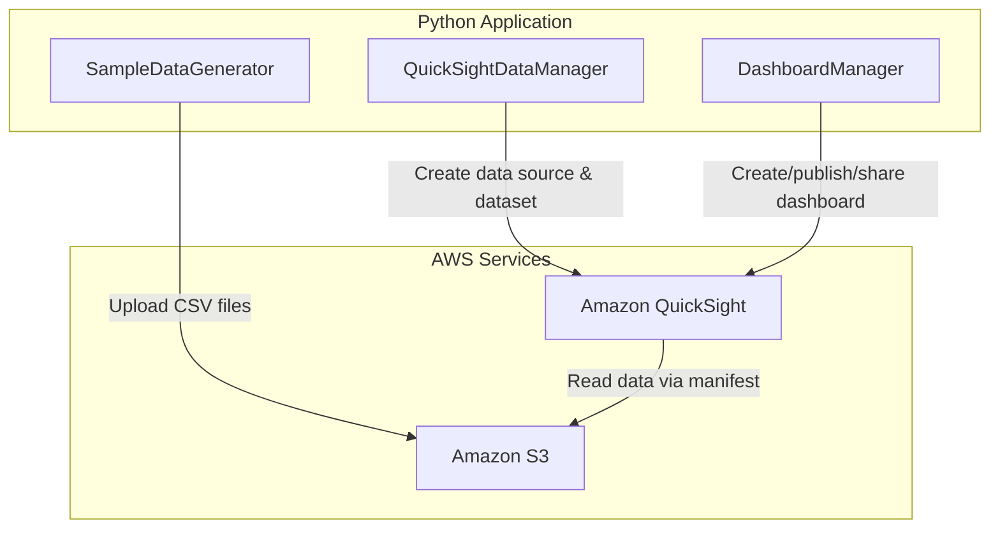

# Design Document: Build a Business Intelligence Dashboard with Amazon QuickSight

## Overview

This project guides learners through building a Business Intelligence dashboard using Amazon QuickSight. The learner will prepare sample sales data, upload it to Amazon S3, connect QuickSight to the data, create datasets with calculated fields, build an interactive analysis with multiple visualization types, and publish a shareable dashboard. The project covers the full BI workflow from data preparation to dashboard sharing.

Since QuickSight is a managed visual BI service with a console-driven workflow, most of the hands-on learning happens through the QuickSight console. The programmatic components focus on preparing and uploading sample data to S3, and using the QuickSight SDK to automate data source, dataset, and dashboard operations. This hybrid approach lets learners understand both the console experience and the API-driven automation behind it.

### Learning Scope
- **Goal**: Prepare data in S3, connect QuickSight, create datasets with calculated fields, build multi-visual analyses with filters and ML insights, and publish a dashboard
- **Out of Scope**: QuickSight Enterprise features (row-level security, VPC connectivity), QuickSight Q natural language queries, embedded analytics, SAML/SSO federation, multi-account setups, CI/CD pipelines
- **Prerequisites**: AWS account, Python 3.12, QuickSight account (Enterprise edition signed up via AWS Console; Enterprise edition is required for ML Insights features), basic understanding of data visualization concepts

### Technology Stack
- Language/Runtime: Python 3.12
- AWS Services: Amazon QuickSight, Amazon S3
- SDK/Libraries: boto3, pandas, csv (standard library)
- Infrastructure: AWS Console (QuickSight account provisioning), AWS CLI (S3 bucket creation)

## Architecture

The application consists of three components. SampleDataGenerator creates realistic sales CSV data and uploads it to S3. QuickSightDataManager handles creating and managing data sources and datasets programmatically via the QuickSight API. DashboardManager handles analysis and dashboard lifecycle operations including publishing and sharing. The QuickSight console is used alongside these components for visual tasks like building charts, adding filters, enabling ML insights, and arranging visuals.



## Components and Interfaces

### Component 1: SampleDataGenerator
Module: `components/sample_data_generator.py`
Uses: `boto3.client('s3')`, `pandas`, `csv`

Generates realistic sample sales data with time-series, categories, regions, and revenue figures suitable for BI analysis. Creates a CSV file and an S3 manifest file, then uploads both to an S3 bucket. The data spans multiple years to support forecasting and anomaly detection exercises.

```python
INTERFACE SampleDataGenerator:
    FUNCTION generate_sales_data(num_records: int, start_date: string, end_date: string) -> DataFrame
    FUNCTION save_to_csv(data: DataFrame, file_path: string) -> string
    FUNCTION create_s3_manifest(bucket_name: string, csv_key: string) -> Dictionary
    FUNCTION upload_to_s3(bucket_name: string, file_path: string, s3_key: string) -> string
    FUNCTION upload_manifest(bucket_name: string, manifest: Dictionary, manifest_key: string) -> string
```

### Component 2: QuickSightDataManager
Module: `components/quicksight_data_manager.py`
Uses: `boto3.client('quicksight')`

Manages QuickSight data source and dataset lifecycle via the API. Creates an S3 data source using a manifest file, creates a dataset with field type mappings, imports data into SPICE, creates calculated fields, and checks SPICE ingestion status.

```python
INTERFACE QuickSightDataManager:
    FUNCTION create_s3_data_source(aws_account_id: string, data_source_id: string, data_source_name: string, bucket_name: string, manifest_key: string) -> Dictionary
    FUNCTION describe_data_source(aws_account_id: string, data_source_id: string) -> Dictionary
    FUNCTION create_dataset(aws_account_id: string, dataset_id: string, dataset_name: string, data_source_id: string, columns: List[ColumnDefinition], import_mode: string) -> Dictionary
    FUNCTION add_calculated_field(aws_account_id: string, dataset_id: string, field_name: string, expression: string) -> Dictionary
    FUNCTION describe_dataset(aws_account_id: string, dataset_id: string) -> Dictionary
    FUNCTION check_ingestion_status(aws_account_id: string, dataset_id: string, ingestion_id: string) -> Dictionary
    FUNCTION delete_data_source(aws_account_id: string, data_source_id: string) -> None
    FUNCTION delete_dataset(aws_account_id: string, dataset_id: string) -> None
```

### Component 3: DashboardManager
Module: `components/dashboard_manager.py`
Uses: `boto3.client('quicksight')`

Handles the creation of analyses and dashboards, publishing an analysis as a read-only dashboard, sharing dashboards with other QuickSight users, and updating dashboards from modified analyses. Also supports listing and describing existing dashboards.

```python
INTERFACE DashboardManager:
    FUNCTION create_template_from_analysis(aws_account_id: string, template_id: string, template_name: string, analysis_arn: string, dataset_references: List[DatasetReference]) -> Dictionary
    FUNCTION create_dashboard(aws_account_id: string, dashboard_id: string, dashboard_name: string, template_arn: string, dataset_references: List[DatasetReference]) -> Dictionary
    FUNCTION describe_dashboard(aws_account_id: string, dashboard_id: string) -> Dictionary
    FUNCTION update_dashboard(aws_account_id: string, dashboard_id: string, template_arn: string, dataset_references: List[DatasetReference]) -> Dictionary
    FUNCTION share_dashboard(aws_account_id: string, dashboard_id: string, principal_id: string) -> Dictionary
    FUNCTION list_dashboards(aws_account_id: string) -> List[Dictionary]
    FUNCTION delete_dashboard(aws_account_id: string, dashboard_id: string) -> None
    FUNCTION delete_template(aws_account_id: string, template_id: string) -> None
```

## Data Models

```python
TYPE SalesRecord:
    order_id: string            # Unique order identifier (e.g., "ORD-2024-00001")
    order_date: string          # ISO date format (e.g., "2024-01-15")
    region: string              # Sales region (e.g., "North America", "Europe", "Asia Pacific")
    category: string            # Product category (e.g., "Electronics", "Clothing", "Home")
    product_name: string        # Product name
    quantity: integer           # Units sold
    unit_price: number          # Price per unit
    revenue: number             # Total revenue (quantity * unit_price)
    cost: number                # Cost of goods sold
    customer_segment: string    # Customer type (e.g., "Enterprise", "SMB", "Consumer")

TYPE ColumnDefinition:
    name: string                # Column name matching CSV header
    type: string                # QuickSight data type ("STRING", "INTEGER", "DECIMAL", "DATETIME")

TYPE DatasetReference:
    dataset_placeholder: string # Placeholder name used in template
    dataset_arn: string         # ARN of the dataset to bind

TYPE S3Manifest:
    fileLocations: List[S3URI] # List of S3 file URIs
    globalUploadSettings: Dictionary  # Format settings (delimiter, text qualifier)

TYPE S3URI:
    uri: string                 # Full S3 path (e.g., "s3://bucket/key.csv")
```

## Error Handling

| Error | Description | Learner Action |
|-------|-------------|----------------|
| AccessDeniedException | QuickSight lacks permission to access S3 bucket or API | Update QuickSight security settings to grant S3 access; verify IAM role permissions |
| ResourceExistsException | Data source, dataset, or dashboard ID already exists | Use a unique ID or delete the existing resource first |
| ResourceNotFoundException | Referenced data source, dataset, analysis, or dashboard not found | Verify the resource ID/ARN and that the resource was created successfully |
| InvalidParameterValueException | Invalid manifest path, column type, or expression syntax | Check manifest URI format, column type values, and calculated field expressions |
| LimitExceededException | SPICE capacity insufficient for dataset import | Reduce dataset size or request SPICE capacity increase in QuickSight settings |
| ConflictException | Dashboard update conflicts with current state | Wait and retry; ensure no concurrent updates are in progress |
| NoSuchBucket / NoSuchKey | S3 bucket or CSV file does not exist | Verify bucket name and file key; ensure upload completed successfully |
| PreconditionNotMetException | QuickSight account not set up or edition mismatch | Sign up for QuickSight in the AWS Console before running SDK operations |
