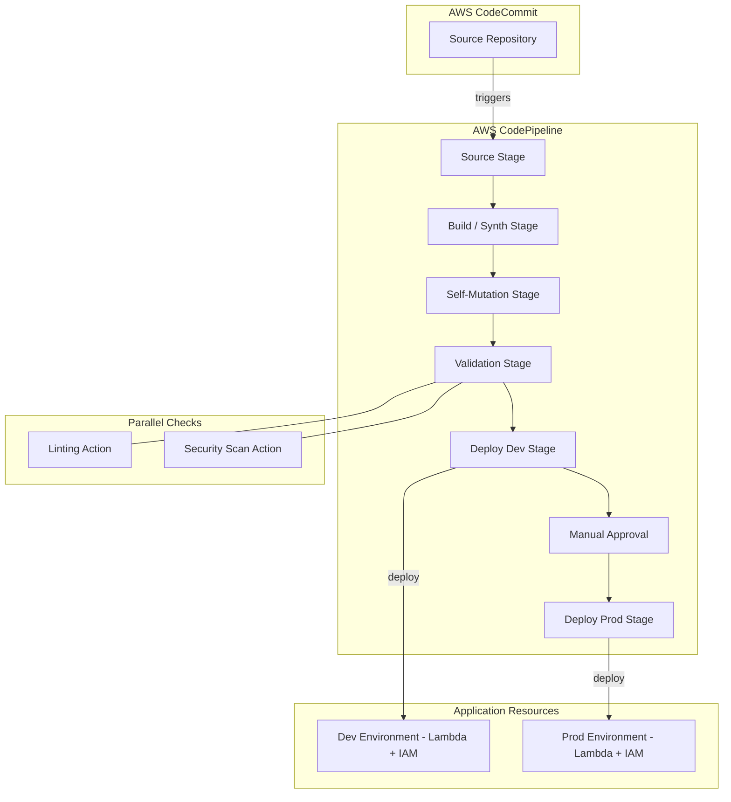

# Design Document: Build a CI/CD Pipeline with AWS CodePipeline and CDK

## Overview

This project guides learners through building a fully automated CI/CD pipeline using AWS CDK Pipelines. The learner will define a pipeline stack that sources code from AWS CodeCommit, synthesizes CDK applications via AWS CodeBuild, self-mutates when pipeline definitions change, runs parallel validation checks (linting and security scanning), and deploys application stacks to dev and prod environments with a manual approval gate before production.

The architecture follows the CDK Pipelines pattern: a pipeline stack defines the CodePipeline resource and its stages, while separate application stage constructs define the actual cloud resources being deployed. The pipeline is self-mutating — when you change the pipeline CDK code and push, the pipeline updates itself before proceeding to deploy application changes. A simple Lambda-backed application stack serves as the deployment target to demonstrate end-to-end flow.

### Learning Scope
- **Goal**: Define a self-mutating CI/CD pipeline with CDK Pipelines that deploys to multiple environments with validation and approval gates
- **Out of Scope**: Cross-account deployments, GitHub/Bitbucket sources, container-based deployments, monitoring/alerting, custom Lambda-backed pipeline actions
- **Prerequisites**: AWS account, Node.js 18+, TypeScript basics, AWS CDK CLI installed, AWS CLI configured, basic Git knowledge

### Technology Stack
- Language/Runtime: TypeScript (Node.js 18+)
- AWS Services: CodePipeline, CodeBuild, CodeCommit, CloudFormation, Lambda, IAM, S3
- SDK/Libraries: aws-cdk-lib (v2), aws-cdk-lib/pipelines, constructs
- Infrastructure: AWS CDK (programmatic provisioning)

## Architecture

The CDK app contains a pipeline stack and an application stage. The pipeline stack defines a CodeCommit repository, a CDK Pipeline (which auto-creates source, build, self-update, and assets stages), parallel validation steps, and two deployment stages (Dev and Prod). The Prod stage is gated by a manual approval action. The application stage wraps a simple application stack containing a Lambda function, representing the workload being deployed.



## Components and Interfaces

### Component 1: CDK App Entry Point
Module: `bin/pipeline-app.ts`
Uses: `aws-cdk-lib.App`, `PipelineStack`

Instantiates the CDK App and the pipeline stack, providing the AWS environment configuration (account and region).

```python
INTERFACE PipelineApp:
    FUNCTION main() -> App
```

### Component 2: PipelineStack
Module: `lib/pipeline-stack.ts`
Uses: `aws-cdk-lib.Stack`, `aws-cdk-lib/aws-codecommit.Repository`, `aws-cdk-lib/pipelines.CodePipeline`, `aws-cdk-lib/pipelines.CodeBuildStep`, `aws-cdk-lib/pipelines.ManualApprovalStep`, `ApplicationStage`

Defines the CodeCommit repository and the CDK Pipeline with all stages: source input from CodeCommit, synth via CodeBuild, self-mutation (automatic with CDK Pipelines), parallel validation steps (linting and security scanning), dev deployment stage, manual approval gate, and prod deployment stage.

```python
INTERFACE PipelineStack:
    FUNCTION constructor(scope: Construct, id: string, props: PipelineStackProps) -> PipelineStack
    FUNCTION createRepository() -> Repository
    FUNCTION createPipeline(repoInput: CodePipelineSource) -> CodePipeline
    FUNCTION addValidationStage(pipeline: CodePipeline) -> void
    FUNCTION addDevStage(pipeline: CodePipeline) -> void
    FUNCTION addProdStageWithApproval(pipeline: CodePipeline) -> void
```

### Component 3: ApplicationStage
Module: `lib/application-stage.ts`
Uses: `aws-cdk-lib.Stage`, `ApplicationStack`

Represents a deployable unit (environment) in the pipeline. Wraps one or more application stacks so the pipeline can deploy them as a single stage to a target environment.

```python
INTERFACE ApplicationStage:
    FUNCTION constructor(scope: Construct, id: string, props: StageProps) -> ApplicationStage
```

### Component 4: ApplicationStack
Module: `lib/application-stack.ts`
Uses: `aws-cdk-lib.Stack`, `aws-cdk-lib/aws-lambda.Function`

Defines the application resources deployed by the pipeline. Contains a simple Lambda function to demonstrate a working deployment target that can be verified after pipeline execution.

```python
INTERFACE ApplicationStack:
    FUNCTION constructor(scope: Construct, id: string, props: StackProps) -> ApplicationStack
    FUNCTION createLambdaFunction(functionName: string) -> Function
```

### Component 5: BuildSpec Definitions
Module: `lib/buildspec-configs.ts`
Uses: `aws-cdk-lib/pipelines.CodeBuildStep`, `aws-cdk-lib/pipelines.ShellStep`

Provides factory functions that return configured CodeBuildStep and ShellStep instances for synth, linting, and security scanning actions. The synth step installs dependencies and runs `cdk synth`. The lint step runs `npm run lint`. The security step runs `cfn-nag` against synthesized templates.

```python
INTERFACE BuildSpecConfigs:
    FUNCTION createSynthStep(source: CodePipelineSource) -> CodeBuildStep
    FUNCTION createLintStep(source: CodePipelineSource) -> ShellStep
    FUNCTION createSecurityScanStep(source: CodePipelineSource) -> ShellStep
```

## Data Models

```python
TYPE PipelineStackProps:
    env: Environment               # AWS account and region
    repositoryName: string         # CodeCommit repository name
    mainBranch: string             # Branch to trigger pipeline (default: "main")

TYPE StageProps:
    env: Environment               # Target environment (account/region)
    stageName: string              # e.g., "Dev" or "Prod"

TYPE Environment:
    account: string                # AWS account ID
    region: string                 # AWS region (e.g., "us-east-1")

TYPE BuildConfig:
    installCommands: List[string]  # e.g., ["npm ci"]
    buildCommands: List[string]    # e.g., ["npm run build", "npx cdk synth"]
    primaryOutputDirectory: string # e.g., "cdk.out"

TYPE LambdaConfig:
    runtime: string                # e.g., "nodejs18.x"
    handler: string                # e.g., "index.handler"
    codePath: string               # e.g., "lambda/"
```

## Error Handling

| Error | Description | Learner Action |
|-------|-------------|----------------|
| Bootstrap not performed | CDK deploy fails with "Has the environment been bootstrapped?" | Run `cdk bootstrap aws://ACCOUNT/REGION` before deploying |
| Repository already exists | CodeCommit repository name conflicts with existing repo | Change `repositoryName` in PipelineStackProps or delete existing repo |
| Synth step failure | CDK synthesis fails due to TypeScript errors or missing dependencies | Check build logs in CodeBuild console; fix code errors and push again |
| Lint step failure | Linting check finds code style violations | Review lint output in CodeBuild logs; fix violations and push |
| Security scan failure | cfn-nag detects security misconfigurations in templates | Review cfn-nag findings; update CDK code to resolve issues and push |
| Manual approval rejected | Approver rejects the production deployment | Pipeline stops; review concerns, make fixes, push new commit to restart |
| Deployment stage failure | CloudFormation stack creation/update fails in target environment | Check CloudFormation events in console for root cause; fix and push |
| Self-mutation conflict | Pipeline update fails due to structural changes | Manually deploy pipeline stack with `cdk deploy` to resolve, then push |
| IAM permission error | Pipeline role lacks permissions for a service action | Verify CDK bootstrap version is current; re-bootstrap if needed |
