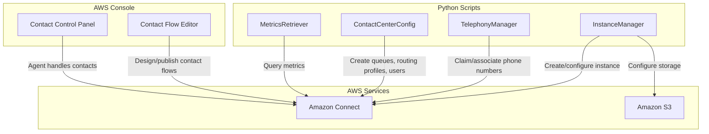

# Design Document: Build a Cloud Contact Center with Amazon Connect

## Overview

This project guides learners through building a cloud contact center using Amazon Connect. The learner will provision a Connect instance, claim a phone number, design contact flows with branching logic, configure queues and routing profiles, set up agents, enable chat support, and explore real-time and historical metrics. The project delivers a fully functional inbound contact center running entirely in the cloud.

Amazon Connect is primarily a console-driven managed service. The architecture uses a combination of AWS Console operations and Python scripts (using boto3) for programmatic provisioning and configuration. Console-based steps are used for the visual contact flow editor and the Contact Control Panel (CCP), while SDK scripts handle instance creation, phone number management, queue/routing configuration, and metrics retrieval. This hybrid approach reflects how Amazon Connect is used in practice.

### Learning Scope
- **Goal**: Create an Amazon Connect instance, claim a phone number, design contact flows with branching, configure skills-based routing with queues and agents, enable chat, and view real-time/historical metrics
- **Out of Scope**: Amazon Lex integration, Lambda functions in flows, outbound campaigns, SAML/SSO identity federation, AWS Direct Connect, Contact Lens AI analytics, production HA patterns
- **Prerequisites**: AWS account, Python 3.12, basic understanding of contact center concepts (agents, queues, IVR)

### Technology Stack
- Language/Runtime: Python 3.12
- AWS Services: Amazon Connect, Amazon S3 (call recordings/transcripts storage)
- SDK/Libraries: boto3
- Infrastructure: AWS Console (contact flow editor, CCP) + boto3 scripts (provisioning, configuration, metrics)

## Architecture

The project consists of four components. InstanceManager handles Connect instance lifecycle and storage configuration. TelephonyManager handles phone number claiming and association. ContactCenterConfig manages queues, hours of operation, routing profiles, agent users, and chat enablement. MetricsRetriever queries real-time and historical metrics. The contact flow design and agent CCP experience are performed through the AWS Console.



## Components and Interfaces

### Component 1: InstanceManager
Module: `components/instance_manager.py`
Uses: `boto3.client('connect')`, `boto3.client('s3')`

Handles Amazon Connect instance creation with identity management configuration, storage setup for call recordings and chat transcripts in S3, instance status verification, and instance settings retrieval. Supports listing and deleting instances.

```python
INTERFACE InstanceManager:
    FUNCTION create_instance(instance_alias: string, identity_management_type: string) -> Dictionary
    FUNCTION get_instance_status(instance_id: string) -> string
    FUNCTION wait_until_active(instance_id: string) -> None
    FUNCTION configure_instance_storage(instance_id: string, resource_type: string, bucket_name: string, prefix: string) -> Dictionary
    FUNCTION get_instance_settings(instance_id: string) -> Dictionary
    FUNCTION list_instances() -> List[Dictionary]
    FUNCTION delete_instance(instance_id: string) -> None
```

### Component 2: TelephonyManager
Module: `components/telephony_manager.py`
Uses: `boto3.client('connect')`

Handles claiming phone numbers (DID or toll-free) from the Amazon Connect inventory, listing available numbers by country and type, associating a claimed phone number with a contact flow, and releasing phone numbers.

```python
INTERFACE TelephonyManager:
    FUNCTION list_available_phone_numbers(instance_id: string, country_code: string, phone_number_type: string) -> List[Dictionary]
    FUNCTION claim_phone_number(instance_id: string, phone_number: string, contact_flow_id: string) -> Dictionary
    FUNCTION associate_phone_number_to_flow(phone_number_id: string, instance_id: string, contact_flow_id: string) -> None
    FUNCTION list_claimed_phone_numbers(instance_id: string) -> List[Dictionary]
    FUNCTION release_phone_number(phone_number_id: string) -> None
```

### Component 3: ContactCenterConfig
Module: `components/contact_center_config.py`
Uses: `boto3.client('connect')`

Manages hours of operation, queues, routing profiles with channel concurrency (voice and chat), and agent user accounts with security profile assignments. Handles the complete routing chain: hours → queues → routing profiles → agents.

```python
INTERFACE ContactCenterConfig:
    FUNCTION create_hours_of_operation(instance_id: string, name: string, timezone: string, schedule: List[Dictionary]) -> Dictionary
    FUNCTION create_queue(instance_id: string, name: string, hours_of_operation_id: string, description: string) -> Dictionary
    FUNCTION list_queues(instance_id: string) -> List[Dictionary]
    FUNCTION create_routing_profile(instance_id: string, name: string, default_outbound_queue_id: string, queue_configs: List[Dictionary], channel_concurrencies: List[Dictionary]) -> Dictionary
    FUNCTION list_routing_profiles(instance_id: string) -> List[Dictionary]
    FUNCTION list_security_profiles(instance_id: string) -> List[Dictionary]
    FUNCTION create_agent_user(instance_id: string, username: string, password: string, routing_profile_id: string, security_profile_ids: List[string], identity_info: Dictionary) -> Dictionary
    FUNCTION list_users(instance_id: string) -> List[Dictionary]
    FUNCTION get_contact_flow_list(instance_id: string) -> List[Dictionary]
```

### Component 4: MetricsRetriever
Module: `components/metrics_retriever.py`
Uses: `boto3.client('connect')`

Retrieves real-time metrics (contacts in queue, agents available, oldest contact) and historical metrics (contact volumes, average handle time, service level) with filtering and grouping by queue, agent, routing profile, or phone number. Also supports contact search for reviewing recorded interactions.

```python
INTERFACE MetricsRetriever:
    FUNCTION get_current_metric_data(instance_id: string, filters: Dictionary, groupings: List[string], metrics: List[Dictionary]) -> List[Dictionary]
    FUNCTION get_metric_data_v2(instance_id: string, start_time: datetime, end_time: datetime, filters: List[Dictionary], groupings: List[string], metrics: List[Dictionary]) -> List[Dictionary]
    FUNCTION search_contacts(instance_id: string, time_range: Dictionary, search_criteria: Dictionary) -> List[Dictionary]
    FUNCTION get_contact_details(instance_id: string, contact_id: string) -> Dictionary
```

## Data Models

```python
TYPE ConnectInstance:
    instance_id: string
    instance_alias: string
    identity_management_type: string     # "CONNECT_MANAGED" | "SAML" | "EXISTING_DIRECTORY"
    status: string                       # "CREATION_IN_PROGRESS" | "ACTIVE" | "CREATION_FAILED"
    service_role: string
    created_time: datetime

TYPE PhoneNumber:
    phone_number_id: string
    phone_number: string                 # E.164 format (e.g., "+18005551234")
    country_code: string                 # e.g., "US"
    phone_number_type: string            # "DID" | "TOLL_FREE"
    contact_flow_id?: string
    instance_id: string

TYPE HoursOfOperation:
    hours_of_operation_id: string
    name: string
    timezone: string                     # e.g., "America/New_York"
    schedule: List[DaySchedule]

TYPE DaySchedule:
    day: string                          # "MONDAY" | "TUESDAY" | ... | "SUNDAY"
    start_time_hour: number
    start_time_minute: number
    end_time_hour: number
    end_time_minute: number

TYPE Queue:
    queue_id: string
    name: string
    hours_of_operation_id: string
    description: string
    instance_id: string

TYPE QueueConfig:
    queue_id: string
    queue_priority: number               # Lower number = higher priority
    queue_delay: number                  # Seconds before contacts route from this queue
    channel: string                      # "VOICE" | "CHAT"

TYPE ChannelConcurrency:
    channel: string                      # "VOICE" | "CHAT"
    concurrency: number                  # 1 for voice, 1-10 for chat

TYPE RoutingProfile:
    routing_profile_id: string
    name: string
    default_outbound_queue_id: string
    queue_configs: List[QueueConfig]
    channel_concurrencies: List[ChannelConcurrency]
    instance_id: string

TYPE AgentUser:
    user_id: string
    username: string
    routing_profile_id: string
    security_profile_ids: List[string]
    identity_info: IdentityInfo
    instance_id: string

TYPE IdentityInfo:
    first_name: string
    last_name: string
    email?: string

TYPE MetricFilter:
    field: string                        # "QUEUE" | "ROUTING_PROFILE" | "AGENT" | "CHANNEL"
    values: List[string]

TYPE MetricResult:
    dimensions: Dictionary
    metrics: List[MetricValue]

TYPE MetricValue:
    name: string                         # e.g., "CONTACTS_IN_QUEUE", "AGENTS_AVAILABLE", "AVG_HANDLE_TIME"
    value: number
```

## Error Handling

| Error | Description | Learner Action |
|-------|-------------|----------------|
| DuplicateResourceException | Instance alias or resource name already exists in the account/region | Choose a different alias/name or delete the existing resource |
| ResourceNotFoundException | Instance, queue, routing profile, or contact flow not found | Verify the resource ID exists; ensure instance is active |
| InvalidParameterException | Invalid parameter value (e.g., bad phone number type, invalid timezone) | Review parameter values against Amazon Connect API documentation |
| InvalidRequestException | Malformed request or missing required fields | Check all required fields are provided and properly formatted |
| LimitExceededException | Account limit reached for instances, phone numbers, or other resources | Request a service limit increase or delete unused resources |
| ResourceConflictException | Resource is in a conflicting state (e.g., instance still creating) | Wait for the resource to reach a stable state before retrying |
| AccessDeniedException | IAM permissions insufficient for the Connect API call | Add required Connect permissions to the IAM user/role policy |
| ThrottlingException | API rate limit exceeded | Implement exponential backoff and retry the request |
