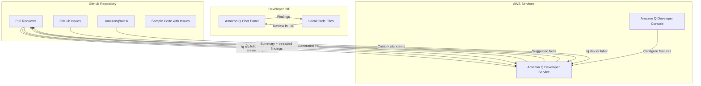

# Design Document: Code Review Automation with Amazon Q Developer

## Overview

This project guides learners through setting up Amazon Q Developer's automated code review capabilities within a GitHub-based development workflow. Learners will install and configure the Amazon Q Developer GitHub App, experience automated pull request reviews, interact with findings using slash commands, define custom project rules, and explore IDE-based code reviews. The project also introduces the Amazon Q Developer agent for generating implementation code from GitHub issues.

The architecture is workflow-driven rather than application-driven: learners create a sample repository with intentionally flawed code, configure the Amazon Q Developer integration, and then iterate through pull request cycles to observe and interact with automated review findings. A set of Python and CloudFormation sample files with deliberate issues serves as the review target, while shell scripts and Markdown files handle setup automation and custom rule definition.

### Learning Scope
- **Goal**: Install Amazon Q Developer for GitHub, trigger automated and on-demand code reviews, interpret findings, apply suggested fixes, define custom project rules, use IDE-based reviews, and use the `/q dev` agent for feature generation
- **Out of Scope**: Production CI/CD pipelines, IAM advanced policies, multi-account setups, Amazon Q Developer Pro subscriptions, auto-reviews, billing optimization
- **Prerequisites**: AWS account, GitHub account with organization (free tier), GitHub repository with Write/Maintain/Admin role, IDE with Amazon Q Developer extension (VS Code or JetBrains), Python 3.12, basic Git knowledge

### Technology Stack
- Language/Runtime: Python 3.12, Bash
- AWS Services: Amazon Q Developer (GitHub integration, IDE integration)
- Platform: GitHub (pull requests, issues, GitHub Apps)
- Infrastructure: AWS Console (manual configuration), GitHub UI
- SDK/Libraries: boto3 (sample code for review targets only)

## Architecture

The project centers on a GitHub repository containing sample code with intentional issues. Amazon Q Developer, installed as a GitHub App and registered with an AWS account, automatically reviews pull requests and responds to slash commands. Custom project rules in `.amazonq/rules/` shape review behavior. The IDE integration provides a local review path before code is pushed. The `/q dev` agent generates pull requests from GitHub issues.



## Components and Interfaces

### Component 1: SetupManager
Module: `components/setup_manager.sh`
Uses: `AWS Console, GitHub UI, AWS CLI`

Handles the installation and configuration of Amazon Q Developer for GitHub. Provides scripted guidance and verification steps for installing the GitHub App, registering it with an AWS account, and enabling code review features in the Amazon Q Developer console.

```python
INTERFACE SetupManager:
    FUNCTION verify_github_app_installed(org_name: string) -> boolean
    FUNCTION verify_repository_access(org_name: string, repo_name: string) -> boolean
    FUNCTION verify_user_role(repo_name: string, username: string) -> string
    FUNCTION print_setup_instructions() -> None
    FUNCTION verify_console_registration() -> boolean
```

### Component 2: SampleCodeGenerator
Module: `components/sample_code_generator.py`
Uses: `os, json`

Generates sample Python files and CloudFormation templates containing intentional security vulnerabilities, code quality issues, and IaC misconfigurations. These files serve as review targets for Amazon Q Developer to analyze during pull request reviews.

```python
INTERFACE SampleCodeGenerator:
    FUNCTION generate_vulnerable_python(output_dir: string) -> string
    FUNCTION generate_iac_misconfiguration(output_dir: string) -> string
    FUNCTION generate_code_quality_issues(output_dir: string) -> string
    FUNCTION generate_clean_python(output_dir: string) -> string
    FUNCTION list_generated_files(output_dir: string) -> List[string]
```

### Component 3: ProjectRulesManager
Module: `components/project_rules_manager.py`
Uses: `os, pathlib`

Creates and manages custom coding standards in Markdown files within the `.amazonq/rules/` directory. These rules instruct Amazon Q Developer to enforce project-specific conventions during code reviews.

```python
INTERFACE ProjectRulesManager:
    FUNCTION create_rules_directory(project_root: string) -> string
    FUNCTION add_rule(project_root: string, rule_name: string, rule_content: string) -> string
    FUNCTION list_rules(project_root: string) -> List[string]
    FUNCTION update_rule(project_root: string, rule_name: string, rule_content: string) -> string
    FUNCTION delete_rule(project_root: string, rule_name: string) -> None
```

### Component 4: PRWorkflowManager
Module: `components/pr_workflow_manager.py`
Uses: `subprocess (git CLI)`

Automates Git branch creation and commit workflows to streamline the process of creating pull requests with sample code for Amazon Q Developer to review. Handles branch management and commit operations needed for the review cycle.

```python
INTERFACE PRWorkflowManager:
    FUNCTION create_feature_branch(branch_name: string) -> None
    FUNCTION add_and_commit_files(file_paths: List[string], commit_message: string) -> None
    FUNCTION push_branch(branch_name: string) -> None
    FUNCTION create_review_cycle_branch(cycle_name: string, sample_files: List[string]) -> string
    FUNCTION list_branches() -> List[string]
```

### Component 5: IssueWorkflowManager
Module: `components/issue_workflow_manager.py`
Uses: `subprocess (gh CLI)`

Creates GitHub issues with detailed feature descriptions and applies the "Amazon Q development agent" label to trigger automated feature development. Manages the workflow for the `/q dev` agent integration.

```python
INTERFACE IssueWorkflowManager:
    FUNCTION create_feature_issue(title: string, description: string, acceptance_criteria: List[string]) -> string
    FUNCTION apply_agent_label(issue_number: string) -> None
    FUNCTION add_dev_command_comment(issue_number: string) -> None
    FUNCTION get_issue_status(issue_number: string) -> Dictionary
```

### Component 6: ReviewGuidePrinter
Module: `components/review_guide_printer.py`
Uses: `None`

Provides structured guidance for interpreting Amazon Q Developer findings, using slash commands, applying suggested fixes, and performing IDE-based code reviews. Serves as an interactive reference during the learning workflow.

```python
INTERFACE ReviewGuidePrinter:
    FUNCTION print_interpreting_findings_guide() -> None
    FUNCTION print_slash_commands_guide() -> None
    FUNCTION print_applying_fixes_guide() -> None
    FUNCTION print_ide_review_guide() -> None
    FUNCTION print_review_cycle_checklist(cycle_number: integer) -> None
```

## Data Models

```python
TYPE SampleFile:
    file_path: string           # Relative path in the repository
    file_type: string           # "python" | "cloudformation" | "markdown"
    issue_category: string      # "security" | "code_quality" | "iac" | "clean"
    description: string         # What intentional issues are included

TYPE ProjectRule:
    rule_name: string           # Filename without extension (e.g., "naming-conventions")
    file_path: string           # Full path: .amazonq/rules/{rule_name}.md
    content: string             # Markdown content with natural language guidelines

TYPE ReviewCycle:
    cycle_number: integer       # Sequential cycle identifier (1, 2, 3...)
    branch_name: string         # Git branch for this cycle
    sample_files: List[string]  # Files included in this cycle's PR
    purpose: string             # Learning objective for this cycle

TYPE FeatureIssue:
    title: string               # GitHub issue title
    description: string         # Detailed feature description
    acceptance_criteria: List[string]  # List of acceptance criteria
    issue_number: string        # GitHub issue number after creation
    agent_label: string         # "Amazon Q development agent"
```

## Error Handling

| Error | Description | Learner Action |
|-------|-------------|----------------|
| GitHub App not installed | Amazon Q Developer app not found in organization | Follow setup instructions to install the GitHub App from the GitHub Marketplace |
| Repository access denied | User lacks Write/Maintain/Admin role on repository | Request appropriate repository role from organization admin |
| Console registration missing | GitHub installation not registered with AWS account | Complete registration in the Amazon Q Developer console |
| Code review not triggered | Automated review did not run on PR creation | Verify code reviews feature is enabled in Amazon Q Developer console |
| Slash command ignored | `/q review` entered in existing thread instead of new comment | Add `/q review` as a new top-level pull request comment |
| Rules not applied | Custom rules not picked up during review | Verify files are in `.amazonq/rules/` directory and trigger new review with `/q review` |
| IDE review unavailable | Amazon Q Developer extension not configured in IDE | Install and authenticate the Amazon Q Developer extension for your IDE |
| gh CLI not found | GitHub CLI required for issue workflow not installed | Install GitHub CLI (`gh`) and authenticate with `gh auth login` |
| Branch already exists | Feature branch name conflicts with existing branch | Choose a unique branch name or delete the existing branch |
| Agent label not applied | "Amazon Q development agent" label doesn't exist in repo | Create the label manually in GitHub repository settings before applying |
