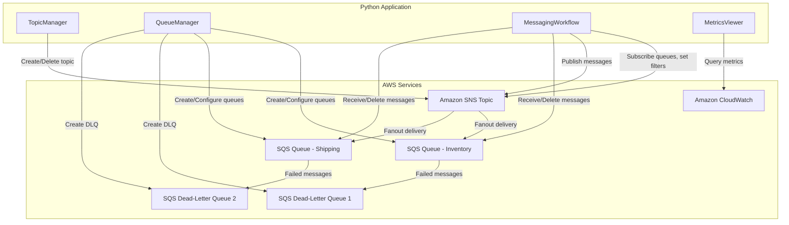

# Design Document: Build a Decoupled Architecture with Amazon SQS and SNS

## Overview

This project guides learners through building a decoupled messaging architecture using Amazon SNS and Amazon SQS. The learner will create an SNS topic, provision multiple SQS queues representing independent consumers, wire them together using the fanout pattern, and observe how a single published message reaches multiple downstream processors simultaneously. The project simulates an order processing system where different departments (inventory, shipping) each receive and independently process the same order notification.

The architecture is script-based: Python modules interact with SNS and SQS using boto3. The learner runs operations as CLI scripts to create resources, configure subscriptions with filter policies, set up dead-letter queues for failed message handling, publish messages with attributes, consume messages from each queue, and observe CloudWatch metrics to understand message flow. No web framework or Lambda functions are needed.

### Learning Scope
- **Goal**: Implement the SNS-SQS fanout pattern with message filtering, dead-letter queues, and CloudWatch monitoring
- **Out of Scope**: FIFO topics/queues, Lambda triggers, EventBridge, CI/CD, high availability patterns, encryption configuration
- **Prerequisites**: AWS account, Python 3.12, basic understanding of messaging concepts and JSON

### Technology Stack
- Language/Runtime: Python 3.12
- AWS Services: Amazon SNS (Standard topic), Amazon SQS (Standard queues), Amazon CloudWatch
- SDK/Libraries: boto3
- Infrastructure: AWS CLI (manual provisioning via scripts)

## Architecture

The application consists of four components. TopicManager handles SNS topic lifecycle. QueueManager handles SQS queue creation, dead-letter queue configuration, and access policies. MessagingWorkflow ties them together by managing subscriptions, filter policies, message publishing, and consumption. MetricsViewer reads CloudWatch metrics for SNS topics and SQS queues to provide operational visibility.



## Components and Interfaces

### Component 1: TopicManager
Module: `components/topic_manager.py`
Uses: `boto3.client('sns')`

Handles SNS topic lifecycle — creation, listing, and deletion of Standard SNS topics.

```python
INTERFACE TopicManager:
    FUNCTION create_topic(topic_name: string) -> string
    FUNCTION get_topic_attributes(topic_arn: string) -> Dictionary
    FUNCTION delete_topic(topic_arn: string) -> None
    FUNCTION list_topics() -> List[string]
```

### Component 2: QueueManager
Module: `components/queue_manager.py`
Uses: `boto3.client('sqs')`

Handles SQS queue lifecycle — creation with configurable visibility timeout and retention period, dead-letter queue configuration via redrive policy, access policy configuration to allow SNS delivery, and queue deletion.

```python
INTERFACE QueueManager:
    FUNCTION create_queue(queue_name: string, visibility_timeout: integer, message_retention_period: integer) -> string
    FUNCTION get_queue_url(queue_name: string) -> string
    FUNCTION get_queue_arn(queue_url: string) -> string
    FUNCTION get_queue_attributes(queue_url: string) -> Dictionary
    FUNCTION set_queue_policy(queue_url: string, queue_arn: string, topic_arn: string) -> None
    FUNCTION configure_dead_letter_queue(source_queue_url: string, dlq_arn: string, max_receive_count: integer) -> None
    FUNCTION delete_queue(queue_url: string) -> None
```

### Component 3: MessagingWorkflow
Module: `components/messaging_workflow.py`
Uses: `boto3.client('sns')`, `boto3.client('sqs')`

Manages SNS-to-SQS subscriptions including filter policies, publishes messages with attributes to SNS topics, and consumes messages from SQS queues with receive and delete operations.

```python
INTERFACE MessagingWorkflow:
    FUNCTION subscribe_queue(topic_arn: string, queue_arn: string) -> string
    FUNCTION set_filter_policy(subscription_arn: string, filter_policy: Dictionary) -> None
    FUNCTION list_subscriptions(topic_arn: string) -> List[Dictionary]
    FUNCTION unsubscribe(subscription_arn: string) -> None
    FUNCTION publish_message(topic_arn: string, subject: string, message: string, message_attributes: Dictionary) -> string
    FUNCTION receive_messages(queue_url: string, max_messages: integer, wait_time: integer) -> List[Dictionary]
    FUNCTION delete_message(queue_url: string, receipt_handle: string) -> None
```

### Component 4: MetricsViewer
Module: `components/metrics_viewer.py`
Uses: `boto3.client('cloudwatch')`

Queries Amazon CloudWatch to retrieve SNS and SQS metrics for observability — including messages published, messages delivered, approximate queue depth, and in-flight message counts.

```python
INTERFACE MetricsViewer:
    FUNCTION get_topic_metrics(topic_name: string, metric_name: string, period_seconds: integer, minutes_back: integer) -> List[Dictionary]
    FUNCTION get_queue_metrics(queue_name: string, metric_name: string, period_seconds: integer, minutes_back: integer) -> List[Dictionary]
    FUNCTION display_topic_summary(topic_name: string, minutes_back: integer) -> None
    FUNCTION display_queue_summary(queue_name: string, minutes_back: integer) -> None
```

## Data Models

```python
TYPE OrderMessage:
    order_id: string            # Unique identifier (e.g., "ORD-001")
    customer_name: string
    item: string
    quantity: integer
    total_amount: number
    department: string          # Used as message attribute for filtering (e.g., "inventory", "shipping", "all")

TYPE MessageAttribute:
    name: string                # Attribute name (e.g., "department")
    data_type: string           # "String" | "String.Array" | "Number" | "Binary"
    value: string               # Attribute value

TYPE SubscriptionInfo:
    subscription_arn: string
    topic_arn: string
    queue_arn: string
    filter_policy: Dictionary?  # Optional filter policy applied to subscription

TYPE QueueConfig:
    queue_name: string
    visibility_timeout: integer     # Seconds (e.g., 30)
    message_retention_period: integer  # Seconds (e.g., 345600 for 4 days)
    dlq_arn: string?                # ARN of associated dead-letter queue
    max_receive_count: integer?     # Max receives before DLQ redrive (e.g., 3)

TYPE MetricDatapoint:
    timestamp: datetime
    value: number
    unit: string
```

## Error Handling

| Error | Description | Learner Action |
|-------|-------------|----------------|
| TopicNotFoundException | SNS topic ARN does not exist | Verify topic was created and ARN is correct |
| QueueDoesNotExist | SQS queue name or URL is invalid | Check queue name spelling and that queue was created |
| InvalidParameterValue | Invalid attribute value (e.g., bad filter policy JSON) | Review filter policy structure and attribute data types |
| AuthorizationError | SQS queue policy does not permit SNS delivery | Run set_queue_policy to grant SNS publish permission to the queue |
| ReceiptHandleIsInvalid | Receipt handle expired or already used | Re-receive the message to get a fresh receipt handle |
| OverLimit | Exceeded maximum number of SNS subscriptions or SQS queues | Delete unused resources before creating new ones |
| InvalidParameterException | Malformed message attributes or subscription parameters | Verify message attribute data types and filter policy format |
