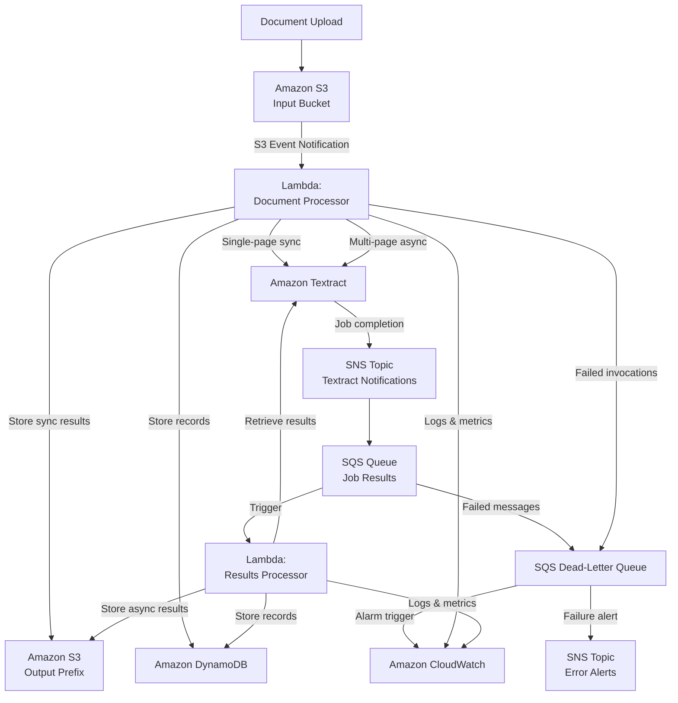

# Design Document: Document Processing Pipeline with Amazon Textract

## Overview

This project guides learners through building a serverless document processing pipeline using Amazon Textract, S3, Lambda, SNS, SQS, and DynamoDB. The learner will upload documents to S3, trigger automated text extraction and document analysis via Textract, handle asynchronous processing for multi-page documents using SNS/SQS, store structured results in DynamoDB, and implement error handling with dead-letter queues and CloudWatch monitoring.

The architecture follows an event-driven pattern: S3 upload events trigger a Lambda function that routes documents to synchronous or asynchronous Textract processing based on page count and format. Asynchronous job completions are notified via SNS→SQS, which triggers a results processor Lambda. Extracted data is transformed and stored in DynamoDB. Failed messages route to a dead-letter queue with SNS alerting. CloudWatch provides logging, custom metrics, and alarms.

### Learning Scope
- **Goal**: Build an event-driven document processing pipeline that extracts text, forms, and tables from documents using Amazon Textract, stores structured results in DynamoDB, and handles errors with dead-letter queues
- **Out of Scope**: AnalyzeExpense API, AnalyzeID API, Analyze Lending, CI/CD, high availability, DAX caching, QuickSight visualization, Amazon Comprehend integration
- **Prerequisites**: AWS account, Python 3.12, basic understanding of AWS Lambda, S3 event notifications, and boto3

### Technology Stack
- Language/Runtime: Python 3.12
- AWS Services: Amazon S3, Amazon Textract, AWS Lambda, Amazon SNS, Amazon SQS, Amazon DynamoDB (on-demand), Amazon CloudWatch
- SDK/Libraries: boto3
- Infrastructure: AWS CLI / Console (manual provisioning of S3 bucket, Lambda functions, SNS topic, SQS queues, DynamoDB table, IAM roles, CloudWatch dashboard/alarms)

## Architecture

The pipeline has two Lambda entry points. The first is triggered by S3 upload events — it validates documents, routes single-page documents to synchronous Textract processing, and submits multi-page documents as asynchronous Textract jobs. Asynchronous job completions publish to an SNS topic subscribed by an SQS queue, which triggers the second Lambda to retrieve results. Both paths transform Textract output into structured records stored in DynamoDB and S3. Failed messages from either SQS queue route to a dead-letter queue that triggers an SNS notification.



## Components and Interfaces

### Component 1: InfrastructureSetup
Module: `components/infrastructure_setup.py`
Uses: `boto3.client('s3')`, `boto3.client('sns')`, `boto3.client('sqs')`, `boto3.client('dynamodb')`, `boto3.client('cloudwatch')`, `boto3.client('lambda')`

Provisions and configures all AWS resources needed by the pipeline: S3 bucket with folder structure and event notifications, SNS topics for Textract notifications and error alerts, SQS queues with dead-letter queue configuration, DynamoDB table, CloudWatch alarm on DLQ depth, and CloudWatch dashboard.

```python
INTERFACE InfrastructureSetup:
    FUNCTION create_s3_bucket(bucket_name: string) -> Dictionary
    FUNCTION configure_s3_event_notification(bucket_name: string, lambda_arn: string, prefix: string) -> None
    FUNCTION create_sns_topic(topic_name: string) -> string
    FUNCTION subscribe_sqs_to_sns(topic_arn: string, queue_arn: string) -> string
    FUNCTION subscribe_email_to_sns(topic_arn: string, email: string) -> string
    FUNCTION create_sqs_queue(queue_name: string, dead_letter_queue_arn: string, max_receive_count: integer) -> Dictionary
    FUNCTION create_dynamodb_table(table_name: string, partition_key: string, sort_key: string) -> Dictionary
    FUNCTION create_dlq_alarm(alarm_name: string, queue_name: string, threshold: integer, sns_topic_arn: string) -> None
    FUNCTION create_cloudwatch_dashboard(dashboard_name: string, lambda_function_names: List[string], dlq_name: string) -> None
```

### Component 2: DocumentProcessor
Module: `components/document_processor.py`
Uses: `boto3.client('textract')`, `boto3.client('s3')`

Lambda handler triggered by S3 events. Validates document format, routes single-page documents to synchronous Textract APIs (DetectDocumentText, AnalyzeDocument), and submits multi-page documents as asynchronous Textract jobs. Moves unsupported files to the error prefix. Publishes custom CloudWatch metrics for documents processed and failed.

```python
INTERFACE DocumentProcessor:
    FUNCTION handler(event: Dictionary, context: Dictionary) -> Dictionary
    FUNCTION validate_document(bucket: string, key: string) -> Dictionary
    FUNCTION detect_text_sync(bucket: string, key: string) -> Dictionary
    FUNCTION analyze_document_sync(bucket: string, key: string, feature_types: List[string]) -> Dictionary
    FUNCTION start_async_text_detection(bucket: string, key: string, sns_topic_arn: string, role_arn: string) -> string
    FUNCTION start_async_document_analysis(bucket: string, key: string, feature_types: List[string], sns_topic_arn: string, role_arn: string) -> string
    FUNCTION move_to_error_prefix(bucket: string, key: string, reason: string) -> None
    FUNCTION publish_metrics(metric_name: string, value: number) -> None
```

### Component 3: ResultsProcessor
Module: `components/results_processor.py`
Uses: `boto3.client('textract')`, `boto3.client('s3')`

Lambda handler triggered by the SQS queue receiving Textract job completion notifications. Retrieves paginated async results, assembles complete result sets, and delegates to TextractParser for transformation and storage. Publishes custom CloudWatch metrics.

```python
INTERFACE ResultsProcessor:
    FUNCTION handler(event: Dictionary, context: Dictionary) -> Dictionary
    FUNCTION parse_sqs_notification(record: Dictionary) -> Dictionary
    FUNCTION get_text_detection_results(job_id: string) -> List[Dictionary]
    FUNCTION get_document_analysis_results(job_id: string) -> List[Dictionary]
    FUNCTION assemble_paginated_results(job_id: string, api_type: string) -> List[Dictionary]
    FUNCTION publish_metrics(metric_name: string, value: number) -> None
```

### Component 4: TextractParser
Module: `components/textract_parser.py`
Uses: None (pure transformation logic)

Transforms raw Textract Block objects into structured data. Extracts lines/words from text detection, key-value pairs from forms, and row/column data from tables. Produces structured records suitable for DynamoDB storage and JSON output for S3.

```python
INTERFACE TextractParser:
    FUNCTION extract_text_lines(blocks: List[Dictionary]) -> List[Dictionary]
    FUNCTION extract_key_value_pairs(blocks: List[Dictionary]) -> List[Dictionary]
    FUNCTION extract_tables(blocks: List[Dictionary]) -> List[Dictionary]
    FUNCTION build_document_record(document_id: string, s3_location: string, analysis_type: string, extracted_data: Dictionary) -> Dictionary
    FUNCTION count_blocks_by_type(blocks: List[Dictionary]) -> Dictionary
```

### Component 5: DataStore
Module: `components/data_store.py`
Uses: `boto3.resource('dynamodb')`, `boto3.client('s3')`

Persists transformed Textract results. Writes structured JSON to S3 output prefixes (separate locations for text detection vs document analysis) and stores structured records in DynamoDB for querying.

```python
INTERFACE DataStore:
    FUNCTION save_results_to_s3(bucket: string, prefix: string, document_id: string, analysis_type: string, results: Dictionary) -> string
    FUNCTION store_document_record(table_name: string, record: Dictionary) -> None
    FUNCTION get_document_record(table_name: string, document_id: string, sort_key: string) -> Dictionary
    FUNCTION query_by_document(table_name: string, document_id: string) -> List[Dictionary]
```

## Data Models

```python
TYPE DocumentMetadata:
    bucket: string
    key: string
    file_format: string           # "jpeg", "png", "pdf", "tiff"
    is_multi_page: boolean
    upload_timestamp: string

TYPE TextractJobInfo:
    job_id: string
    document_id: string
    s3_bucket: string
    s3_key: string
    api_type: string              # "text_detection" or "document_analysis"
    status: string                # "IN_PROGRESS", "SUCCEEDED", "FAILED"
    sns_topic_arn: string

TYPE DocumentRecord:
    document_id: string           # Partition key (derived from S3 key)
    sort_key: string              # Sort key: "META", "TEXT#<line_num>", "FORM#<field_name>", "TABLE#<table_idx>#<row>#<col>"
    s3_location: string           # Source document S3 URI
    analysis_type: string         # "text_detection" or "document_analysis"
    processing_timestamp: string  # ISO 8601 timestamp
    content: string               # Extracted text, field value, or cell content
    field_name?: string           # For form key-value pairs
    field_value?: string          # For form key-value pairs
    table_index?: integer         # For table cells
    row_index?: integer           # For table cells
    column_index?: integer        # For table cells
    block_count?: integer         # Total blocks detected (on META record)

TYPE ExtractedText:
    lines: List[Dictionary]       # [{text: string, confidence: number}]
    word_count: integer
    line_count: integer

TYPE ExtractedFormField:
    key: string
    value: string
    confidence: number

TYPE ExtractedTable:
    table_index: integer
    rows: List[List[string]]      # 2D array of cell contents
    row_count: integer
    column_count: integer

SUPPORTED_FORMATS: List[string] = ["jpeg", "jpg", "png", "pdf", "tiff", "tif"]

S3_PREFIXES:
    input: "incoming/"
    output_text: "results/text-detection/"
    output_analysis: "results/document-analysis/"
    error: "errors/"
```

## Error Handling

| Error | Description | Learner Action |
|-------|-------------|----------------|
| UnsupportedDocumentException | File format not in SUPPORTED_FORMATS list | Upload a JPEG, PNG, PDF, or TIFF document |
| InvalidS3ObjectException | Textract cannot access the S3 object | Verify S3 bucket policy and IAM role grant Textract read access |
| ProvisionedThroughputExceededException | Textract API quota exceeded | Wait and retry, or request quota increase via Service Quotas console |
| DocumentTooLargeException | Document exceeds Textract size/page limits | Ensure single-page docs < 10MB, multi-page PDFs < 500MB and ≤ 3000 pages |
| TextractJobFailure | Async Textract job returned FAILED status | Check CloudWatch logs for job ID, verify document quality (≥150 DPI) |
| SQS MaxReceiveCount Exceeded | Message failed processing after max retries | Inspect dead-letter queue message for document ID and error context |
| DynamoDB ValidationException | Record does not match table key schema | Verify document_id and sort_key are populated correctly |
| Lambda Timeout | Processing exceeded Lambda timeout limit | Increase Lambda timeout or reduce document size for sync processing |
| SNS PublishFailure | Cannot publish to SNS topic | Verify SNS topic exists and Lambda execution role has sns:Publish permission |
