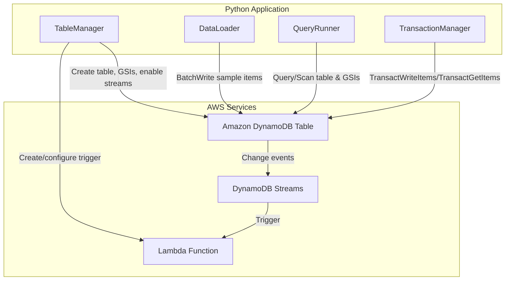

# Design Document: DynamoDB Data Model for a Serverless Application

## Overview

This project guides learners through designing and implementing a single-table DynamoDB data model for an e-commerce serverless application. The learner will define access patterns for three entity types (users, orders, and products), design composite key structures, create global secondary indexes, execute queries to validate each access pattern, use transactions for multi-item consistency, and integrate DynamoDB Streams with a Lambda function for event-driven processing.

The architecture uses Python scripts that interact directly with DynamoDB via boto3. The e-commerce domain provides natural one-to-many relationships (user → orders) and many-to-many relationships (orders ↔ products via order items). A single DynamoDB table with composite keys and GSIs supports all six access patterns without full table scans. A Lambda function connected to DynamoDB Streams demonstrates change data capture.

### Learning Scope
- **Goal**: Design a single-table DynamoDB model with composite keys and GSIs, validate all access patterns with queries, use transactions for consistency, and integrate DynamoDB Streams with Lambda
- **Out of Scope**: API Gateway, DAX caching, global tables, CI/CD, monitoring, production IAM policies
- **Prerequisites**: AWS account, Python 3.12, AWS CLI configured, basic understanding of NoSQL concepts

### Technology Stack
- Language/Runtime: Python 3.12
- AWS Services: DynamoDB (on-demand capacity), DynamoDB Streams, Lambda
- SDK/Libraries: boto3
- Infrastructure: AWS CLI + boto3 (programmatic provisioning)

## Architecture

The application consists of five components. TableManager handles table and GSI lifecycle. DataLoader populates the table with sample items across all entity types. QueryRunner executes query and scan operations against the base table and indexes. TransactionManager performs transactional reads and writes across entity types. StreamProcessor is a Lambda function triggered by DynamoDB Streams that logs change events with old and new item images.



## Components and Interfaces

### Component 1: TableManager
Module: `components/table_manager.py`
Uses: `boto3.client('dynamodb')`, `boto3.client('lambda')`, `boto3.resource('dynamodb')`

Handles DynamoDB table creation with composite primary key, GSI creation, DynamoDB Streams enablement, Lambda function deployment, and event source mapping for the stream trigger.

```python
INTERFACE TableManager:
    FUNCTION create_table(table_name: string, partition_key: string, sort_key: string, gsi_definitions: List[GSIDefinition]) -> None
    FUNCTION wait_until_active(table_name: string) -> None
    FUNCTION enable_streams(table_name: string, stream_view_type: string) -> string
    FUNCTION deploy_stream_processor(function_name: string, handler_path: string, role_arn: string) -> string
    FUNCTION create_event_source_mapping(function_name: string, stream_arn: string) -> None
    FUNCTION delete_table(table_name: string) -> None
    FUNCTION describe_table(table_name: string) -> Dictionary
```

### Component 2: DataLoader
Module: `components/data_loader.py`
Uses: `boto3.resource('dynamodb').Table()`

Loads sample data for all entity types (users, orders, products, order items) into the single table using batch writes. Provides functions to generate sample items with realistic attributes and relationships.

```python
INTERFACE DataLoader:
    FUNCTION generate_sample_items() -> List[Dictionary]
    FUNCTION batch_write_items(table_name: string, items: List[Dictionary]) -> None
    FUNCTION count_items_by_type(table_name: string) -> Dictionary
```

### Component 3: QueryRunner
Module: `components/query_runner.py`
Uses: `boto3.resource('dynamodb').Table()`

Executes query and scan operations against the base table and GSIs to validate all six access patterns. Supports key conditions, sort key conditions (begins_with, between), and filter expressions on scans.

```python
INTERFACE QueryRunner:
    FUNCTION query_by_partition_key(table_name: string, pk_value: string) -> List[Dictionary]
    FUNCTION query_with_sort_key_condition(table_name: string, pk_value: string, sk_prefix: string) -> List[Dictionary]
    FUNCTION query_gsi(table_name: string, index_name: string, pk_value: string, sk_condition: Dictionary | None) -> List[Dictionary]
    FUNCTION scan_with_filter(table_name: string, filter_expression: string, expression_values: Dictionary) -> List[Dictionary]
    FUNCTION validate_all_access_patterns(table_name: string) -> Dictionary
```

### Component 4: TransactionManager
Module: `components/transaction_manager.py`
Uses: `boto3.client('dynamodb')`

Performs transactional writes to create related items atomically (e.g., create order + order items + update inventory) and transactional reads to retrieve related items consistently across entity types.

```python
INTERFACE TransactionManager:
    FUNCTION transact_create_order(table_name: string, order_item: Dictionary, order_line_items: List[Dictionary], inventory_updates: List[Dictionary]) -> None
    FUNCTION transact_create_order_with_condition(table_name: string, order_item: Dictionary, order_line_items: List[Dictionary], inventory_checks: List[Dictionary]) -> None
    FUNCTION transact_read_related_items(table_name: string, keys: List[Dictionary]) -> List[Dictionary]
```

### Component 5: StreamProcessor
Module: `components/stream_processor.py`
Uses: Lambda runtime (event-driven)

Lambda function handler triggered by DynamoDB Streams. Logs change events including event type (INSERT, MODIFY, REMOVE) and compares old and new item images for modifications.

```python
INTERFACE StreamProcessor:
    FUNCTION handler(event: Dictionary, context: Dictionary) -> Dictionary
    FUNCTION process_record(record: Dictionary) -> Dictionary
    FUNCTION compare_images(old_image: Dictionary, new_image: Dictionary) -> List[Dictionary]
```

## Data Models

```python
TYPE GSIDefinition:
    index_name: string
    partition_key: string
    sort_key: string | None
    projection_type: string          # "ALL", "KEYS_ONLY", or "INCLUDE"
    non_key_attributes: List[string] | None

TYPE AccessPattern:
    name: string
    entity_type: string
    operation: string                # "read" or "write"
    lookup_keys: Dictionary
    sort_condition: string | None
    target: string                   # "base_table", "GSI1", or "GSI2"

TYPE UserItem:
    PK: string                       # "USER#<user_id>"
    SK: string                       # "USER#<user_id>"
    entity_type: string              # "User"
    user_id: string
    name: string
    email: string
    created_at: string

TYPE OrderItem:
    PK: string                       # "USER#<user_id>"
    SK: string                       # "ORDER#<order_id>"
    entity_type: string              # "Order"
    order_id: string
    user_id: string
    status: string
    total_amount: number
    order_date: string
    GSI1PK: string                   # "ORDER#<order_id>"
    GSI1SK: string                   # "ORDER#<order_id>"

TYPE OrderLineItem:
    PK: string                       # "ORDER#<order_id>"
    SK: string                       # "PRODUCT#<product_id>"
    entity_type: string              # "OrderLineItem"
    order_id: string
    product_id: string
    quantity: number
    unit_price: number

TYPE ProductItem:
    PK: string                       # "PRODUCT#<product_id>"
    SK: string                       # "PRODUCT#<product_id>"
    entity_type: string              # "Product"
    product_id: string
    product_name: string
    category: string
    price: number
    inventory_count: number
    GSI2PK: string                   # "CATEGORY#<category>"
    GSI2SK: string                   # "PRODUCT#<product_id>"

TYPE AccessPatternMapping:
    # AP1: Get user by ID           -> Base table: PK=USER#<id>, SK=USER#<id>
    # AP2: Get orders for a user    -> Base table: PK=USER#<id>, SK begins_with ORDER#
    # AP3: Get order items by order -> Base table: PK=ORDER#<id>, SK begins_with PRODUCT#
    # AP4: Get products by category -> GSI2: GSI2PK=CATEGORY#<cat>, GSI2SK begins_with PRODUCT#
    # AP5: Get order by order ID    -> GSI1: GSI1PK=ORDER#<id> (inverted index)
    # AP6: Get all products         -> Base table: PK begins_with PRODUCT# (query per product or scan with filter)
    name: string
    description: string

TYPE StreamRecord:
    event_name: string               # "INSERT", "MODIFY", "REMOVE"
    old_image: Dictionary | None
    new_image: Dictionary | None
    changed_attributes: List[Dictionary] | None
```

## Error Handling

| Error | Description | Learner Action |
|-------|-------------|----------------|
| ResourceInUseException | Table or GSI name already exists | Delete existing table or choose a different name |
| ResourceNotFoundException | Table, index, or item does not exist | Verify table name, index name, and key values |
| ValidationException | Invalid key schema, attribute types, or expression syntax | Check attribute definitions and expression parameters |
| TransactionCanceledException | Transaction failed due to condition check or conflict | Inspect cancellation reasons; verify condition expressions and item states |
| ConditionalCheckFailedException | A condition expression evaluated to false | Review condition logic (e.g., check inventory values) |
| LimitExceededException | Too many GSIs (max 20) or concurrent table operations | Wait for operations to complete; remove unused indexes |
| ResourceConflictException | Lambda function or event source mapping already exists | Delete existing function or mapping before recreating |
| InvalidParameterValueException | Invalid Lambda configuration (handler, role, runtime) | Verify handler path, IAM role ARN, and runtime setting |
