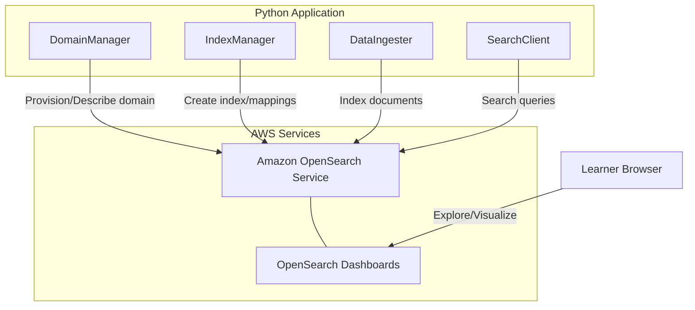

# Design Document: Full-Text Search Application with Amazon OpenSearch

## Overview

This project guides learners through building a full-text search application for an e-commerce product catalog using Amazon OpenSearch Service. The learner will provision an OpenSearch domain, design index mappings with appropriate analyzers, ingest product data, and implement a range of search capabilities including full-text queries, filtering, aggregations, fuzzy matching, synonyms, and search-as-you-type autocomplete.

The architecture uses Python scripts that interact directly with an OpenSearch domain via the `opensearch-py` client library. The OpenSearch domain is provisioned manually through the AWS Console or CLI. The learner runs each component as a CLI script to progressively build and query the product catalog. OpenSearch Dashboards is accessed through the domain's built-in endpoint for visualization and ad-hoc query exploration.

### Learning Scope
- **Goal**: Deploy an OpenSearch domain, design index mappings with custom analyzers, ingest product data, and implement full-text search with filtering, aggregations, fuzziness, synonyms, and autocomplete
- **Out of Scope**: VPC networking, CI/CD pipelines, Logstash/Firehose ingestion pipelines, semantic/neural search, production scaling, monitoring alarms
- **Prerequisites**: AWS account, Python 3.12, basic understanding of REST APIs and JSON, familiarity with search concepts

### Technology Stack
- Language/Runtime: Python 3.12
- AWS Services: Amazon OpenSearch Service (single-node domain with OpenSearch Dashboards)
- SDK/Libraries: `opensearch-py`, `boto3` (for domain provisioning), `requests-aws4auth`
- Infrastructure: AWS Console or CLI (manual domain provisioning)

## Architecture

The application consists of four components. DomainManager provisions and checks the OpenSearch domain. IndexManager creates indices with explicit mappings and custom analyzers (including synonym support). DataIngester loads product documents individually and in bulk. SearchClient executes all search operations — full-text queries, filters, aggregations, fuzziness, and autocomplete. OpenSearch Dashboards is accessed directly via the domain endpoint for visualization and Dev Tools queries.



## Components and Interfaces

### Component 1: DomainManager
Module: `components/domain_manager.py`
Uses: `boto3.client('opensearch')`

Provisions an Amazon OpenSearch Service domain with fine-grained access control, encryption at rest, and node-to-node encryption. Checks domain status and retrieves the domain endpoint and Dashboards URL.

```python
INTERFACE DomainManager:
    FUNCTION create_domain(domain_name: string, instance_type: string, volume_size: int, master_user: string, master_password: string) -> Dictionary
    FUNCTION get_domain_status(domain_name: string) -> Dictionary
    FUNCTION wait_until_active(domain_name: string) -> string
    FUNCTION get_dashboards_url(domain_name: string) -> string
    FUNCTION delete_domain(domain_name: string) -> None
```

### Component 2: IndexManager
Module: `components/index_manager.py`
Uses: `OpenSearch` client from `opensearch-py`

Creates and manages product indices with explicit mappings that define text fields with analyzers, keyword fields for exact-match filtering, numeric fields for range queries, and search-as-you-type fields for autocomplete. Supports custom analyzer configuration with synonym filters.

```python
INTERFACE IndexManager:
    FUNCTION create_client(host: string, port: int, auth: tuple) -> OpenSearch
    FUNCTION create_product_index(client: OpenSearch, index_name: string) -> Dictionary
    FUNCTION create_product_index_with_synonyms(client: OpenSearch, index_name: string, synonyms: List[string]) -> Dictionary
    FUNCTION get_mapping(client: OpenSearch, index_name: string) -> Dictionary
    FUNCTION delete_index(client: OpenSearch, index_name: string) -> Dictionary
    FUNCTION index_exists(client: OpenSearch, index_name: string) -> boolean
```

### Component 3: DataIngester
Module: `components/data_ingester.py`
Uses: `OpenSearch` client from `opensearch-py`

Loads product documents into the index individually and in bulk. Generates sample product data for the e-commerce catalog and handles mapping conflict errors during ingestion.

```python
INTERFACE DataIngester:
    FUNCTION index_product(client: OpenSearch, index_name: string, product: ProductDocument, doc_id: string) -> Dictionary
    FUNCTION bulk_index_products(client: OpenSearch, index_name: string, products: List[ProductDocument]) -> Dictionary
    FUNCTION generate_sample_products() -> List[ProductDocument]
    FUNCTION refresh_index(client: OpenSearch, index_name: string) -> None
```

### Component 4: SearchClient
Module: `components/search_client.py`
Uses: `OpenSearch` client from `opensearch-py`

Executes all search operations against the product index: match queries, multi-match queries, phrase matching, filtered queries with bool/filter context, numeric range filters, term aggregations, sorted results, fuzzy queries for typo tolerance, and search-as-you-type prefix queries for autocomplete.

```python
INTERFACE SearchClient:
    FUNCTION match_search(client: OpenSearch, index_name: string, field: string, query_text: string) -> SearchResult
    FUNCTION multi_match_search(client: OpenSearch, index_name: string, fields: List[string], query_text: string) -> SearchResult
    FUNCTION phrase_search(client: OpenSearch, index_name: string, field: string, phrase: string) -> SearchResult
    FUNCTION filtered_search(client: OpenSearch, index_name: string, query_text: string, filters: Dictionary) -> SearchResult
    FUNCTION range_filter_search(client: OpenSearch, index_name: string, query_text: string, field: string, gte: number, lte: number) -> SearchResult
    FUNCTION aggregation_search(client: OpenSearch, index_name: string, agg_field: string, query_text: string) -> SearchResult
    FUNCTION sorted_search(client: OpenSearch, index_name: string, query_text: string, sort_field: string, order: string) -> SearchResult
    FUNCTION fuzzy_search(client: OpenSearch, index_name: string, field: string, query_text: string, fuzziness: string) -> SearchResult
    FUNCTION autocomplete_search(client: OpenSearch, index_name: string, field: string, prefix_text: string) -> SearchResult
```

## Data Models

```python
TYPE ProductDocument:
    product_id: string          # Unique product identifier (e.g., "PROD-001")
    name: string                # Product name (text field with standard analyzer)
    name_suggest: string        # Product name (search_as_you_type field for autocomplete)
    description: string         # Product description (text field for full-text search)
    category: string            # Product category (keyword field for filtering/aggregation)
    brand: string               # Brand name (keyword field for filtering/aggregation)
    price: number               # Product price (float field for range queries and sorting)
    tags: List[string]          # Product tags (keyword array for filtering)
    in_stock: boolean           # Availability status

TYPE SearchResult:
    total_hits: integer         # Total number of matching documents
    hits: List[HitItem]         # List of matching documents with scores
    aggregations: Dictionary    # Aggregation buckets (empty if not requested)

TYPE HitItem:
    doc_id: string              # Document ID
    score: number               # Relevance score
    source: ProductDocument     # The matching product document

TYPE IndexMapping:
    name: TextFieldMapping              # analyzed text + keyword sub-field
    name_suggest: SearchAsYouTypeMapping # search_as_you_type field
    description: TextFieldMapping       # analyzed text for full-text search
    category: KeywordFieldMapping       # keyword for exact match and aggregations
    brand: KeywordFieldMapping          # keyword for exact match and aggregations
    price: NumericFieldMapping          # float for range queries and sorting
    tags: KeywordFieldMapping           # keyword array for filtering
    in_stock: BooleanFieldMapping       # boolean for filtering
```

## Error Handling

| Error | Description | Learner Action |
|-------|-------------|----------------|
| ResourceAlreadyExistsException | Domain creation via the SDK may silently return details of the existing domain rather than raising this error; however, if an explicit conflict is detected, this exception may be raised | Verify whether the domain already exists using `get_domain_status` before attempting creation, and choose a different domain name or delete the existing domain if needed |
| RequestError (index_already_exists) | Index with the specified name already exists on the domain | Delete the existing index first or use a different index name |
| RequestError (mapper_parsing_exception) | Document field value conflicts with the defined mapping type | Verify document field values match the types defined in the index mapping |
| ConnectionError | Cannot connect to the OpenSearch domain endpoint | Verify the domain is active, check the endpoint URL, and confirm access policy allows your IP |
| AuthenticationException | Fine-grained access control credentials are invalid | Verify master username and password used when creating the domain |
| NotFoundError | Specified index or document does not exist | Verify the index name and document ID are correct |
| BulkIndexError | One or more documents in a bulk operation failed | Inspect the per-document error details in the response to identify failures |
| ValidationException | Invalid domain configuration parameters | Check instance type, volume size, and domain name constraints |
