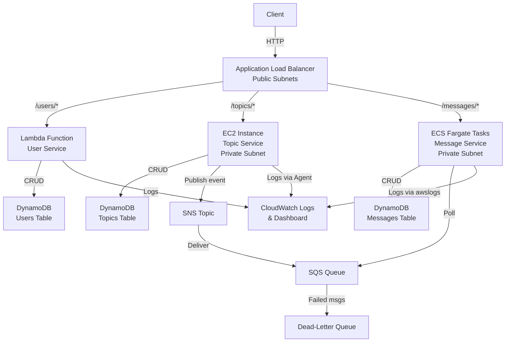

# Design Document: Build a Microservices Architecture on AWS

## Overview

This project guides learners through building a microservices architecture on AWS by decomposing a conceptual forum application into three independently deployed services: a user service (AWS Lambda), a topic service (Amazon EC2), and a message service (Amazon ECS/Fargate). All three services are fronted by an Application Load Balancer with path-based routing, following the reference architecture from the AWS "Implementing Microservices on AWS" whitepaper.

The project uses AWS CDK (Python) as the primary infrastructure-as-code tool to provision networking, compute, data stores, and messaging resources. Each microservice has its own dedicated data store (DynamoDB tables), and asynchronous inter-service communication is implemented via SNS and SQS. Centralized logging and monitoring are configured through CloudWatch. The learner will experience deploying, updating, and observing a distributed system where each service runs on a different compute platform.

### Learning Scope
- **Goal**: Deploy three microservices on different AWS compute platforms (Lambda, ECS Fargate, EC2) behind an ALB with path-based routing, each with its own data store, connected via async messaging, and observed through centralized monitoring
- **Out of Scope**: CI/CD pipelines, auto-scaling policies, service mesh (App Mesh), X-Ray tracing, API Gateway (REST), production hardening, custom domain names, HTTPS/TLS certificates
- **Prerequisites**: AWS account, Python 3.12, Docker installed locally, AWS CDK v2 bootstrapped, basic understanding of networking (VPC/subnets), containers, and serverless concepts

### Technology Stack
- Language/Runtime: Python 3.12 (CDK and Lambda), Node.js or Python for EC2/ECS services
- AWS Services: VPC, ALB, Lambda, ECS (Fargate), EC2, ECR, DynamoDB (×3 tables), SNS, SQS, CloudWatch
- SDK/Libraries: aws-cdk-lib, boto3, aws_ecs, aws_ec2, aws_lambda, aws_elasticloadbalancingv2
- Infrastructure: AWS CDK (Python)

**Complexity Assessment**: Complex — 8+ AWS services, multi-compute architecture, IaC-based approach, 6 components.

## Architecture

The architecture places an Application Load Balancer in public subnets across two Availability Zones. Three path-based routing rules direct `/users/*` to a Lambda target group, `/topics/*` to an EC2 target group, and `/messages/*` to an ECS Fargate target group. Each service has a dedicated DynamoDB table. When the topic service creates a new topic, it publishes an event to an SNS topic; an SQS queue subscribed to that SNS topic delivers the event to the message service for asynchronous processing. A dead-letter queue captures failed messages. All services emit logs to distinct CloudWatch log groups, and a CloudWatch dashboard provides a unified view.



## Components and Interfaces

### Component 1: NetworkStack
Module: `stacks/network_stack.py`
Uses: `aws_cdk.aws_ec2`

Provisions the VPC with public and private subnets across two Availability Zones, NAT Gateway for private subnet outbound access, and security groups for the ALB, Lambda, EC2, and ECS resources. Each compute security group allows inbound traffic only from the ALB security group.

```python
INTERFACE NetworkStack:
    FUNCTION create_vpc(cidr: string, az_count: number) -> Vpc
    FUNCTION create_public_subnets(vpc: Vpc, count: number) -> List[Subnet]
    FUNCTION create_private_subnets(vpc: Vpc, count: number) -> List[Subnet]
    FUNCTION create_nat_gateway(vpc: Vpc, public_subnet: Subnet) -> NatGateway
    FUNCTION create_alb_security_group(vpc: Vpc) -> SecurityGroup
    FUNCTION create_service_security_group(vpc: Vpc, name: string, alb_sg: SecurityGroup, port: number) -> SecurityGroup
```

### Component 2: LoadBalancerStack
Module: `stacks/load_balancer_stack.py`
Uses: `aws_cdk.aws_elasticloadbalancingv2`

Creates the Application Load Balancer in public subnets, configures a listener with path-based routing rules for `/users/*`, `/topics/*`, and `/messages/*`, creates target groups for Lambda, EC2, and ECS, sets up health checks per target group, and configures a default fixed-response action for unmatched paths.

```python
INTERFACE LoadBalancerStack:
    FUNCTION create_alb(vpc: Vpc, subnets: List[Subnet], security_group: SecurityGroup) -> ApplicationLoadBalancer
    FUNCTION create_listener(alb: ApplicationLoadBalancer, default_status: number, default_body: string) -> ApplicationListener
    FUNCTION create_lambda_target_group(listener: ApplicationListener, path_pattern: string, lambda_function: Function) -> ApplicationTargetGroup
    FUNCTION create_instance_target_group(vpc: Vpc, listener: ApplicationListener, path_pattern: string, port: number, health_path: string) -> ApplicationTargetGroup
    FUNCTION create_ecs_target_group(vpc: Vpc, listener: ApplicationListener, path_pattern: string, port: number, health_path: string) -> ApplicationTargetGroup
```

### Component 3: UserServiceStack (Lambda)
Module: `stacks/user_service_stack.py`
Uses: `aws_cdk.aws_lambda, aws_cdk.aws_dynamodb`

Deploys the serverless user service as a Lambda function with a dedicated DynamoDB table for user data. Creates a least-privilege IAM execution role granting access only to the Users DynamoDB table and CloudWatch Logs. Registers the Lambda function as a target in the ALB target group.

```python
INTERFACE UserServiceStack:
    FUNCTION create_users_table(table_name: string, partition_key: string) -> Table
    FUNCTION create_lambda_role(table_arn: string) -> Role
    FUNCTION create_lambda_function(function_name: string, handler: string, role: Role, environment: Dictionary) -> Function
    FUNCTION register_with_target_group(target_group: ApplicationTargetGroup, function: Function) -> None
```

### Component 4: TopicServiceStack (EC2)
Module: `stacks/topic_service_stack.py`
Uses: `aws_cdk.aws_ec2, aws_cdk.aws_dynamodb, aws_cdk.aws_sns`

Deploys the topic service on an EC2 instance in a private subnet with a dedicated DynamoDB table for topic data. Configures user data script to install dependencies, deploy the application, and install the CloudWatch agent. Grants the instance permission to publish events to the SNS topic when a new topic is created. Registers the instance with the ALB target group.

```python
INTERFACE TopicServiceStack:
    FUNCTION create_topics_table(table_name: string, partition_key: string) -> Table
    FUNCTION create_instance_role(table_arn: string, sns_topic_arn: string) -> Role
    FUNCTION create_ec2_instance(instance_type: string, subnet: Subnet, security_group: SecurityGroup, role: Role, user_data: string) -> Instance
    FUNCTION create_user_data_script(app_port: number, table_name: string, sns_topic_arn: string, region: string) -> string
    FUNCTION register_with_target_group(target_group: ApplicationTargetGroup, instance: Instance) -> None
```

### Component 5: MessageServiceStack (ECS Fargate)
Module: `stacks/message_service_stack.py`
Uses: `aws_cdk.aws_ecs, aws_cdk.aws_ecr, aws_cdk.aws_dynamodb, aws_cdk.aws_sqs`

Deploys the message service as a containerized application on ECS Fargate with a dedicated DynamoDB table for message data. Creates an ECR repository, an ECS cluster, task definition, and Fargate service distributed across two AZs. Configures the container to poll the SQS queue for async events. Uses the awslogs driver to send container logs to CloudWatch. Registers tasks with the ALB target group.

```python
INTERFACE MessageServiceStack:
    FUNCTION create_messages_table(table_name: string, partition_key: string) -> Table
    FUNCTION create_ecr_repository(repository_name: string) -> Repository
    FUNCTION create_ecs_cluster(vpc: Vpc, cluster_name: string) -> Cluster
    FUNCTION create_task_definition(family: string, cpu: number, memory: number, table_name: string, queue_url: string, log_group: string) -> FargateTaskDefinition
    FUNCTION create_fargate_service(cluster: Cluster, task_def: FargateTaskDefinition, desired_count: number, subnets: List[Subnet], security_group: SecurityGroup) -> FargateService
    FUNCTION register_with_target_group(target_group: ApplicationTargetGroup, service: FargateService, container_port: number) -> None
```

### Component 6: MessagingAndMonitoringStack
Module: `stacks/messaging_monitoring_stack.py`
Uses: `aws_cdk.aws_sns, aws_cdk.aws_sqs, aws_cdk.aws_cloudwatch`

Creates the SNS topic for inter-service events, an SQS queue subscribed to that topic with an access policy restricting sends to only the SNS topic, and a dead-letter queue for failed messages. Creates distinct CloudWatch log groups per service, a unified CloudWatch dashboard displaying Lambda invocations, ECS task health, and EC2 instance metrics, and a CloudWatch alarm that sends notifications to an alerting SNS topic when error thresholds are breached.

```python
INTERFACE MessagingAndMonitoringStack:
    FUNCTION create_event_sns_topic(topic_name: string) -> Topic
    FUNCTION create_event_sqs_queue(queue_name: string, sns_topic: Topic, max_receive_count: number) -> Queue
    FUNCTION create_dead_letter_queue(dlq_name: string) -> Queue
    FUNCTION create_log_group(log_group_name: string, retention_days: number) -> LogGroup
    FUNCTION create_dashboard(dashboard_name: string, lambda_name: string, ecs_service_name: string, ecs_cluster_name: string, ec2_instance_id: string) -> Dashboard
    FUNCTION create_alarm(alarm_name: string, metric_name: string, namespace: string, threshold: number, alert_topic: Topic) -> Alarm
    FUNCTION create_alert_sns_topic(topic_name: string, email: string) -> Topic
```

## Data Models

```python
TYPE User:
    user_id: string          # Partition key (UUID)
    username: string
    email: string
    created_at: string       # ISO 8601 timestamp

TYPE Topic:
    topic_id: string         # Partition key (UUID)
    title: string
    author_user_id: string
    created_at: string       # ISO 8601 timestamp

TYPE Message:
    message_id: string       # Partition key (UUID)
    topic_id: string         # GSI partition key for querying messages by topic
    author_user_id: string
    body: string
    created_at: string       # ISO 8601 timestamp

TYPE TopicCreatedEvent:
    event_type: string       # "TopicCreated"
    topic_id: string
    title: string
    author_user_id: string
    timestamp: string        # ISO 8601 timestamp

TYPE HealthCheckResponse:
    service: string          # "user-service" | "topic-service" | "message-service"
    status: string           # "healthy" | "unhealthy"
    timestamp: string
```

## Error Handling

| Error | Description | Learner Action |
|-------|-------------|----------------|
| VPC LimitExceeded | AWS account has reached the VPC limit for the region | Delete unused VPCs or request a limit increase |
| SubnetConflict | CIDR block overlaps with an existing subnet | Choose a non-overlapping CIDR range |
| ALB TargetGroup HealthCheckFailed | Target is not responding on the health check path | Verify the application is running and listening on the correct port and path |
| Lambda ResourceNotFoundException | DynamoDB table referenced by the function does not exist | Deploy the data store stack before the service stack |
| ECS TaskFailedToStart | Container fails to start or pull image from ECR | Check ECR image URI, verify NAT Gateway allows outbound access, and review task logs |
| EC2 UserData ScriptFailure | Application did not start after instance launch | SSH via Session Manager and inspect /var/log/cloud-init-output.log |
| SNS PublishFailure | IAM role lacks sns:Publish permission on the topic | Verify the EC2 instance role has the SNS publish policy attached |
| SQS AccessDenied | Queue policy does not allow the SNS topic to send messages | Confirm the SQS access policy includes the SNS topic ARN as a permitted source |
| CloudWatch Agent NotRunning | EC2 instance not sending custom metrics or logs | Verify the CloudWatch agent config and restart the agent service |
| DLQ MessageAccumulation | Messages repeatedly failing processing and landing in the dead-letter queue | Inspect DLQ messages, fix the consumer logic, and redrive messages |
| ECS RollingUpdateTimeout | New tasks fail health checks during deployment | Check container logs, verify health check endpoint, and review task definition changes |
| SecurityGroup ConnectionRefused | Direct access to EC2/ECS bypassing ALB is denied | This is expected behavior — access services only through the ALB DNS |
