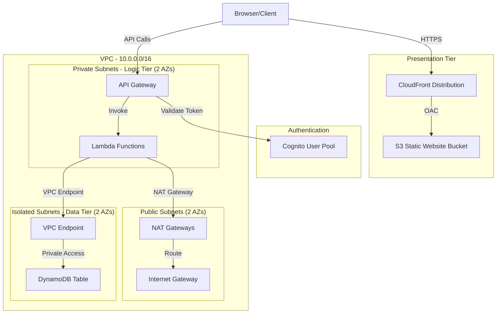

# Design Document: Build a Multi-Tier Web Application on AWS

## Overview

This project guides learners through building a serverless multi-tier web application on AWS, implementing the classic three-tier architecture pattern: a static presentation tier hosted on S3 with CloudFront, a serverless logic tier using API Gateway and Lambda, and a data tier using DynamoDB — all within a properly configured VPC with network isolation between tiers.

The learner will construct the infrastructure layer-by-layer using Python scripts with boto3, starting from VPC and subnet creation, progressing through security configuration, database provisioning, Lambda function deployment, API Gateway setup, Cognito authentication, and finally static frontend hosting. Each component maps to one or two AWS services, reinforcing how tiers communicate only through defined interfaces with least-privilege network and IAM controls.

The project emphasizes understanding architectural decisions: why tiers are isolated in separate subnets, how security groups enforce inter-tier communication rules, why a VPC endpoint keeps DynamoDB traffic private, and how managed services inherently provide multi-AZ availability.

### Learning Scope
- **Goal**: Deploy a functional three-tier serverless web application with VPC network isolation, authentication, and multi-AZ design
- **Out of Scope**: CI/CD pipelines, monitoring/alerting, custom domain names, WAF, DynamoDB Streams, global tables, production hardening
- **Prerequisites**: AWS account, Python 3.12, basic understanding of networking (CIDR, subnets), REST APIs, and HTML/JavaScript

### Technology Stack
- Language/Runtime: Python 3.12 (infrastructure scripts and Lambda functions)
- AWS Services: VPC, Lambda, API Gateway (REST), DynamoDB, S3, CloudFront, Cognito
- SDK/Libraries: boto3, zipfile (for Lambda packaging)
- Infrastructure: boto3 SDK scripts (programmatic provisioning)

## Architecture

The application follows a three-tier serverless architecture. The presentation tier serves static assets from S3 through CloudFront. User requests pass through Cognito authentication at API Gateway, which routes to Lambda functions running inside private VPC subnets. Lambda accesses DynamoDB through a VPC gateway endpoint, ensuring data-tier traffic stays off the public internet. The VPC contains three subnet tiers across two Availability Zones: public subnets (ingress), private subnets with NAT access (logic tier), and isolated private subnets (data tier).



## Components and Interfaces

### Component 1: NetworkManager
Module: `components/network_manager.py`
Uses: `boto3.client('ec2')`

Creates and configures the VPC foundation: VPC with DNS enabled, three tiers of subnets across two AZs, internet gateway, NAT gateways in each AZ, route tables with appropriate routing (public→IGW, private→NAT, isolated→no internet), and the DynamoDB VPC gateway endpoint.

```python
INTERFACE NetworkManager:
    FUNCTION create_vpc(cidr_block: string, name: string) -> string
    FUNCTION enable_vpc_dns(vpc_id: string) -> None
    FUNCTION create_subnet(vpc_id: string, cidr: string, az: string, name: string, public: boolean) -> string
    FUNCTION create_internet_gateway(vpc_id: string) -> string
    FUNCTION create_nat_gateway(subnet_id: string, name: string) -> string
    FUNCTION create_route_table(vpc_id: string, name: string) -> string
    FUNCTION add_route(route_table_id: string, destination_cidr: string, gateway_id: string) -> None
    FUNCTION associate_subnet_to_route_table(subnet_id: string, route_table_id: string) -> None
    FUNCTION create_vpc_endpoint(vpc_id: string, service_name: string, route_table_ids: List[string]) -> string
    FUNCTION get_vpc_summary(vpc_id: string) -> Dictionary
```

### Component 2: SecurityManager
Module: `components/security_manager.py`
Uses: `boto3.client('ec2')`

Creates security groups for each tier with inter-tier rules enforcing least privilege, and configures network ACLs for subnet-level defense. Presentation SG allows inbound HTTPS from internet; logic SG allows inbound only from presentation SG; data SG allows inbound only from logic SG on the DynamoDB port. Network ACLs provide a secondary stateless firewall layer.

```python
INTERFACE SecurityManager:
    FUNCTION create_security_group(vpc_id: string, name: string, description: string) -> string
    FUNCTION add_ingress_rule(sg_id: string, protocol: string, port: integer, source: string) -> None
    FUNCTION add_egress_rule(sg_id: string, protocol: string, port: integer, destination: string) -> None
    FUNCTION create_network_acl(vpc_id: string, name: string) -> string
    FUNCTION add_nacl_rule(nacl_id: string, rule_number: integer, protocol: string, port_range: Tuple, cidr: string, egress: boolean, action: string) -> None
    FUNCTION associate_nacl_to_subnet(nacl_id: string, subnet_id: string) -> None
    FUNCTION verify_tier_isolation(presentation_sg: string, logic_sg: string, data_sg: string) -> Dictionary
```

### Component 3: DataTierManager
Module: `components/data_tier_manager.py`
Uses: `boto3.resource('dynamodb')`

Creates and manages the DynamoDB table with on-demand capacity mode. Handles table lifecycle and provides CRUD operations used by Lambda function code.

```python
INTERFACE DataTierManager:
    FUNCTION create_table(table_name: string, partition_key: string, sort_key: string) -> Dictionary
    FUNCTION wait_until_active(table_name: string) -> None
    FUNCTION put_item(table_name: string, item: Dictionary) -> None
    FUNCTION get_item(table_name: string, partition_key_value: string, sort_key_value: string) -> Dictionary
    FUNCTION update_item(table_name: string, partition_key_value: string, sort_key_value: string, updates: Dictionary) -> Dictionary
    FUNCTION delete_item(table_name: string, partition_key_value: string, sort_key_value: string) -> None
    FUNCTION query_items(table_name: string, partition_key_value: string) -> List[Dictionary]
    FUNCTION delete_table(table_name: string) -> None
```

### Component 4: LogicTierManager
Module: `components/logic_tier_manager.py`
Uses: `boto3.client('lambda')`, `boto3.client('iam')`

Creates the IAM execution role with least-privilege permissions (DynamoDB access and VPC ENI management), packages and deploys Lambda functions into the logic-tier private subnets with the logic-tier security group. Each Lambda function handles one CRUD operation.

```python
INTERFACE LogicTierManager:
    FUNCTION create_execution_role(role_name: string, dynamodb_table_arn: string) -> string
    FUNCTION wait_for_role_propagation(role_arn: string) -> None
    FUNCTION package_lambda_code(handler_file: string) -> bytes
    FUNCTION create_function(function_name: string, role_arn: string, handler: string, zip_bytes: bytes, subnet_ids: List[string], security_group_id: string, environment_vars: Dictionary) -> string
    FUNCTION invoke_function(function_name: string, payload: Dictionary) -> Dictionary
    FUNCTION delete_function(function_name: string) -> None
    FUNCTION delete_execution_role(role_name: string) -> None
```

### Component 5: ApiTierManager
Module: `components/api_tier_manager.py`
Uses: `boto3.client('apigateway')`

Creates a REST API with resources and methods routed to Lambda functions. Configures request validation models, CORS headers, a Cognito authorizer for token validation, and deploys to a stage exposing a public invoke URL.

```python
INTERFACE ApiTierManager:
    FUNCTION create_rest_api(api_name: string) -> string
    FUNCTION create_resource(api_id: string, parent_id: string, path_part: string) -> string
    FUNCTION get_root_resource_id(api_id: string) -> string
    FUNCTION create_request_model(api_id: string, model_name: string, schema: Dictionary) -> string
    FUNCTION create_method_with_lambda(api_id: string, resource_id: string, http_method: string, lambda_arn: string, model_name: string, authorizer_id: string) -> None
    FUNCTION configure_cors(api_id: string, resource_id: string, allowed_origin: string) -> None
    FUNCTION create_cognito_authorizer(api_id: string, user_pool_arn: string) -> string
    FUNCTION deploy_api(api_id: string, stage_name: string) -> string
    FUNCTION delete_rest_api(api_id: string) -> None
```

### Component 6: PresentationTierManager
Module: `components/presentation_tier_manager.py`
Uses: `boto3.client('s3')`, `boto3.client('cloudfront')`, `boto3.client('cognito-idp')`

Creates the Cognito user pool with email verification and password policies. Creates the S3 bucket with Block Public Access enabled, uploads static assets, creates a CloudFront distribution with origin access control and HTTPS, and configures the Cognito user pool client for frontend authentication.

```python
INTERFACE PresentationTierManager:
    FUNCTION create_cognito_user_pool(pool_name: string, password_policy: Dictionary) -> string
    FUNCTION create_cognito_app_client(user_pool_id: string, client_name: string) -> string
    FUNCTION get_user_pool_arn(user_pool_id: string) -> string
    FUNCTION create_s3_bucket(bucket_name: string, region: string) -> None
    FUNCTION block_public_access(bucket_name: string) -> None
    FUNCTION upload_static_assets(bucket_name: string, assets_directory: string) -> None
    FUNCTION create_origin_access_control(name: string) -> string
    FUNCTION set_bucket_policy_for_cloudfront(bucket_name: string, distribution_arn: string) -> None
    FUNCTION create_cloudfront_distribution(bucket_name: string, oac_id: string) -> Dictionary
    FUNCTION delete_cognito_user_pool(user_pool_id: string) -> None
    FUNCTION delete_s3_bucket(bucket_name: string) -> None
    FUNCTION delete_cloudfront_distribution(distribution_id: string) -> None
```

## Data Models

```python
TYPE VpcConfig:
    vpc_id: string
    vpc_cidr: string                    # e.g., "10.0.0.0/16"
    public_subnet_ids: List[string]     # 2 subnets across 2 AZs
    logic_subnet_ids: List[string]      # 2 private subnets across 2 AZs
    data_subnet_ids: List[string]       # 2 isolated subnets across 2 AZs
    internet_gateway_id: string
    nat_gateway_ids: List[string]       # 1 per AZ
    vpc_endpoint_id: string

TYPE SecurityConfig:
    presentation_sg_id: string
    logic_sg_id: string
    data_sg_id: string
    public_nacl_id: string
    logic_nacl_id: string
    data_nacl_id: string

TYPE AppItem:
    user_id: string                     # Partition key
    item_id: string                     # Sort key
    title: string
    description: string
    status: string                      # "active" | "archived"
    created_at: string                  # ISO 8601 timestamp
    updated_at?: string

TYPE LambdaEvent:
    http_method: string
    path_parameters?: Dictionary
    body?: string
    request_context: Dictionary

TYPE LambdaResponse:
    status_code: integer
    headers: Dictionary
    body: string                        # JSON-serialized response

TYPE DeploymentConfig:
    region: string
    vpc_config: VpcConfig
    security_config: SecurityConfig
    table_name: string
    api_id: string
    api_invoke_url: string
    cloudfront_domain: string
    user_pool_id: string
    user_pool_client_id: string
```

## Error Handling

| Error | Description | Learner Action |
|-------|-------------|----------------|
| VpcLimitExceeded | AWS account has reached maximum VPCs per region | Delete unused VPCs or request a limit increase |
| SubnetConflict | CIDR block overlaps with existing subnet | Choose non-overlapping CIDR ranges |
| ResourceInUseException | DynamoDB table name already exists | Delete existing table or choose different name |
| InvalidSubnetID.NotFound | Subnet ID referenced does not exist | Verify VPC setup completed successfully before deploying Lambda |
| ENILimitReachedException | Lambda cannot create ENIs in VPC subnets | Check subnet sizing and ENI limits |
| InvalidParameterValueException | Lambda role not yet propagated | Wait for IAM role propagation before creating function |
| ResourceNotFoundException | Lambda function or API resource not found | Verify resource was created and name/ID is correct |
| BadRequestException | API Gateway request validation failure | Check request body against defined model schema |
| UnauthorizedException | Missing or invalid Cognito token on API request | Authenticate through Cognito and include valid JWT token |
| AccessDenied | S3 bucket policy or CloudFront OAC misconfigured | Verify bucket policy grants CloudFront access and Block Public Access is enabled |
| InvalidParameterException | Cognito password doesn't meet policy requirements | Ensure password meets length and complexity rules |
| CorsError | Browser blocks cross-origin request to API Gateway | Verify CORS configuration allows CloudFront domain as origin |
