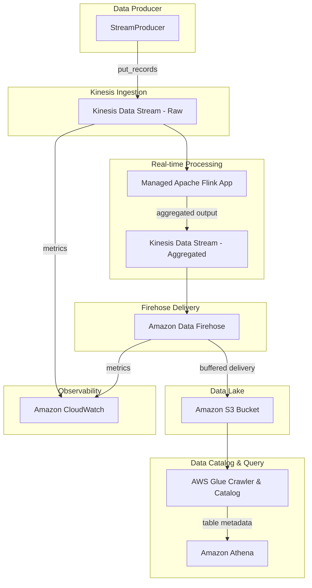

# Design Document: Real-time Streaming Pipeline with Amazon Kinesis

## Overview

This project guides learners through building an end-to-end real-time streaming data pipeline using Amazon Kinesis services. The learner will create a Kinesis Data Stream for ingestion, produce simulated streaming records, deploy a Managed Service for Apache Flink application for time-windowed aggregations, deliver data to S3 via Amazon Data Firehose, catalog the data with AWS Glue, and query it with Amazon Athena. A lightweight monitoring component rounds out the experience by exposing CloudWatch metrics and alarms.

The architecture follows the standard AWS streaming pattern: produce → ingest → process → deliver → catalog → query. Each stage is implemented as a separate Python component interacting with the corresponding AWS service via boto3. Infrastructure resources (streams, delivery streams, S3 buckets) are provisioned programmatically so the learner sees the full lifecycle.

### Learning Scope
- **Goal**: Build a streaming pipeline from ingestion through real-time processing to queryable data lake storage
- **Out of Scope**: VPC networking, IAM policy authoring, CI/CD, multi-region replication, Kinesis Video Streams, custom Flink checkpointing configuration, QuickSight dashboards
- **Prerequisites**: AWS account with permissions for Kinesis, Firehose, Flink, S3, Glue, Athena, and CloudWatch; Python 3.12; basic SQL knowledge; familiarity with JSON data

### Technology Stack
- Language/Runtime: Python 3.12
- AWS Services: Kinesis Data Streams, Amazon Data Firehose, Managed Service for Apache Flink, Amazon S3, AWS Glue Data Catalog, Amazon Athena, Amazon CloudWatch
- SDK/Libraries: boto3, json, time, random
- Infrastructure: Provisioned programmatically via boto3; Flink SQL application uploaded as a zip artifact

## Architecture

The pipeline flows from a data producer through Kinesis Data Streams into two parallel paths: one through Managed Service for Apache Flink for real-time aggregation (writing results to a second Kinesis stream consumed by Firehose), and one directly from the raw stream to Firehose for raw data delivery to S3. AWS Glue crawls the S3 output, and Athena queries the cataloged data. CloudWatch provides observability across the pipeline.



## Components and Interfaces

### Component 1: StreamProvisioner
Module: `components/stream_provisioner.py`
Uses: `boto3.client('kinesis')`, `boto3.client('firehose')`, `boto3.client('s3')`

Handles lifecycle management for Kinesis Data Streams (raw and aggregated), the Firehose delivery stream with S3 destination and Parquet conversion, and the destination S3 bucket. Configures retention period, buffer settings, and date-based S3 prefix partitioning.

```python
INTERFACE StreamProvisioner:
    FUNCTION create_data_stream(stream_name: string, shard_count: integer, retention_hours: integer) -> Dictionary
    FUNCTION wait_stream_active(stream_name: string) -> None
    FUNCTION describe_stream(stream_name: string) -> Dictionary
    FUNCTION delete_data_stream(stream_name: string) -> None
    FUNCTION create_s3_bucket(bucket_name: string) -> None
    FUNCTION create_delivery_stream(delivery_stream_name: string, source_stream_arn: string, s3_bucket_arn: string, buffer_seconds: integer, buffer_mb: integer, parquet_enabled: boolean, glue_database: string, glue_table: string) -> Dictionary
    FUNCTION delete_delivery_stream(delivery_stream_name: string) -> None
```

### Component 2: StreamProducer
Module: `components/stream_producer.py`
Uses: `boto3.client('kinesis')`

Generates and sends simulated streaming records to the Kinesis Data Stream. Supports single-record and batch puts with varied partition keys to demonstrate shard distribution and throttling behavior.

```python
INTERFACE StreamProducer:
    FUNCTION generate_record(record_type: string) -> StreamRecord
    FUNCTION put_record(stream_name: string, record: StreamRecord, partition_key: string) -> Dictionary
    FUNCTION put_record_batch(stream_name: string, records: List[StreamRecord], partition_keys: List[string]) -> Dictionary
    FUNCTION run_continuous_producer(stream_name: string, records_per_second: integer, duration_seconds: integer) -> ProducerSummary
```

### Component 3: FlinkAppManager
Module: `components/flink_app_manager.py`
Uses: `boto3.client('kinesisanalyticsv2')`, `boto3.client('s3')`

Manages the Managed Service for Apache Flink application lifecycle. Uploads the Flink SQL application code to S3, creates the application configured to read from the raw stream and write tumbling-window aggregations to the aggregated output stream, and controls start/stop operations.

```python
INTERFACE FlinkAppManager:
    FUNCTION upload_application_code(bucket_name: string, code_key: string, local_path: string) -> string
    FUNCTION create_flink_application(app_name: string, role_arn: string, code_bucket: string, code_key: string, input_stream_arn: string, output_stream_arn: string) -> Dictionary
    FUNCTION start_application(app_name: string) -> None
    FUNCTION stop_application(app_name: string) -> None
    FUNCTION describe_application(app_name: string) -> Dictionary
    FUNCTION delete_application(app_name: string) -> None
```

### Component 4: GlueCatalogManager
Module: `components/glue_catalog_manager.py`
Uses: `boto3.client('glue')`

Creates a Glue database and crawler targeting the S3 delivery location. Runs the crawler to discover schemas and create/update table definitions with partition awareness.

```python
INTERFACE GlueCatalogManager:
    FUNCTION create_database(database_name: string) -> None
    FUNCTION create_crawler(crawler_name: string, role_arn: string, database_name: string, s3_target_path: string) -> None
    FUNCTION start_crawler(crawler_name: string) -> None
    FUNCTION wait_crawler_ready(crawler_name: string) -> None
    FUNCTION get_table(database_name: string, table_name: string) -> Dictionary
    FUNCTION list_tables(database_name: string) -> List[string]
    FUNCTION delete_crawler(crawler_name: string) -> None
    FUNCTION delete_database(database_name: string) -> None
```

### Component 5: AthenaQueryRunner
Module: `components/athena_query_runner.py`
Uses: `boto3.client('athena')`

Executes SQL queries against Glue-cataloged tables via Athena. Supports ad-hoc queries, aggregation queries, and partition-filtered queries. Returns results and data-scanned metadata for observing partition pruning.

```python
INTERFACE AthenaQueryRunner:
    FUNCTION configure_output(s3_output_location: string) -> None
    FUNCTION run_query(database_name: string, query_sql: string) -> QueryResult
    FUNCTION get_query_status(query_execution_id: string) -> string
    FUNCTION get_query_results(query_execution_id: string) -> QueryResult
    FUNCTION run_aggregation_query(database_name: string, table_name: string, group_by_column: string, agg_function: string, agg_column: string) -> QueryResult
    FUNCTION run_partition_filtered_query(database_name: string, table_name: string, partition_filter: Dictionary, select_columns: List[string]) -> QueryResult
```

### Component 6: PipelineMonitor
Module: `components/pipeline_monitor.py`
Uses: `boto3.client('cloudwatch')`

Retrieves CloudWatch metrics for Kinesis Data Streams and Firehose delivery streams. Creates alarms on pipeline health indicators such as iterator age.

```python
INTERFACE PipelineMonitor:
    FUNCTION get_stream_metrics(stream_name: string, metric_name: string, period_seconds: integer, minutes_back: integer) -> List[Dictionary]
    FUNCTION get_firehose_metrics(delivery_stream_name: string, metric_name: string, period_seconds: integer, minutes_back: integer) -> List[Dictionary]
    FUNCTION create_iterator_age_alarm(alarm_name: string, stream_name: string, threshold_ms: integer) -> None
    FUNCTION describe_alarm(alarm_name: string) -> Dictionary
    FUNCTION delete_alarm(alarm_name: string) -> None
```

## Data Models

```python
TYPE StreamRecord:
    event_id: string            # Unique identifier (UUID)
    event_type: string          # Category (e.g., "click", "purchase", "pageview")
    user_id: string             # Simulated user identifier
    amount: number              # Numeric value for aggregation
    timestamp: string           # ISO 8601 timestamp
    metadata?: Dictionary       # Optional key-value pairs

TYPE ProducerSummary:
    total_records_sent: integer
    successful_count: integer
    failed_count: integer
    throttled_count: integer
    duration_seconds: number
    records_per_shard: Dictionary   # partition_key -> count mapping

TYPE QueryResult:
    query_execution_id: string
    status: string                  # QUEUED, RUNNING, SUCCEEDED, FAILED
    rows: List[Dictionary]
    column_names: List[string]
    data_scanned_bytes: integer
    execution_time_ms: integer

TYPE FlinkWindowAggregation:
    window_start: string        # ISO 8601 window boundary
    window_end: string          # ISO 8601 window boundary
    event_type: string          # Grouping key
    record_count: integer       # COUNT of records in window
    total_amount: number        # SUM of amount in window
```

## Error Handling

| Error | Description | Learner Action |
|-------|-------------|----------------|
| ResourceInUseException | Stream or application name already exists | Delete existing resource or choose a different name |
| ResourceNotFoundException | Stream, application, table, or crawler not found | Verify the resource name and that it was created successfully |
| LimitExceededException | AWS account service limit reached | Check shard limits; request a quota increase if needed |
| ProvisionedThroughputExceededException | Shard write/read capacity exceeded (throttling) | Observe back-pressure; reduce producer rate or add shards |
| InvalidArgumentException | Invalid parameter (e.g., retention period out of range) | Check parameter bounds (retention: 24–8760 hours) |
| UnrecognizedClientException | Invalid or expired AWS credentials | Reconfigure AWS credentials via CLI or environment |
| InvalidRequestException | Athena query syntax error or missing output location | Verify SQL syntax and that output S3 location is configured |
| CrawlerRunningException | Crawler is already running when start is requested | Wait for current crawl to complete before restarting |
| EntityNotFoundException | Glue database or table does not exist | Run the crawler first or verify database/table names |
| ResourceNotReadyException | Flink application not in a runnable state | Wait for application to reach READY status before starting |
