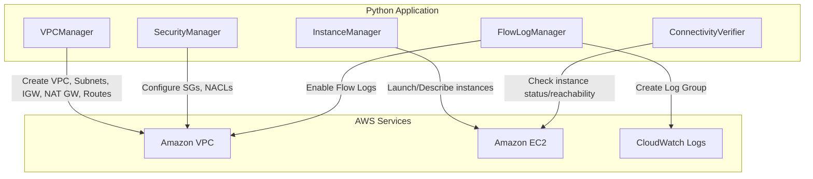

# Design Document: Build a Secure VPC Network with Public and Private Subnets

## Overview

This project guides learners through building a secure multi-tier VPC network on AWS with public and private subnets spanning multiple Availability Zones. The learner will create a VPC, configure subnet tiers with appropriate routing through Internet Gateways and NAT Gateways, apply layered security controls using security groups and network ACLs, and enable VPC Flow Logs for traffic visibility.

The architecture follows a defense-in-depth approach: internet-facing resources reside in public subnets while sensitive workloads are isolated in private subnets. NAT Gateways provide secure outbound internet access for private resources. The project uses AWS CLI commands orchestrated through Python scripts with boto3, allowing learners to understand each networking component while automating the multi-step provisioning process.

Verification is performed by launching EC2 instances in both subnet tiers and confirming connectivity patterns — public instances are internet-reachable, private instances route outbound traffic through NAT Gateways, and the bastion/jump host pattern enables access to private resources.

### Learning Scope
- **Goal**: Build a multi-AZ VPC with public/private subnets, NAT Gateways, layered security controls, EC2 connectivity verification, and VPC Flow Logs
- **Out of Scope**: Transit Gateway, VPN connections, VPC peering, PrivateLink, AWS Network Firewall, CI/CD, high availability monitoring
- **Prerequisites**: AWS account, Python 3.12, basic understanding of IP addressing and CIDR notation, an existing EC2 key pair for SSH access

### Technology Stack
- Language/Runtime: Python 3.12
- AWS Services: VPC, EC2, CloudWatch Logs
- SDK/Libraries: boto3
- Infrastructure: Scripted provisioning via boto3

## Architecture

The application consists of five components. VPCManager creates the VPC, subnets, Internet Gateway, NAT Gateways, and route tables across two Availability Zones. SecurityManager configures security groups and network ACLs for both subnet tiers. InstanceManager launches EC2 instances in public and private subnets for connectivity verification. FlowLogManager enables VPC Flow Logs publishing to CloudWatch Logs. ConnectivityVerifier tests that the network behaves as designed.



## Components and Interfaces

### Component 1: VPCManager
Module: `components/vpc_manager.py`
Uses: `boto3.client('ec2')`

Handles VPC lifecycle including creation of the VPC with a CIDR block, public and private subnets across two Availability Zones, Internet Gateway attachment, Elastic IP allocation, NAT Gateway deployment in each public subnet, and route table configuration. Public route tables route 0.0.0.0/0 to the Internet Gateway. Private route tables route 0.0.0.0/0 to the NAT Gateway in the same AZ.

```python
INTERFACE VPCManager:
    FUNCTION create_vpc(cidr_block: string, name: string) -> string
    FUNCTION create_subnet(vpc_id: string, cidr_block: string, az: string, is_public: boolean, name: string) -> string
    FUNCTION enable_auto_assign_public_ip(subnet_id: string) -> None
    FUNCTION create_and_attach_internet_gateway(vpc_id: string, name: string) -> string
    FUNCTION allocate_elastic_ip(name: string) -> string
    FUNCTION create_nat_gateway(subnet_id: string, elastic_ip_allocation_id: string, name: string) -> string
    FUNCTION wait_nat_gateway_available(nat_gateway_id: string) -> None
    FUNCTION create_route_table(vpc_id: string, name: string) -> string
    FUNCTION create_route(route_table_id: string, destination_cidr: string, gateway_id: string, nat_gateway_id: string) -> None
    FUNCTION associate_route_table(route_table_id: string, subnet_id: string) -> string
    FUNCTION get_availability_zones(region: string) -> List[string]
    FUNCTION delete_vpc_resources(vpc_id: string) -> None
```

### Component 2: SecurityManager
Module: `components/security_manager.py`
Uses: `boto3.client('ec2')`

Configures security groups and network ACLs for both public and private subnet tiers. Creates a public-tier security group allowing inbound SSH/HTTP/HTTPS from specified sources, and a private-tier security group allowing inbound only from the public-tier security group. Configures custom network ACLs with numbered rules for public subnets (allowing required ports inbound, ephemeral ports outbound) and private subnets (restricting inbound to VPC CIDR).

```python
INTERFACE SecurityManager:
    FUNCTION create_security_group(vpc_id: string, group_name: string, description: string) -> string
    FUNCTION add_ingress_rule(security_group_id: string, protocol: string, from_port: integer, to_port: integer, source: string) -> None
    FUNCTION add_ingress_rule_from_sg(security_group_id: string, protocol: string, from_port: integer, to_port: integer, source_sg_id: string) -> None
    FUNCTION create_network_acl(vpc_id: string, name: string) -> string
    FUNCTION add_network_acl_rule(nacl_id: string, rule_number: integer, protocol: string, port_range_from: integer, port_range_to: integer, cidr_block: string, egress: boolean, action: string) -> None
    FUNCTION associate_network_acl(nacl_id: string, subnet_id: string) -> string
    FUNCTION describe_security_group(security_group_id: string) -> Dictionary
    FUNCTION describe_network_acl(nacl_id: string) -> Dictionary
```

### Component 3: InstanceManager
Module: `components/instance_manager.py`
Uses: `boto3.client('ec2')`

Launches EC2 instances in public and private subnets for connectivity verification. Public instances serve as bastion/jump hosts with public IPs. Private instances have no public IP. Supports describing instance state and retrieving public/private IP addresses. Handles instance termination for cleanup.

```python
INTERFACE InstanceManager:
    FUNCTION launch_instance(subnet_id: string, security_group_id: string, key_name: string, instance_name: string, assign_public_ip: boolean) -> string
    FUNCTION wait_instance_running(instance_id: string) -> None
    FUNCTION get_instance_info(instance_id: string) -> Dictionary
    FUNCTION terminate_instances(instance_ids: List[string]) -> None
    FUNCTION wait_instances_terminated(instance_ids: List[string]) -> None
```

### Component 4: FlowLogManager
Module: `components/flow_log_manager.py`
Uses: `boto3.client('ec2')`, `boto3.client('logs')`, `boto3.client('iam')`

Enables VPC Flow Logs that capture accepted and rejected traffic, publishing to CloudWatch Logs. Creates the required CloudWatch Logs log group and IAM role with permissions for flow log delivery. Supports querying flow log records for traffic analysis.

```python
INTERFACE FlowLogManager:
    FUNCTION create_flow_log_role(role_name: string) -> string
    FUNCTION create_log_group(log_group_name: string) -> None
    FUNCTION create_vpc_flow_log(vpc_id: string, log_group_name: string, role_arn: string, traffic_type: string) -> string
    FUNCTION get_flow_log_records(log_group_name: string, start_time: integer, end_time: integer) -> List[Dictionary]
    FUNCTION delete_flow_log(flow_log_id: string) -> None
    FUNCTION delete_log_group(log_group_name: string) -> None
    FUNCTION delete_flow_log_role(role_name: string) -> None
```

### Component 5: ConnectivityVerifier
Module: `components/connectivity_verifier.py`
Uses: `boto3.client('ec2')`

Verifies the network architecture functions as designed. Checks that public instances have internet-reachable public IPs, confirms private instances have no public IP, validates route table configurations for both subnet tiers, and verifies security group rules allow expected traffic patterns.

```python
INTERFACE ConnectivityVerifier:
    FUNCTION verify_public_instance_has_public_ip(instance_id: string) -> boolean
    FUNCTION verify_private_instance_no_public_ip(instance_id: string) -> boolean
    FUNCTION verify_route_table_has_igw_route(route_table_id: string) -> boolean
    FUNCTION verify_route_table_has_nat_route(route_table_id: string) -> boolean
    FUNCTION verify_route_table_no_igw_route(route_table_id: string) -> boolean
    FUNCTION verify_security_group_allows_port(security_group_id: string, port: integer, source: string) -> boolean
    FUNCTION verify_nacl_rule_exists(nacl_id: string, rule_number: integer, port: integer, action: string, egress: boolean) -> boolean
    FUNCTION print_architecture_summary(vpc_id: string) -> None
```

## Data Models

```python
TYPE VPCConfig:
    vpc_cidr: string                    # e.g., "10.0.0.0/16"
    vpc_name: string                    # e.g., "secure-vpc"
    region: string                      # e.g., "us-east-1"
    public_subnet_cidrs: List[string]   # e.g., ["10.0.1.0/24", "10.0.2.0/24"]
    private_subnet_cidrs: List[string]  # e.g., ["10.0.3.0/24", "10.0.4.0/24"]
    key_pair_name: string               # Existing EC2 key pair for SSH

TYPE SubnetInfo:
    subnet_id: string
    cidr_block: string
    availability_zone: string
    is_public: boolean
    route_table_id: string
    nacl_id: string

TYPE SecurityGroupConfig:
    group_id: string
    group_name: string
    tier: string                        # "public" or "private"
    inbound_rules: List[SecurityRule]

TYPE SecurityRule:
    protocol: string                    # "tcp", "udp", "-1" (all)
    from_port: integer
    to_port: integer
    source: string                      # CIDR or security group ID

TYPE FlowLogRecord:
    timestamp: integer
    src_addr: string
    dst_addr: string
    src_port: integer
    dst_port: integer
    protocol: integer
    action: string                      # "ACCEPT" or "REJECT"

TYPE DeployedResources:
    vpc_id: string
    igw_id: string
    public_subnets: List[SubnetInfo]
    private_subnets: List[SubnetInfo]
    nat_gateway_ids: List[string]
    elastic_ip_ids: List[string]
    public_sg_id: string
    private_sg_id: string
    public_instance_id: string
    private_instance_id: string
    flow_log_id: string
```

## Error Handling

| Error | Description | Learner Action |
|-------|-------------|----------------|
| InvalidParameterValue (CIDR conflict) | Subnet CIDR overlaps with an existing subnet in the VPC | Choose a non-overlapping CIDR block within the VPC range |
| VpcLimitExceeded | AWS account limit on VPCs per region reached | Delete unused VPCs or request a limit increase |
| AddressLimitExceeded | Elastic IP allocation limit reached | Release unused Elastic IPs before allocating new ones |
| InvalidSubnetID.NotFound | Specified subnet ID does not exist | Verify subnet was created successfully and ID is correct |
| InvalidGroup.NotFound | Security group ID does not exist | Verify security group was created and ID is correct |
| NatGatewayNotFound | NAT Gateway ID does not exist or was deleted | Re-create the NAT Gateway in the correct public subnet |
| InvalidPermission.Duplicate | Security group rule already exists | Skip adding the duplicate rule or review existing rules |
| NetworkAclEntryAlreadyExists | NACL rule with same number already exists | Use a different rule number or delete the existing rule |
| UnauthorizedOperation | IAM permissions insufficient for the operation | Ensure AWS credentials have VPC, EC2, CloudWatch Logs, and IAM permissions |
| InvalidKeyPair.NotFound | Specified EC2 key pair does not exist | Create the key pair first or use an existing key pair name |
