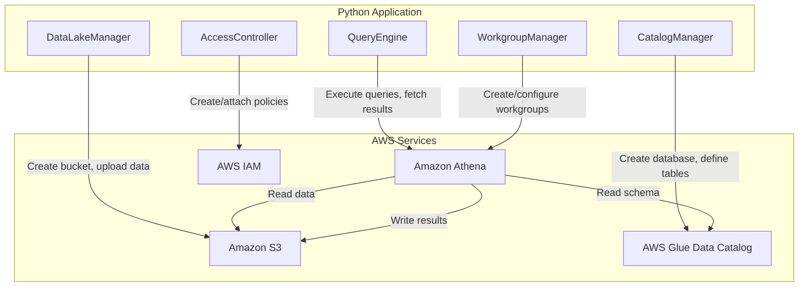

# Design Document: Serverless Analytics Query System with Amazon Athena

## Overview

This project guides learners through building a serverless analytics query system using Amazon Athena, Amazon S3, and AWS Glue. The learner will set up an S3-based data lake, define schemas in the AWS Glue Data Catalog, run interactive SQL queries with Athena, implement partitioning for cost optimization, configure workgroups for cost control, and manage saved queries for reusable analytics workflows.

The architecture uses Python scripts with boto3 to programmatically manage all resources. Learners upload sample sales data to S3 in both CSV and Parquet formats, create Glue catalog entries, execute Athena queries, and observe how partitioning and columnar formats reduce data scanned. IAM policy configuration is handled through JSON policy documents applied via boto3.

### Learning Scope
- **Goal**: Build an end-to-end serverless analytics pipeline — S3 data lake → Glue catalog → Athena queries — with partitioning, workgroups, saved queries, and access control
- **Out of Scope**: Glue ETL crawlers/jobs, Athena Federated Query, Lake Formation, QuickSight visualization, DynamoDB integration, CI/CD
- **Prerequisites**: AWS account, Python 3.12, basic SQL knowledge, familiarity with S3 concepts

### Technology Stack
- Language/Runtime: Python 3.12
- AWS Services: Amazon S3, AWS Glue Data Catalog, Amazon Athena, AWS IAM
- SDK/Libraries: boto3, pyarrow (for Parquet generation)
- Infrastructure: AWS CLI (for account setup), boto3 (for all resource provisioning)

## Architecture

The system consists of five components. DataLakeManager provisions S3 buckets and uploads data files. CatalogManager creates Glue databases and table definitions. QueryEngine executes SQL queries and retrieves results via Athena. WorkgroupManager handles Athena workgroup lifecycle and cost controls. AccessController manages IAM policies for securing analytics resources.



## Components and Interfaces

### Component 1: DataLakeManager
Module: `components/data_lake_manager.py`
Uses: `boto3.client('s3')`, `pyarrow`

Handles S3 bucket creation with Block Public Access, organizes data files under prefix structures, uploads CSV and Parquet datasets, and configures the query result location prefix.

```python
INTERFACE DataLakeManager:
    FUNCTION create_data_bucket(bucket_name: string) -> string
    FUNCTION upload_csv_data(bucket_name: string, prefix: string, file_path: string) -> string
    FUNCTION generate_and_upload_parquet(bucket_name: string, prefix: string, records: List[Dictionary]) -> string
    FUNCTION upload_partitioned_data(bucket_name: string, base_prefix: string, partition_column: string, records: List[Dictionary], file_format: string) -> List[string]
    FUNCTION configure_query_result_location(bucket_name: string, result_prefix: string) -> string
    FUNCTION list_objects_under_prefix(bucket_name: string, prefix: string) -> List[string]
```

### Component 2: CatalogManager
Module: `components/catalog_manager.py`
Uses: `boto3.client('glue')`

Creates and manages Glue Data Catalog databases and external table definitions. Supports defining standard and partitioned tables with column schemas mapped to S3 locations, and loading partitions.

```python
INTERFACE CatalogManager:
    FUNCTION create_database(database_name: string) -> string
    FUNCTION create_external_table(database_name: string, table_name: string, columns: List[ColumnDefinition], s3_location: string, input_format: string) -> string
    FUNCTION create_partitioned_table(database_name: string, table_name: string, columns: List[ColumnDefinition], partition_keys: List[ColumnDefinition], s3_location: string, input_format: string) -> string
    FUNCTION add_partitions(database_name: string, table_name: string, partitions: List[PartitionInput]) -> None
    FUNCTION update_table_add_column(database_name: string, table_name: string, new_column: ColumnDefinition) -> None
    FUNCTION get_table(database_name: string, table_name: string) -> Dictionary
    FUNCTION delete_database(database_name: string, delete_tables: boolean) -> None
```

### Component 3: QueryEngine
Module: `components/query_engine.py`
Uses: `boto3.client('athena')`

Executes SQL queries against Athena, polls for completion, retrieves results, reports data scanned metrics, and manages named queries for reuse.

```python
INTERFACE QueryEngine:
    FUNCTION execute_query(query_sql: string, database_name: string, result_location: string, workgroup: string) -> string
    FUNCTION wait_for_query(query_execution_id: string) -> QueryResult
    FUNCTION get_query_results(query_execution_id: string) -> List[Dictionary]
    FUNCTION get_data_scanned_bytes(query_execution_id: string) -> integer
    FUNCTION create_named_query(name: string, description: string, database_name: string, query_sql: string, workgroup: string) -> string
    FUNCTION list_named_queries(workgroup: string) -> List[string]
    FUNCTION get_named_query(named_query_id: string) -> NamedQuery
    FUNCTION execute_named_query(named_query_id: string, result_location: string) -> string
```

### Component 4: WorkgroupManager
Module: `components/workgroup_manager.py`
Uses: `boto3.client('athena')`

Creates and configures Athena workgroups with query result locations, encryption settings, and per-query data scan limits for cost control. Retrieves workgroup usage metrics.

```python
INTERFACE WorkgroupManager:
    FUNCTION create_workgroup(workgroup_name: string, result_location: string, encryption_option: string, per_query_data_limit_mb: integer) -> string
    FUNCTION get_workgroup(workgroup_name: string) -> Dictionary
    FUNCTION update_workgroup_limit(workgroup_name: string, per_query_data_limit_mb: integer) -> None
    FUNCTION get_workgroup_metrics(workgroup_name: string) -> WorkgroupMetrics
    FUNCTION list_workgroups() -> List[string]
    FUNCTION delete_workgroup(workgroup_name: string) -> None
```

### Component 5: AccessController
Module: `components/access_controller.py`
Uses: `boto3.client('iam')`

Creates IAM policies that restrict Athena query execution and S3 data access to specific prefixes. Attaches policies to users for securing the analytics environment.

```python
INTERFACE AccessController:
    FUNCTION create_athena_s3_policy(policy_name: string, allowed_s3_prefixes: List[string], result_location: string) -> string
    FUNCTION create_deny_athena_policy(policy_name: string) -> string
    FUNCTION attach_policy_to_user(user_name: string, policy_arn: string) -> None
    FUNCTION detach_policy_from_user(user_name: string, policy_arn: string) -> None
    FUNCTION delete_policy(policy_arn: string) -> None
```

## Data Models

```python
TYPE ColumnDefinition:
    name: string              # Column name (e.g., "order_id", "region")
    type: string              # Athena/Glue type (e.g., "string", "int", "double", "date")

TYPE PartitionInput:
    values: List[string]      # Partition column values (e.g., ["2024-01"])
    s3_location: string       # S3 path for this partition's data files

TYPE QueryResult:
    query_execution_id: string
    status: string            # SUCCEEDED | FAILED | CANCELLED
    data_scanned_bytes: integer
    execution_time_ms: integer
    result_s3_path: string    # S3 path where result CSV is written

TYPE NamedQuery:
    named_query_id: string
    name: string
    description: string
    database_name: string
    query_sql: string
    workgroup: string

TYPE WorkgroupMetrics:
    workgroup_name: string
    total_data_scanned_bytes: integer
    total_queries_executed: integer

TYPE SalesRecord:
    order_id: string          # Unique order identifier
    order_date: string        # Date in YYYY-MM format (partition column)
    region: string            # Sales region (e.g., "us-east", "eu-west")
    product_category: string  # Category (e.g., "Electronics", "Books")
    product_name: string
    quantity: integer
    unit_price: number
    total_amount: number
```

## Error Handling

| Error | Description | Learner Action |
|-------|-------------|----------------|
| BucketAlreadyOwnedByYou | S3 bucket name already exists in account | Use the existing bucket or choose a different name |
| EntityAlreadyExistsException | Glue database or table already exists | Delete existing resource or use a different name |
| InvalidRequestException | Athena query syntax error or invalid configuration | Review SQL syntax and verify database/table names |
| QueryCancelledException | Query exceeded workgroup per-query data scan limit | Increase the data scan limit or optimize the query with partitioning/columnar format |
| AccessDeniedException | IAM policy denies the requested operation | Verify IAM permissions for Athena, Glue, and S3 access |
| MetadataException | Table schema does not match underlying S3 data | Compare column definitions to actual file structure |
| NoSuchBucketException | Referenced S3 bucket does not exist | Create the bucket first using DataLakeManager |
| TooManyRequestsException | API rate limit exceeded | Add retry logic or reduce request frequency |
