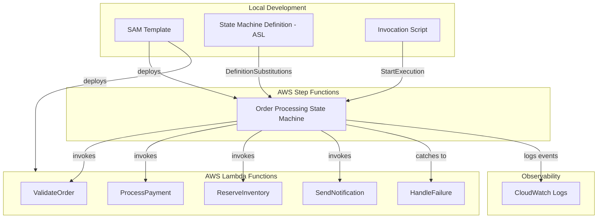

# Design Document: Build a Serverless Application with AWS Step Functions

## Overview

This project guides learners through building a serverless order-processing workflow orchestrated by AWS Step Functions. The learner will create Lambda functions for discrete processing tasks, define a state machine with sequential steps, branching logic, parallel execution, and error handling, then deploy everything using AWS SAM.

The application simulates an order-processing pipeline: an order is validated, then a choice state routes based on order type, parallel branches handle payment processing and inventory reservation simultaneously, and a final notification step completes the workflow. One Lambda function is intentionally designed to fail intermittently so learners can observe retry and catch behavior. The entire application is defined in a SAM template with definition substitutions and deployed as a single CloudFormation stack.

### Learning Scope
- **Goal**: Build and deploy a Step Functions state machine with sequential tasks, choice states, parallel execution, error handling with retries/catches, and monitor executions — all via AWS SAM
- **Out of Scope**: Express workflows, SDK service integrations (non-Lambda), DynamoDB persistence, API Gateway triggers, CI/CD pipelines, custom metrics/alarms
- **Prerequisites**: AWS account, Python 3.12, AWS SAM CLI installed, basic understanding of Lambda and CloudFormation

### Technology Stack
- Language/Runtime: Python 3.12
- AWS Services: AWS Step Functions (Standard), AWS Lambda, Amazon CloudWatch Logs
- SDK/Libraries: boto3 (for invocation scripts), AWS SAM CLI
- Infrastructure: AWS SAM (template.yaml) with ASL definition file

## Architecture

The application is deployed as a single SAM stack. A SAM template defines five Lambda functions and one Step Functions state machine. The state machine definition lives in a separate ASL JSON file and uses definition substitutions to inject Lambda ARNs at deploy time. The learner starts executions via the console or a local invocation script and monitors them through the Step Functions console and CloudWatch Logs.



## Components and Interfaces

### Component 1: ValidateOrder Lambda
Module: `functions/validate_order/app.py`
Uses: Python 3.12 Lambda runtime

Receives order input, validates required fields and data types, and enriches the order with a validation timestamp. Returns validated order data with an `order_type` field used by the downstream choice state.

```python
INTERFACE ValidateOrderHandler:
    FUNCTION lambda_handler(event: Dictionary, context: LambdaContext) -> Dictionary
```

### Component 2: ProcessPayment Lambda
Module: `functions/process_payment/app.py`
Uses: Python 3.12 Lambda runtime

Simulates payment processing for a validated order. Randomly raises a transient error on some invocations to demonstrate retry behavior in Step Functions. Returns payment confirmation with a transaction ID.

```python
INTERFACE ProcessPaymentHandler:
    FUNCTION lambda_handler(event: Dictionary, context: LambdaContext) -> Dictionary
```

### Component 3: ReserveInventory Lambda
Module: `functions/reserve_inventory/app.py`
Uses: Python 3.12 Lambda runtime

Simulates inventory reservation for the items in the order. Runs in parallel with ProcessPayment within the parallel state. Returns reservation confirmation with a reservation ID.

```python
INTERFACE ReserveInventoryHandler:
    FUNCTION lambda_handler(event: Dictionary, context: LambdaContext) -> Dictionary
```

### Component 4: SendNotification Lambda
Module: `functions/send_notification/app.py`
Uses: Python 3.12 Lambda runtime

Receives combined results from the parallel state and produces a final order summary. Simulates sending a notification by logging the outcome. Serves as the last processing step before the workflow succeeds.

```python
INTERFACE SendNotificationHandler:
    FUNCTION lambda_handler(event: Dictionary, context: LambdaContext) -> Dictionary
```

### Component 5: HandleFailure Lambda
Module: `functions/handle_failure/app.py`
Uses: Python 3.12 Lambda runtime

Catches errors forwarded by the state machine's catch configuration. Logs the error details and returns a structured failure report so the workflow terminates gracefully in a known state rather than failing silently.

```python
INTERFACE HandleFailureHandler:
    FUNCTION lambda_handler(event: Dictionary, context: LambdaContext) -> Dictionary
```

### Component 6: Invocation Script
Module: `scripts/start_execution.py`
Uses: `boto3.client('stepfunctions')`

Provides a CLI interface for learners to start state machine executions with different input payloads and retrieve execution results. Supports passing different order types to exercise branching paths.

```python
INTERFACE ExecutionRunner:
    FUNCTION start_execution(state_machine_arn: string, input_payload: Dictionary) -> string
    FUNCTION describe_execution(execution_arn: string) -> Dictionary
    FUNCTION list_executions(state_machine_arn: string, status_filter: string) -> List[Dictionary]
```

## Data Models

```python
TYPE OrderInput:
    order_id: string              # Unique order identifier (e.g., "ORD-001")
    customer_name: string         # Customer name
    order_type: string            # "standard" or "express" — drives choice state routing
    items: List[OrderItem]        # Items in the order
    total_amount: number          # Total order value

TYPE OrderItem:
    item_id: string               # Product identifier
    name: string                  # Product name
    quantity: number              # Quantity ordered
    price: number                 # Unit price

TYPE ValidatedOrder:
    order_id: string
    customer_name: string
    order_type: string
    items: List[OrderItem]
    total_amount: number
    validated_at: string          # ISO 8601 timestamp
    is_valid: boolean

TYPE PaymentResult:
    order_id: string
    transaction_id: string        # Generated payment transaction ID
    status: string                # "succeeded" or "failed"
    charged_amount: number

TYPE ReservationResult:
    order_id: string
    reservation_id: string        # Generated reservation ID
    status: string                # "reserved" or "unavailable"
    reserved_items: List[string]  # List of item_ids reserved

TYPE NotificationResult:
    order_id: string
    message: string               # Summary of order outcome
    notification_sent: boolean

TYPE FailureReport:
    order_id: string
    error_type: string            # Error name from Step Functions
    error_message: string         # Error cause details
    handled_at: string            # ISO 8601 timestamp

TYPE StateMachineDefinition:
    # ASL file: statemachine/order_processing.asl.json
    # States:
    #   "Validate Order"    -> Task state invoking ValidateOrder Lambda
    #   "Check Order Type"  -> Choice state branching on order_type
    #   "Process Standard"  -> Task state (standard path placeholder)
    #   "Process Express"   -> Task state (express path placeholder)
    #   "Parallel Process"  -> Parallel state with ProcessPayment + ReserveInventory branches
    #   "Send Notification" -> Task state invoking SendNotification Lambda
    #   "Handle Failure"    -> Task state invoking HandleFailure Lambda (catch target)
    #   "Order Complete"    -> Succeed state

TYPE SAMTemplate:
    # template.yaml defines:
    #   AWS::Serverless::Function (x5) — one per Lambda
    #   AWS::Serverless::StateMachine — references statemachine/order_processing.asl.json
    #     DefinitionSubstitutions: maps ${ValidateOrderArn}, ${ProcessPaymentArn}, etc.
    #     Policies: LambdaInvokePolicy for each function
    #     Logging: CloudWatch Logs destination with ALL log level
```

## Error Handling

| Error | Description | Learner Action |
|-------|-------------|----------------|
| States.TaskFailed | A Lambda function returned an error or threw an exception | Check the execution event history to see which state failed and review Lambda logs |
| States.Timeout | A state exceeded its configured TimeoutSeconds | Increase the timeout or investigate why the Lambda function took too long |
| PaymentProcessingError | Custom error raised by ProcessPayment to simulate transient failure | Observe retry behavior in execution history; retries are configured with 2 max attempts and exponential backoff |
| States.ALL (catch fallback) | Retries exhausted or an unhandled error occurred | Verify the catch block routes to HandleFailure; inspect the FailureReport output |
| ValidationError | Order input missing required fields or has invalid values | Correct the input payload and start a new execution |
| InvalidDefinitionException | ASL definition has syntax errors or invalid state references | Validate ASL JSON using the Step Functions console or VS Code toolkit before deploying |
| DeploymentFailed (SAM) | SAM deploy fails due to template or permission errors | Check `sam deploy` output and CloudFormation events for the specific error |
| ResourceNotFoundException | State machine ARN not found when starting execution | Verify the stack deployed successfully and use the correct ARN from stack outputs |
