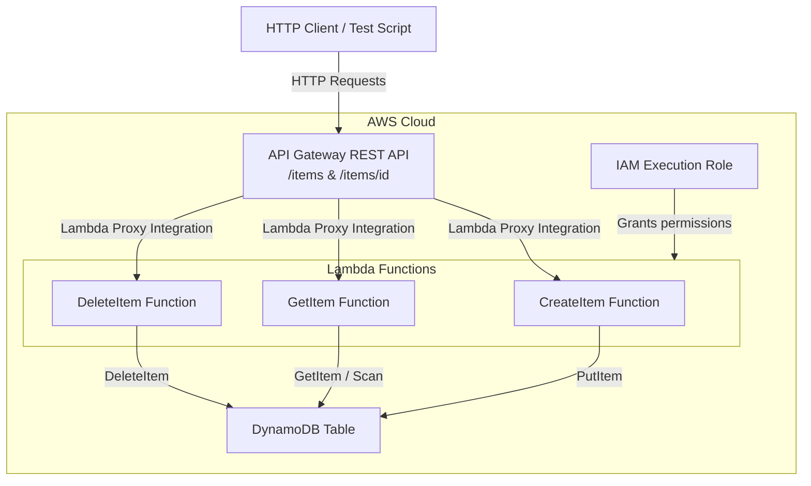

# Design Document: Serverless REST API with Lambda and API Gateway

## Overview

This project guides learners through building a serverless REST API using AWS Lambda, Amazon API Gateway, and Amazon DynamoDB. The learner will create a DynamoDB table for data persistence, implement Lambda functions that handle CRUD operations, configure an API Gateway REST API with resources and methods using Lambda proxy integration, and deploy the API to a publicly accessible stage.

The architecture follows the canonical serverless pattern: API Gateway receives HTTP requests and forwards them to Lambda functions via proxy integration. Lambda functions contain the business logic for create, read, and delete operations against a DynamoDB table. The entire infrastructure is provisioned using boto3 SDK scripts, and the API is tested end-to-end using HTTP requests against the deployed invoke URL.

### Learning Scope
- **Goal**: Build and deploy a serverless REST API with CRUD operations backed by DynamoDB, understanding how API Gateway, Lambda, and DynamoDB integrate
- **Out of Scope**: Custom authorizers, usage plans/API keys, DynamoDB Streams, CI/CD, WAF, caching, CloudWatch alarms, Infrastructure-as-Code frameworks (CDK/SAM/Terraform)
- **Prerequisites**: AWS account with admin access, Python 3.12, basic understanding of REST APIs and HTTP methods

### Technology Stack
- Language/Runtime: Python 3.12
- AWS Services: Amazon API Gateway (REST API), AWS Lambda, Amazon DynamoDB (on-demand), AWS IAM
- SDK/Libraries: boto3, requests (for testing)
- Infrastructure: Provisioned via boto3 SDK scripts

## Architecture

The system has four layers: infrastructure setup (DynamoDB table and IAM role), Lambda function deployment, API Gateway configuration with Lambda proxy integration, and end-to-end testing. The provisioning scripts create resources in dependency order — DynamoDB table and IAM role first, then Lambda functions, then API Gateway resources and methods, and finally deployment to a stage.



## Components and Interfaces

### Component 1: DynamoDBSetup
Module: `components/dynamodb_setup.py`
Uses: `boto3.resource('dynamodb')`, `boto3.client('dynamodb')`

Handles DynamoDB table creation with on-demand capacity mode and partition key configuration. Supports table lifecycle operations needed before Lambda functions can operate.

```python
INTERFACE DynamoDBSetup:
    FUNCTION create_table(table_name: string, partition_key: string) -> Dictionary
    FUNCTION wait_until_active(table_name: string) -> None
    FUNCTION delete_table(table_name: string) -> None
    FUNCTION get_table_arn(table_name: string) -> string
```

### Component 2: IAMRoleSetup
Module: `components/iam_role_setup.py`
Uses: `boto3.client('iam')`

Creates and configures the Lambda execution role with permissions for CloudWatch Logs and scoped DynamoDB access on the specific table, following least-privilege principles.

```python
INTERFACE IAMRoleSetup:
    FUNCTION create_lambda_execution_role(role_name: string) -> string
    FUNCTION attach_cloudwatch_logs_policy(role_name: string) -> None
    FUNCTION attach_dynamodb_policy(role_name: string, table_arn: string) -> None
    FUNCTION get_role_arn(role_name: string) -> string
    FUNCTION delete_role(role_name: string) -> None
```

### Component 3: LambdaDeployer
Module: `components/lambda_deployer.py`
Uses: `boto3.client('lambda')`

Packages and deploys Lambda function code for each CRUD operation. Each function is deployed as a separate Lambda function that receives API Gateway proxy integration events.

```python
INTERFACE LambdaDeployer:
    FUNCTION package_function_code(source_dir: string) -> bytes
    FUNCTION create_function(function_name: string, role_arn: string, handler: string, zip_bytes: bytes, env_vars: Dictionary) -> string
    FUNCTION get_function_arn(function_name: string) -> string
    FUNCTION delete_function(function_name: string) -> None
    FUNCTION add_api_gateway_permission(function_name: string, source_arn: string) -> None
```

### Component 4: APIGatewaySetup
Module: `components/api_gateway_setup.py`
Uses: `boto3.client('apigateway')`

Creates the REST API, defines resources (`/items` and `/items/{id}`), configures HTTP methods with Lambda proxy integration, enables CORS, deploys to a stage, and returns the invoke URL.

```python
INTERFACE APIGatewaySetup:
    FUNCTION create_rest_api(api_name: string) -> string
    FUNCTION get_root_resource_id(api_id: string) -> string
    FUNCTION create_resource(api_id: string, parent_id: string, path_part: string) -> string
    FUNCTION create_method_with_lambda_integration(api_id: string, resource_id: string, http_method: string, lambda_arn: string) -> None
    FUNCTION enable_cors(api_id: string, resource_id: string, methods: List[string]) -> None
    FUNCTION deploy_api(api_id: string, stage_name: string) -> string
    FUNCTION get_invoke_url(api_id: string, stage_name: string) -> string
    FUNCTION delete_rest_api(api_id: string) -> None
```

### Component 5: APITester
Module: `components/api_tester.py`
Uses: `requests`

Sends HTTP requests to the deployed API invoke URL and validates responses for each CRUD operation, including error cases for missing items and malformed payloads.

```python
INTERFACE APITester:
    FUNCTION test_create_item(base_url: string, item: Dictionary) -> Dictionary
    FUNCTION test_get_item(base_url: string, item_id: string) -> Dictionary
    FUNCTION test_get_nonexistent_item(base_url: string, item_id: string) -> Dictionary
    FUNCTION test_delete_item(base_url: string, item_id: string) -> Dictionary
    FUNCTION test_malformed_request(base_url: string, payload: string) -> Dictionary
    FUNCTION run_all_tests(base_url: string) -> List[Dictionary]
```

### Lambda Function Handlers (deployed code, not SDK components)

#### Handler: CreateItem
Module: `lambda_functions/create_item/handler.py`

Parses the request body from the API Gateway proxy event, validates required fields, writes the item to DynamoDB, and returns a structured JSON response.

```python
INTERFACE CreateItemHandler:
    FUNCTION handler(event: Dictionary, context: Dictionary) -> Dictionary
```

#### Handler: GetItem
Module: `lambda_functions/get_item/handler.py`

Extracts the item ID from path parameters, retrieves the item from DynamoDB, and returns it in the response body or a 404 if not found.

```python
INTERFACE GetItemHandler:
    FUNCTION handler(event: Dictionary, context: Dictionary) -> Dictionary
```

#### Handler: DeleteItem
Module: `lambda_functions/delete_item/handler.py`

Extracts the item ID from path parameters, deletes the item from DynamoDB, and returns a confirmation response or a 404 if the item does not exist.

```python
INTERFACE DeleteItemHandler:
    FUNCTION handler(event: Dictionary, context: Dictionary) -> Dictionary
```

## Data Models

```python
TYPE Item:
    id: string              # Partition key — unique identifier (UUID)
    name: string            # Display name of the item
    description?: string    # Optional description
    price: number           # Price as a decimal number
    created_at: string      # ISO 8601 timestamp

TYPE LambdaProxyResponse:
    statusCode: integer     # HTTP status code (200, 201, 400, 404, 500)
    headers: Dictionary     # Response headers including CORS headers
    body: string            # JSON-serialized response body

TYPE LambdaProxyEvent:
    httpMethod: string      # HTTP method (GET, POST, DELETE)
    pathParameters: Dictionary  # Path parameters (e.g., {"id": "abc-123"})
    body: string            # JSON-serialized request body (for POST)
    headers: Dictionary     # Request headers

TYPE TestResult:
    test_name: string       # Name of the test case
    passed: boolean         # Whether the test passed
    status_code: integer    # HTTP status code received
    response_body: Dictionary  # Parsed response body
```

## Error Handling

| Error | Description | Learner Action |
|-------|-------------|----------------|
| ResourceInUseException | DynamoDB table already exists | Delete existing table or use a different name |
| ResourceNotFoundException | Table or Lambda function not found | Verify resource was created and name is correct |
| EntityAlreadyExistsException | IAM role already exists | Delete existing role or use a different name |
| InvalidRequestContentException | Lambda function code is invalid | Check handler path and zip packaging |
| ConflictException | API Gateway resource or method already exists | Delete and recreate the API or check for duplicates |
| AccessDeniedException | Lambda role lacks required permissions | Verify IAM policy is attached with correct table ARN |
| ValidationError (400) | Request body missing required fields | Include all required fields (id, name, price) in payload |
| ItemNotFound (404) | No item exists for the given ID | Verify the item ID exists in DynamoDB |
| BadRequestException | API Gateway configuration error | Review resource paths and integration settings |
| TooManyRequestsException | Lambda concurrent execution limit | Wait and retry; this is rare in learning scenarios |
