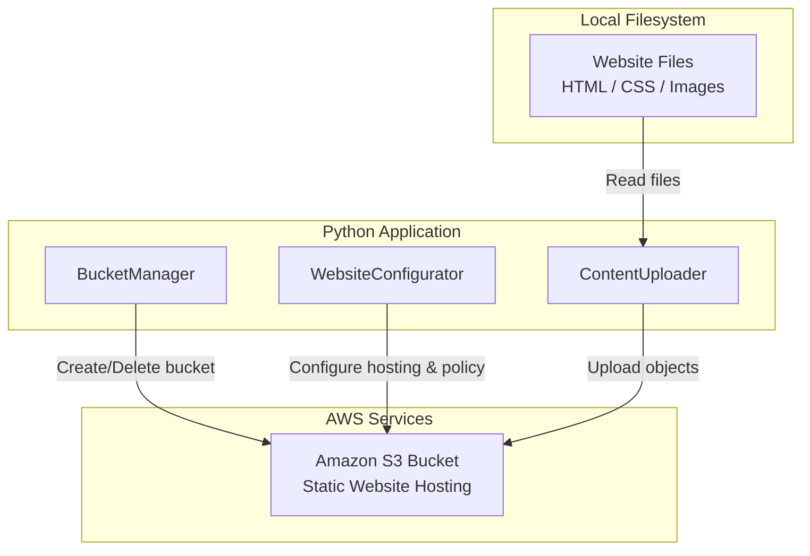

# Design Document: Build a Static Website with Amazon S3

## Overview

This project guides learners through hosting a static website using Amazon S3. The learner will create an S3 bucket, configure it for static website hosting, set up public access permissions via bucket policies, upload website content (HTML, CSS, images), and verify the site is accessible through the S3 website endpoint.

The architecture is intentionally simple: a set of Python scripts interact directly with Amazon S3 using boto3. There is no web framework — the learner runs operations as CLI scripts to configure the bucket and upload files. The website itself consists of static HTML/CSS files served by S3's built-in website hosting feature.

### Learning Scope
- **Goal**: Create an S3 bucket, enable static website hosting, configure public access, upload content, and verify the live website
- **Out of Scope**: Custom domains, Route 53, CloudFront CDN, SSL/TLS, CORS configuration, server-side encryption, AWS Amplify
- **Prerequisites**: AWS account, Python 3.12, basic understanding of HTML/CSS, familiarity with S3 concepts

### Technology Stack
- Language/Runtime: Python 3.12
- AWS Services: Amazon S3 (static website hosting)
- SDK/Libraries: boto3
- Infrastructure: AWS CLI (for credential configuration)

## Architecture

The application consists of three components that interact with Amazon S3. BucketManager handles bucket creation and deletion. WebsiteConfigurator handles enabling static website hosting and configuring public access via bucket policies. ContentUploader handles uploading website files and verifying the site is accessible via the website endpoint.



## Components and Interfaces

### Component 1: BucketManager
Module: `components/bucket_manager.py`
Uses: `boto3.client('s3')`

Handles S3 bucket lifecycle — creation in a specified AWS Region, checking existence, listing buckets, and deletion with cleanup of all objects.

```python
INTERFACE BucketManager:
    FUNCTION create_bucket(bucket_name: string, region: string) -> Dictionary
    FUNCTION bucket_exists(bucket_name: string) -> boolean
    FUNCTION list_buckets() -> List[Dictionary]
    FUNCTION delete_bucket(bucket_name: string) -> None
    FUNCTION empty_bucket(bucket_name: string) -> None
```

### Component 2: WebsiteConfigurator
Module: `components/website_configurator.py`
Uses: `boto3.client('s3')`

Handles enabling static website hosting with index and error document configuration, disabling Block Public Access settings, and applying a public-read bucket policy.

```python
INTERFACE WebsiteConfigurator:
    FUNCTION enable_website_hosting(bucket_name: string, index_document: string, error_document: string) -> None
    FUNCTION get_website_configuration(bucket_name: string) -> Dictionary
    FUNCTION get_website_endpoint(bucket_name: string, region: string) -> string
    FUNCTION disable_block_public_access(bucket_name: string) -> None
    FUNCTION get_block_public_access(bucket_name: string) -> Dictionary
    FUNCTION apply_public_read_policy(bucket_name: string) -> None
    FUNCTION get_bucket_policy(bucket_name: string) -> Dictionary
```

### Component 3: ContentUploader
Module: `components/content_uploader.py`
Uses: `boto3.client('s3')`

Handles uploading individual files and directories of website content to the S3 bucket with correct content types, listing uploaded objects, and verifying the website is accessible via the website endpoint.

```python
INTERFACE ContentUploader:
    FUNCTION upload_file(bucket_name: string, file_path: string, object_key: string) -> None
    FUNCTION upload_directory(bucket_name: string, directory_path: string, prefix: string) -> List[string]
    FUNCTION list_objects(bucket_name: string, prefix: string) -> List[Dictionary]
    FUNCTION get_content_type(file_path: string) -> string
    FUNCTION verify_website(endpoint_url: string) -> Dictionary
```

## Data Models

```python
TYPE WebsiteConfig:
    bucket_name: string
    region: string
    index_document: string       # e.g., "index.html"
    error_document: string       # e.g., "404.html"
    website_endpoint: string     # e.g., "http://my-bucket.s3-website-us-east-1.amazonaws.com"

TYPE UploadedObject:
    key: string                  # S3 object key (e.g., "index.html", "css/style.css")
    size: number                 # File size in bytes
    content_type: string         # MIME type (e.g., "text/html", "text/css", "image/png")

TYPE BucketInfo:
    bucket_name: string
    region: string
    creation_date: string

TYPE PublicAccessConfig:
    block_public_acls: boolean
    ignore_public_acls: boolean
    block_public_policy: boolean
    restrict_public_buckets: boolean
```

## Error Handling

| Error | Description | Learner Action |
|-------|-------------|----------------|
| BucketAlreadyExists | Bucket name is already taken globally | Choose a different globally unique bucket name |
| BucketAlreadyOwnedByYou | You already own a bucket with this name | Use the existing bucket or choose a different name |
| NoSuchBucket | Specified bucket does not exist | Verify the bucket name and ensure it was created |
| NoSuchWebsiteConfiguration | Website hosting not enabled on bucket | Enable static website hosting before accessing endpoint |
| AccessDenied | Insufficient permissions or public access blocked | Check IAM permissions and Block Public Access settings |
| InvalidBucketName | Bucket name violates S3 naming rules | Use only lowercase letters, numbers, hyphens, and periods (3-63 chars) |
| NoSuchKey | Requested object key does not exist in bucket | Verify the file was uploaded with the correct key |
| FileNotFoundError | Local file or directory path does not exist | Verify the local file path before uploading |
| ConnectionError | Cannot reach the website endpoint | Wait a moment for DNS propagation and retry |
