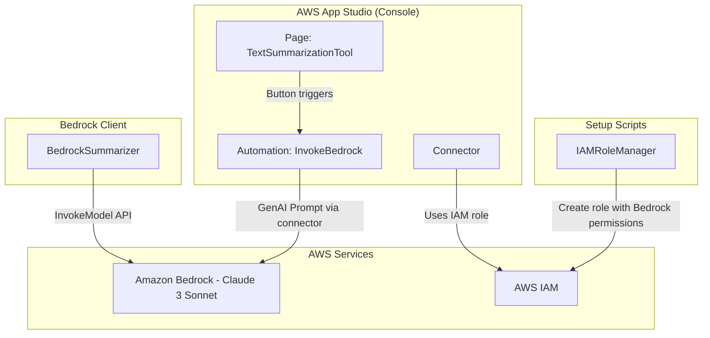

# Design Document: Build a Text Summarization App with Amazon Bedrock

## Overview

This project guides learners through building a text summarization application using AWS App Studio and Amazon Bedrock. The learner will configure IAM permissions, enable a foundation model, create an App Studio connector, design a simple UI, build an automation workflow, and publish the application for testing. The end result is a working app where users paste text and receive AI-generated summaries powered by Claude 3 Sonnet.

The architecture follows the AWS App Studio low-code pattern: a single-page application with UI components (text input, button, text area) connected to an automation that invokes Amazon Bedrock through a connector. Since App Studio is a managed visual builder, the implementation involves configuration steps rather than traditional code — but the project includes a Python-based Bedrock invocation script so learners also understand the underlying SDK interaction.

### Learning Scope
- **Goal**: Build and publish a text summarization app using App Studio with Amazon Bedrock, and understand the underlying Bedrock API invocation
- **Out of Scope**: RAG pipelines, DynamoDB storage, multiple models, streaming responses, production deployment, CI/CD
- **Prerequisites**: AWS account with App Studio access (Admin role), Amazon Bedrock Claude 3 Sonnet enabled in region, Python 3.12, basic understanding of generative AI concepts

### Technology Stack
- Language/Runtime: Python 3.12 (for setup scripts and direct Bedrock invocation)
- AWS Services: Amazon Bedrock (Claude 3 Sonnet), AWS App Studio
- SDK/Libraries: boto3
- Infrastructure: AWS Console / AWS CLI (manual provisioning of IAM role, connector, and App Studio app)

## Architecture

The application has three layers: an IAM/infrastructure setup layer that provisions the role and connector, a Bedrock client layer that encapsulates model invocation logic, and the App Studio application layer configured through the console. The Python components handle IAM role creation and direct Bedrock invocation, while App Studio configuration (connector, UI, automation, publishing) follows console-based steps documented in the requirements.



## Components and Interfaces

### Component 1: IAMRoleManager
Module: `components/iam_role_manager.py`
Uses: `boto3.client('iam')`

Handles creation and deletion of the IAM role with a least-privilege policy scoped to Amazon Bedrock model invocation. The role is used by the App Studio connector to authorize requests.

```python
INTERFACE IAMRoleManager:
    FUNCTION create_bedrock_role(role_name: string, trust_policy: Dictionary) -> Dictionary
    FUNCTION attach_bedrock_policy(role_name: string, model_id: string) -> None
    FUNCTION get_role_arn(role_name: string) -> string
    FUNCTION delete_bedrock_role(role_name: string) -> None
```

### Component 2: BedrockSummarizer
Module: `components/bedrock_summarizer.py`
Uses: `boto3.client('bedrock-runtime')`

Encapsulates the Amazon Bedrock model invocation for text summarization. Constructs the prompt payload with system instructions, temperature, and max token settings matching the App Studio automation configuration. This component lets learners test summarization directly via Python before wiring it through App Studio.

```python
INTERFACE BedrockSummarizer:
    FUNCTION summarize_text(input_text: string, config: SummarizationConfig) -> SummarizationResult
    FUNCTION check_model_access(model_id: string) -> boolean
    FUNCTION list_available_models() -> List[string]
```

### Component 3: AppStudioConfigurator
Module: `components/app_studio_configurator.py`
Uses: `None (console guidance helper)`

Provides structured configuration data and validation helpers for the App Studio setup steps. Outputs the connector configuration, automation definition, UI component layout, and trigger wiring as structured dictionaries that document exactly what to configure in the console.

```python
INTERFACE AppStudioConfigurator:
    FUNCTION generate_connector_config(role_arn: string, connector_name: string) -> ConnectorConfig
    FUNCTION generate_automation_config(connector_name: string, model_id: string, config: SummarizationConfig) -> AutomationConfig
    FUNCTION generate_ui_layout() -> UILayoutConfig
    FUNCTION generate_trigger_config(automation_name: string) -> TriggerConfig
    FUNCTION generate_cleanup_checklist() -> List[string]
```

## Data Models

```python
TYPE SummarizationConfig:
    model_id: string            # e.g., "anthropic.claude-3-sonnet-20240229-v1:0"
    temperature: number         # 0 for deterministic output
    max_tokens: number          # 4096 for detailed summaries
    system_prompt: string       # Instructions for summarization behavior

TYPE SummarizationResult:
    summary_text: string        # Generated summary from the model
    input_token_count: number   # Tokens consumed by the input
    output_token_count: number  # Tokens generated in the response
    model_id: string            # Model used for generation

TYPE ConnectorConfig:
    connector_name: string      # e.g., "BedrockConnector"
    iam_role_arn: string        # ARN of the IAM role with Bedrock permissions
    service: string             # "Bedrock Runtime"

TYPE AutomationConfig:
    automation_name: string     # "InvokeBedrock"
    input_parameter_name: string  # "input"
    input_parameter_type: string  # "String"
    action_name: string         # "PromptBedrock"
    connector_name: string
    model_id: string
    user_prompt_template: string  # "{{params.input}}"
    system_prompt: string
    temperature: number
    max_tokens: number
    output_expression: string   # "{{results.PromptBedrock.text}}"

TYPE UILayoutConfig:
    page_name: string           # "TextSummarizationTool"
    input_component_name: string  # "inputPrompt"
    button_component_name: string # "sendButton"
    button_label: string        # "Send"
    output_component_name: string # "textSummary"

TYPE TriggerConfig:
    button_name: string         # "sendButton"
    trigger_1_name: string      # "invokeBedrockAutomation"
    trigger_1_type: string      # "Invoke Automation"
    trigger_1_automation: string  # "InvokeBedrock"
    trigger_1_input: string     # "{{ui.inputPrompt.value}}"
    trigger_2_name: string      # "setTextSummary"
    trigger_2_type: string      # "Run component action"
    trigger_2_component: string # "textSummary"
    trigger_2_action: string    # "Set value"
    trigger_2_value: string     # "{{results.invokeBedrockAutomation}}"
```

## Error Handling

| Error | Description | Learner Action |
|-------|-------------|----------------|
| AccessDeniedException | IAM role lacks Bedrock invocation permissions | Verify the IAM policy includes `bedrock:InvokeModel` for the target model ARN |
| ModelNotReadyException | The model is temporarily not ready to serve inference requests (transient state) | Retry the request; the AWS SDK automatically retries up to 5 times. If the error persists, check service health |
| ValidationException | Empty or malformed input text sent to the model | Ensure the text input field contains non-empty text before clicking Send |
| ThrottlingException | Too many requests to Bedrock in a short period | Wait a few seconds and retry the summarization request |
| ConnectorAuthorizationError | App Studio connector configured with incorrect IAM role | Verify the connector's IAM role ARN matches the role with Bedrock permissions |
| ResourceNotFoundException | IAM role does not exist when creating connector | Run the IAM role creation step before configuring the App Studio connector |
| InvalidRequestException | Input text exceeds model context window limits | Reduce the input text length to fit within the model's token limit |
