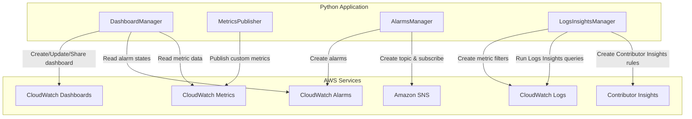

# Design Document: Application Monitoring Dashboard with Amazon CloudWatch

## Overview

This project guides learners through building an Application Monitoring Dashboard using Amazon CloudWatch. The learner will create a CloudWatch dashboard with organized widgets, visualize standard AWS service metrics and custom metrics, configure alarms with SNS notifications, set up metric filters from log data, explore Contributor Insights, and configure dashboard sharing. All components interact with CloudWatch programmatically via boto3.

The architecture uses Python scripts that provision and configure CloudWatch resources: a dashboard manager handles dashboard lifecycle and widget layout, a metrics publisher handles custom metric publishing, an alarms manager configures alarms and SNS integration, and a logs and insights manager handles metric filters, log insights queries, and Contributor Insights rules. The learner runs these as CLI scripts to build up a comprehensive monitoring dashboard incrementally.

### Learning Scope
- **Goal**: Build a CloudWatch dashboard with service metrics, custom metrics, alarms, log-based metrics, Contributor Insights, and sharing configuration
- **Out of Scope**: CloudWatch Agent installation, X-Ray tracing, CloudWatch RUM, Synthetics canaries, cross-account/cross-region dashboards, CI/CD pipelines
- **Prerequisites**: AWS account, Python 3.12, at least one running EC2 instance, a CloudWatch Logs log group with sample log data, basic familiarity with CloudWatch concepts

### Technology Stack
- Language/Runtime: Python 3.12
- AWS Services: Amazon CloudWatch (Dashboards, Metrics, Alarms, Logs, Contributor Insights), Amazon SNS
- SDK/Libraries: boto3
- Infrastructure: AWS CLI (manual provisioning of EC2 instance and log group)

## Architecture

The application consists of four components that build up a CloudWatch monitoring dashboard. DashboardManager handles dashboard creation, widget layout, sharing, and export. MetricsPublisher publishes custom application metrics. AlarmsManager creates alarms, SNS topics, and alarm status widgets. LogsInsightsManager handles metric filters, Logs Insights queries, and Contributor Insights rules. All components contribute widget definitions that DashboardManager assembles into the final dashboard body.



## Components and Interfaces

### Component 1: DashboardManager
Module: `components/dashboard_manager.py`
Uses: `boto3.client('cloudwatch')`

Handles CloudWatch dashboard lifecycle including creation, widget assembly, layout arrangement, sharing configuration, auto-refresh settings, and export of the dashboard body JSON. Builds widget definitions for markdown, metric, alarm status, Logs Insights query, and Contributor Insights widgets. Assembles all widgets into logical groupings and publishes the complete dashboard.

```python
INTERFACE DashboardManager:
    FUNCTION create_dashboard(dashboard_name: string, dashboard_body: Dictionary) -> None
    FUNCTION build_markdown_widget(title: string, description: string, x: integer, y: integer, width: integer, height: integer) -> Dictionary
    FUNCTION build_metric_widget(metrics: List[List[string]], title: string, view: string, x: integer, y: integer, width: integer, height: integer, period: integer) -> Dictionary
    FUNCTION build_alarm_status_widget(alarm_arns: List[string], title: string, x: integer, y: integer, width: integer, height: integer) -> Dictionary
    FUNCTION build_log_insights_widget(log_group_name: string, query: string, title: string, x: integer, y: integer, width: integer, height: integer) -> Dictionary
    FUNCTION build_contributor_insights_widget(rule_name: string, title: string, x: integer, y: integer, width: integer, height: integer) -> Dictionary
    FUNCTION assemble_dashboard(widgets: List[Dictionary]) -> Dictionary
    FUNCTION export_dashboard_body(dashboard_name: string) -> string
    FUNCTION enable_sharing(dashboard_name: string) -> string
    FUNCTION get_dashboard(dashboard_name: string) -> Dictionary
    FUNCTION delete_dashboard(dashboard_name: string) -> None
```

### Component 2: MetricsPublisher
Module: `components/metrics_publisher.py`
Uses: `boto3.client('cloudwatch')`

Publishes custom application metrics to CloudWatch with specified namespace, metric name, dimensions, and unit. Also queries existing metric data for verification and lists available metrics in custom namespaces.

```python
INTERFACE MetricsPublisher:
    FUNCTION publish_custom_metric(namespace: string, metric_name: string, value: float, unit: string, dimensions: List[Dictionary]) -> None
    FUNCTION publish_metric_batch(namespace: string, metric_data: List[MetricDataPoint]) -> None
    FUNCTION get_metric_statistics(namespace: string, metric_name: string, dimensions: List[Dictionary], start_time: datetime, end_time: datetime, period: integer, statistics: List[string]) -> List[Dictionary]
    FUNCTION list_custom_metrics(namespace: string) -> List[Dictionary]
```

### Component 3: AlarmsManager
Module: `components/alarms_manager.py`
Uses: `boto3.client('cloudwatch')`, `boto3.client('sns')`

Creates and manages CloudWatch alarms with configurable thresholds, evaluation periods, and comparison operators. Creates SNS topics for alarm notifications, subscribes endpoints, and retrieves alarm states for dashboard integration.

```python
INTERFACE AlarmsManager:
    FUNCTION create_sns_topic(topic_name: string) -> string
    FUNCTION subscribe_email(topic_arn: string, email: string) -> string
    FUNCTION create_alarm(alarm_name: string, namespace: string, metric_name: string, dimensions: List[Dictionary], threshold: float, comparison_operator: string, evaluation_periods: integer, period: integer, statistic: string, alarm_actions: List[string], ok_actions: List[string]) -> None
    FUNCTION get_alarm_state(alarm_name: string) -> Dictionary
    FUNCTION list_alarms() -> List[Dictionary]
    FUNCTION get_alarm_arns(alarm_names: List[string]) -> List[string]
    FUNCTION delete_alarm(alarm_name: string) -> None
    FUNCTION delete_sns_topic(topic_arn: string) -> None
```

### Component 4: LogsInsightsManager
Module: `components/logs_insights_manager.py`
Uses: `boto3.client('logs')`, `boto3.client('cloudwatch')`

Creates metric filters on CloudWatch Logs log groups to generate CloudWatch metrics from log patterns. Runs CloudWatch Logs Insights queries for log analysis. Creates and manages Contributor Insights rules for identifying top contributors in log data.

```python
INTERFACE LogsInsightsManager:
    FUNCTION create_metric_filter(log_group_name: string, filter_name: string, filter_pattern: string, metric_namespace: string, metric_name: string, metric_value: string, default_value: float) -> None
    FUNCTION delete_metric_filter(log_group_name: string, filter_name: string) -> None
    FUNCTION run_insights_query(log_group_name: string, query: string, start_time: datetime, end_time: datetime) -> List[Dictionary]
    FUNCTION create_contributor_insights_rule(rule_name: string, log_group_name: string, rule_body: Dictionary) -> None
    FUNCTION get_contributor_insights_report(rule_name: string, start_time: datetime, end_time: datetime) -> Dictionary
    FUNCTION delete_contributor_insights_rule(rule_name: string) -> None
```

## Data Models

```python
TYPE MetricDataPoint:
    metric_name: string
    value: float
    unit: string                    # "Count", "Milliseconds", "Percent", etc.
    dimensions: List[Dimension]
    timestamp?: datetime

TYPE Dimension:
    name: string
    value: string

TYPE AlarmConfig:
    alarm_name: string
    namespace: string
    metric_name: string
    dimensions: List[Dimension]
    threshold: float
    comparison_operator: string     # "GreaterThanThreshold", "LessThanThreshold", etc.
    evaluation_periods: integer
    period: integer                 # Seconds
    statistic: string               # "Average", "Sum", "Maximum", etc.
    alarm_actions: List[string]     # SNS topic ARNs
    ok_actions: List[string]        # SNS topic ARNs

TYPE MetricFilterConfig:
    log_group_name: string
    filter_name: string
    filter_pattern: string          # e.g., "[ERROR]" or "{ $.statusCode = 500 }"
    metric_namespace: string
    metric_name: string
    metric_value: string            # "1" for count, or "$.latency" for extraction
    default_value: float

TYPE ContributorInsightsRuleBody:
    schema: Dictionary
    log_group_names: List[string]
    log_format: string              # "CLF", "JSON"
    contribution: Dictionary        # keys, valueAggregation, filters
    aggregate_on: string            # "Sum" or "Count"

TYPE WidgetDefinition:
    type: string                    # "metric", "text", "alarm", "log", "explorer"
    x: integer
    y: integer
    width: integer
    height: integer
    properties: Dictionary

TYPE DashboardBody:
    widgets: List[WidgetDefinition]
```

## Error Handling

| Error | Description | Learner Action |
|-------|-------------|----------------|
| DashboardNotFoundError | Specified dashboard name does not exist when fetching or exporting | Verify dashboard name matches what was created |
| InvalidParameterValueException | Invalid metric namespace, dimension, or widget property | Check metric names, namespaces, and widget properties match CloudWatch requirements |
| ResourceNotFoundException | Log group, alarm, or Contributor Insights rule does not exist | Ensure the referenced resource was created before referencing it |
| LimitExceededException | Too many dashboards, alarms, or metric filters in account | Delete unused resources or request a service limit increase |
| InvalidFormatFault | Dashboard body JSON is malformed or contains invalid widget definitions | Validate the dashboard body JSON structure against CloudWatch widget schema |
| ResourceAlreadyExistsException | SNS topic or Contributor Insights rule name already in use | Use a different name or delete the existing resource first |
| MissingRequiredParameterException | Required parameter missing from alarm or metric filter creation | Review function parameters and supply all required values |
| InvalidQueryException | CloudWatch Logs Insights query syntax is invalid | Review query syntax against Logs Insights query language documentation |
