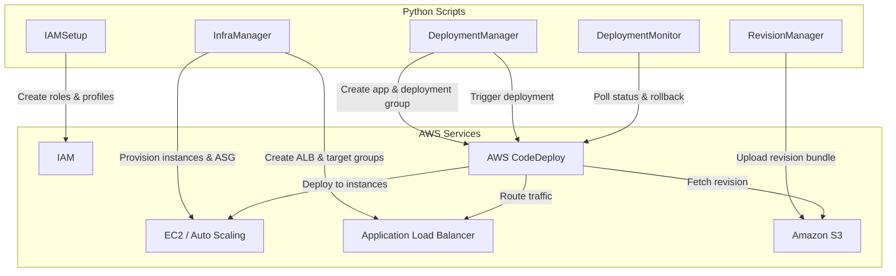

# Design Document: Automated Blue-Green Deployment with AWS CodeDeploy

## Overview

This project guides learners through building an automated blue-green deployment pipeline using AWS CodeDeploy on the EC2 compute platform. The learner will set up the foundational infrastructure (IAM roles, EC2 instances with CodeDeploy agent, Application Load Balancer), create a CodeDeploy application with a blue-green deployment group, prepare application revisions with AppSpec lifecycle hooks, and execute deployments using different deployment configurations (CodeDeployDefault.AllAtOnce, CodeDeployDefault.HalfAtATime, CodeDeployDefault.OneAtATime). The project culminates with observing zero-downtime traffic cutover and practicing rollback scenarios.

The architecture uses Python scripts with boto3 to automate the provisioning and orchestration of AWS resources. The learner provisions EC2 instances behind an ALB, configures CodeDeploy to manage blue-green traffic shifting through the load balancer, and experiments with deployment configurations and rollback behavior. This is a script-driven approach where each component handles a distinct AWS service domain.

### Learning Scope
- **Goal**: Configure and execute blue-green deployments with CodeDeploy on EC2, using ALB for traffic routing, with multiple traffic shifting strategies and rollback
- **Out of Scope**: CodePipeline integration, ECS/Lambda deployments, CloudFormation-managed blue-green, CloudWatch alarms, production monitoring, CI/CD pipelines
- **Prerequisites**: AWS account, Python 3.12, basic understanding of EC2, load balancers, and IAM roles

### Technology Stack
- Language/Runtime: Python 3.12
- AWS Services: AWS CodeDeploy, Amazon EC2, EC2 Auto Scaling, Elastic Load Balancing (ALB), Amazon S3, IAM
- SDK/Libraries: boto3
- Infrastructure: boto3 SDK scripts for provisioning

## Architecture

The system has five components spanning the key AWS service boundaries. IAMSetup creates the service role and instance profile. InfraManager provisions the ALB, target groups, and Auto Scaling group with EC2 instances running the CodeDeploy agent. RevisionManager packages AppSpec bundles and uploads them to S3. DeploymentManager creates the CodeDeploy application, configures blue-green deployment groups with traffic shifting strategies, and executes deployments. DeploymentMonitor tracks deployment status, lifecycle events, and handles rollbacks.



## Components and Interfaces

### Component 1: IAMSetup
Module: `components/iam_setup.py`
Uses: `boto3.client('iam')`

Creates the CodeDeploy service role with permissions for EC2, Auto Scaling, and ELB interactions. Creates an EC2 instance profile that grants instances permission to pull revisions from S3 and communicate with CodeDeploy.

```python
INTERFACE IAMSetup:
    FUNCTION create_codedeploy_service_role(role_name: string) -> string
    FUNCTION create_ec2_instance_profile(profile_name: string, role_name: string) -> string
    FUNCTION get_role_arn(role_name: string) -> string
    FUNCTION delete_roles_and_profiles(role_name: string, profile_name: string) -> None
```

### Component 2: InfraManager
Module: `components/infra_manager.py`
Uses: `boto3.client('elbv2')`, `boto3.client('autoscaling')`, `boto3.client('ec2')`

Provisions the networking and compute infrastructure: creates an ALB with target groups for traffic routing, and creates a launch template and Auto Scaling group with EC2 instances that have the CodeDeploy agent installed via user data. Configures health checks on the target group.

```python
INTERFACE InfraManager:
    FUNCTION create_application_load_balancer(alb_name: string, subnet_ids: List[string], security_group_id: string) -> string
    FUNCTION create_target_group(tg_name: string, vpc_id: string, health_check_path: string) -> string
    FUNCTION create_listener(alb_arn: string, target_group_arn: string, port: integer) -> string
    FUNCTION create_launch_template(template_name: string, ami_id: string, instance_type: string, instance_profile_name: string, security_group_id: string, user_data_script: string) -> string
    FUNCTION create_auto_scaling_group(asg_name: string, launch_template_id: string, target_group_arn: string, subnet_ids: List[string], desired_capacity: integer) -> None
    FUNCTION get_target_group_health(target_group_arn: string) -> List[Dictionary]
    FUNCTION delete_infrastructure(alb_arn: string, target_group_arn: string, asg_name: string, launch_template_id: string) -> None
```

### Component 3: RevisionManager
Module: `components/revision_manager.py`
Uses: `boto3.client('s3')`

Creates the S3 bucket for storing revisions, generates AppSpec files with file mappings and lifecycle event hooks, bundles application source files with the AppSpec file into a zip archive, and uploads revision bundles to S3.

```python
INTERFACE RevisionManager:
    FUNCTION create_revision_bucket(bucket_name: string) -> None
    FUNCTION generate_appspec(file_mappings: List[Dictionary], hooks: List[Dictionary]) -> string
    FUNCTION create_revision_bundle(appspec_content: string, source_dir: string, output_path: string) -> string
    FUNCTION upload_revision(bucket_name: string, bundle_path: string, key: string) -> string
    FUNCTION get_revision_location(bucket_name: string, key: string) -> Dictionary
    FUNCTION delete_revision_bucket(bucket_name: string) -> None
```

### Component 4: DeploymentManager
Module: `components/deployment_manager.py`
Uses: `boto3.client('codedeploy')`

Creates the CodeDeploy application for the EC2/On-Premises compute platform. Configures blue-green deployment groups with load balancer info, Auto Scaling group references, green fleet provisioning options, and blue instance termination settings. Triggers deployments with specified deployment configurations (AllAtOnce, HalfAtATime, OneAtATime). Note: canary and linear traffic-shifting configurations are only available for Lambda and ECS compute platforms, not EC2/On-Premises.

```python
INTERFACE DeploymentManager:
    FUNCTION create_application(app_name: string) -> string
    FUNCTION create_blue_green_deployment_group(app_name: string, group_name: string, service_role_arn: string, asg_name: string, target_group_name: string, auto_rollback_enabled: boolean, termination_wait_minutes: integer) -> string
    FUNCTION create_deployment(app_name: string, group_name: string, revision_location: Dictionary, deployment_config_name: string, description: string) -> string
    FUNCTION list_deployment_configs() -> List[string]
    FUNCTION delete_deployment_group(app_name: string, group_name: string) -> None
    FUNCTION delete_application(app_name: string) -> None
```

### Component 5: DeploymentMonitor
Module: `components/deployment_monitor.py`
Uses: `boto3.client('codedeploy')`

Polls deployment status and lifecycle event details for each target instance. Supports manual stop of in-progress deployments and rollback triggering. Retrieves deployment history including rollback events.

```python
INTERFACE DeploymentMonitor:
    FUNCTION get_deployment_status(deployment_id: string) -> Dictionary
    FUNCTION get_instance_targets(deployment_id: string) -> List[Dictionary]
    FUNCTION get_lifecycle_events(deployment_id: string, target_id: string) -> List[Dictionary]
    FUNCTION wait_for_deployment(deployment_id: string, poll_interval_seconds: integer) -> string
    FUNCTION stop_deployment(deployment_id: string, auto_rollback: boolean) -> None
    FUNCTION list_deployments(app_name: string, group_name: string) -> List[Dictionary]
```

## Data Models

```python
TYPE AppSpecFileMapping:
    source: string              # Relative path in revision bundle (e.g., "/src")
    destination: string         # Absolute path on instance (e.g., "/var/www/html")

TYPE AppSpecHook:
    event_name: string          # Lifecycle event (e.g., "BeforeInstall", "AfterInstall", "ValidateService")
    script_location: string     # Path to script in revision (e.g., "scripts/validate.sh")
    timeout: integer            # Seconds before script times out
    runas: string               # User to run script as (e.g., "root")

TYPE RevisionLocation:
    revision_type: string       # "S3"
    bucket: string
    key: string
    bundle_type: string         # "zip"

TYPE BlueGreenConfig:
    app_name: string
    group_name: string
    service_role_arn: string
    asg_name: string
    target_group_name: string
    auto_rollback_enabled: boolean
    termination_wait_minutes: integer

TYPE DeploymentStatus:
    deployment_id: string
    status: string              # "Created", "Queued", "InProgress", "Baking", "Succeeded", "Failed", "Stopped", "Ready"
    deployment_config: string
    create_time: datetime
    complete_time?: datetime
    rollback_info?: Dictionary
    error_info?: Dictionary

TYPE InstanceTarget:
    target_id: string
    status: string              # "Pending", "InProgress", "Succeeded", "Failed", "Skipped"
    lifecycle_events: List[LifecycleEvent]

TYPE LifecycleEvent:
    event_name: string
    status: string              # "Pending", "InProgress", "Succeeded", "Failed", "Skipped"
    start_time?: datetime
    end_time?: datetime
    diagnostics?: Dictionary
```

## Error Handling

| Error | Description | Learner Action |
|-------|-------------|----------------|
| ApplicationAlreadyExistsException | CodeDeploy application name already exists in this region | Choose a different name or delete the existing application |
| ApplicationDoesNotExistException | Referenced application not found | Verify application name and ensure it was created |
| DeploymentGroupAlreadyExistsException | Deployment group name already exists for this application | Use a different group name or delete the existing one |
| DeploymentGroupDoesNotExistException | Referenced deployment group not found | Verify deployment group name and create it first |
| InvalidLoadBalancerInfoException | Deployment group missing or invalid load balancer configuration | Ensure target group name is correct and ALB is configured |
| InvalidAutoScalingGroupException | Referenced Auto Scaling group does not exist or has no instances | Verify ASG name exists and has running instances |
| RevisionDoesNotExistException | Specified revision not found in S3 | Verify bucket name, key, and that revision was uploaded |
| InvalidRevisionException | AppSpec file is malformed or missing required sections | Validate AppSpec YAML structure, file mappings, and hooks |
| DeploymentLimitExceededException | Too many active deployments for this deployment group | Wait for current deployments to complete before starting new ones |
| LifecycleHookFailedException | A lifecycle event hook script returned non-zero exit code | Check script logic, permissions, and instance logs in /var/log/aws/codedeploy-agent |
| UnsupportedActionForDeploymentTypeException | Action not supported for blue-green (e.g., in-place only operation) | Review action compatibility with blue-green deployment type |
| BucketNameFilterRequiredException | S3 bucket name not specified for revision | Provide valid S3 bucket name in revision location |
