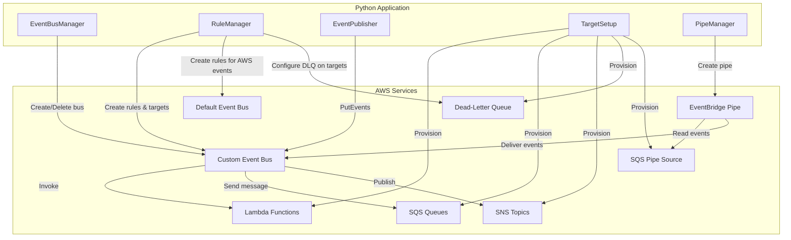

# Design Document: Event-Driven Architecture with Amazon EventBridge

## Overview

This project teaches learners how to build an event-driven architecture using Amazon EventBridge as the central event router. The learner will create a custom event bus, define rules with event patterns, publish custom events, and configure multiple target types (Lambda, SQS, SNS) to process, queue, and notify on events. The project demonstrates how loosely-coupled components communicate through events rather than direct calls.

The system uses Python scripts with boto3 to provision EventBridge resources, publish events, and verify routing behavior. The learner will also configure input transformers to reshape event payloads before delivery, set up dead-letter queues for failed deliveries, monitor AWS service events on the default event bus, and create an EventBridge Pipe for point-to-point integration from an SQS source to the custom event bus.

### Learning Scope
- **Goal**: Build a multi-component event-driven system with EventBridge, routing custom and AWS service events to Lambda, SQS, and SNS targets
- **Out of Scope**: Schema registry, cross-account/cross-region routing, EventBridge Scheduler, API destinations, CI/CD, monitoring dashboards
- **Prerequisites**: AWS account, Python 3.12, basic understanding of AWS Lambda, SQS, SNS, and IAM roles

### Technology Stack
- Language/Runtime: Python 3.12
- AWS Services: Amazon EventBridge (event buses, rules, pipes), AWS Lambda, Amazon SQS, Amazon SNS
- SDK/Libraries: boto3
- Infrastructure: AWS CLI for IAM role setup; boto3 for all other provisioning

## Architecture

The application consists of five components. EventBusManager handles event bus lifecycle. RuleManager creates rules with event patterns, targets, input transformers, and dead-letter queues on both custom and default event buses. EventPublisher emits custom events. TargetSetup provisions the Lambda functions, SQS queues, and SNS topics used as targets. PipeManager creates an EventBridge Pipe that reads from an SQS source and delivers events to the custom event bus.



## Components and Interfaces

### Component 1: EventBusManager
Module: `components/event_bus_manager.py`
Uses: `boto3.client('events')`

Handles custom event bus lifecycle — creation, description, listing, and deletion. Validates that a custom event bus is active before other components use it.

```python
INTERFACE EventBusManager:
    FUNCTION create_event_bus(bus_name: string) -> Dictionary
    FUNCTION describe_event_bus(bus_name: string) -> Dictionary
    FUNCTION list_event_buses() -> List[Dictionary]
    FUNCTION delete_event_bus(bus_name: string) -> None
```

### Component 2: RuleManager
Module: `components/rule_manager.py`
Uses: `boto3.client('events')`

Creates and manages EventBridge rules with event patterns on both custom and default event buses. Configures targets on rules including Lambda, SQS, and SNS. Supports input transformers for payload reshaping and dead-letter queue configuration on targets. Handles rules that filter on source, detail-type, and nested detail attributes.

```python
INTERFACE RuleManager:
    FUNCTION create_rule(rule_name: string, bus_name: string, event_pattern: Dictionary) -> Dictionary
    FUNCTION add_target(rule_name: string, bus_name: string, target_id: string, target_arn: string, role_arn: string) -> Dictionary
    FUNCTION add_target_with_transform(rule_name: string, bus_name: string, target_id: string, target_arn: string, role_arn: string, input_paths_map: Dictionary, input_template: string) -> Dictionary
    FUNCTION add_target_with_dlq(rule_name: string, bus_name: string, target_id: string, target_arn: string, role_arn: string, dlq_arn: string) -> Dictionary
    FUNCTION list_rules(bus_name: string) -> List[Dictionary]
    FUNCTION list_targets(rule_name: string, bus_name: string) -> List[Dictionary]
    FUNCTION delete_rule(rule_name: string, bus_name: string) -> None
    FUNCTION remove_targets(rule_name: string, bus_name: string, target_ids: List[string]) -> None
```

### Component 3: EventPublisher
Module: `components/event_publisher.py`
Uses: `boto3.client('events')`

Publishes custom application events to a specified event bus. Supports publishing single events and batch events in a single PutEvents request. Returns success/failure counts for batch operations.

```python
INTERFACE EventPublisher:
    FUNCTION publish_event(bus_name: string, source: string, detail_type: string, detail: Dictionary) -> Dictionary
    FUNCTION publish_events_batch(bus_name: string, entries: List[Dictionary]) -> Dictionary
```

### Component 4: TargetSetup
Module: `components/target_setup.py`
Uses: `boto3.client('lambda')`, `boto3.client('sqs')`, `boto3.client('sns')`

Provisions the downstream AWS resources used as EventBridge targets: Lambda functions for event processing, SQS queues (including a dead-letter queue) for message queuing, and an SNS topic with an email subscription for notifications. Also provisions the SQS queue used as the source for the EventBridge Pipe.

```python
INTERFACE TargetSetup:
    FUNCTION create_lambda_function(function_name: string, role_arn: string, handler: string, zip_path: string) -> Dictionary
    FUNCTION delete_lambda_function(function_name: string) -> None
    FUNCTION create_sqs_queue(queue_name: string) -> Dictionary
    FUNCTION get_queue_arn(queue_name: string) -> string
    FUNCTION get_queue_url(queue_name: string) -> string
    FUNCTION receive_messages(queue_url: string, max_messages: integer) -> List[Dictionary]
    FUNCTION delete_sqs_queue(queue_url: string) -> None
    FUNCTION create_sns_topic(topic_name: string) -> Dictionary
    FUNCTION subscribe_email(topic_arn: string, email: string) -> Dictionary
    FUNCTION delete_sns_topic(topic_arn: string) -> None
```

### Component 5: PipeManager
Module: `components/pipe_manager.py`
Uses: `boto3.client('pipes')`

Creates and manages an EventBridge Pipe for point-to-point integration. Configures a pipe with an SQS queue as the source and an event bus as the target. Supports optional filtering on the pipe source to deliver only matching events.

```python
INTERFACE PipeManager:
    FUNCTION create_pipe(pipe_name: string, source_arn: string, target_arn: string, role_arn: string) -> Dictionary
    FUNCTION create_pipe_with_filter(pipe_name: string, source_arn: string, target_arn: string, role_arn: string, filter_pattern: List[Dictionary]) -> Dictionary
    FUNCTION describe_pipe(pipe_name: string) -> Dictionary
    FUNCTION delete_pipe(pipe_name: string) -> None
```

## Data Models

```python
TYPE CustomEvent:
    source: string              # e.g., "com.myapp.orders"
    detail_type: string         # e.g., "OrderCreated"
    detail: Dictionary          # JSON payload with event-specific data
    event_bus_name: string      # Target event bus name

TYPE OrderDetail:
    order_id: string            # e.g., "ORD-2024-001"
    customer_id: string         # e.g., "CUST-100"
    status: string              # e.g., "created", "shipped", "delivered"
    total_amount: number
    items: List[Dictionary]     # List of {item_id, name, quantity, price}

TYPE EventPatternFilter:
    source: List[string]        # e.g., ["com.myapp.orders"]
    detail_type?: List[string]  # e.g., ["OrderCreated"]
    detail?: Dictionary         # Nested attribute filters, e.g., {"status": ["created"]}

TYPE InputTransformConfig:
    input_paths_map: Dictionary  # e.g., {"orderId": "$.detail.order_id", "status": "$.detail.status"}
    input_template: string       # e.g., '{"id": <orderId>, "currentStatus": <status>}'

TYPE BatchEntry:
    source: string
    detail_type: string
    detail: Dictionary
    event_bus_name: string

TYPE PipeFilterCriteria:
    filters: List[Dictionary]   # e.g., [{"Pattern": "{\"body\": {\"status\": [\"critical\"]}}"}]
```

## Error Handling

| Error | Description | Learner Action |
|-------|-------------|----------------|
| ResourceAlreadyExistsException | Event bus or pipe name already exists | Choose a different name or delete the existing resource |
| ResourceNotFoundException | Event bus, rule, or pipe not found | Verify the resource name and region |
| ValidationException | Invalid event pattern JSON or malformed parameters | Check event pattern syntax and parameter types |
| InvalidEventPatternException | Event pattern does not conform to EventBridge syntax | Review EventBridge event pattern documentation |
| ManagedRuleException | Attempt to modify an AWS-managed rule | Only modify rules you have created |
| PolicyLengthExceededException | Resource policy exceeds size limit | Reduce the number of permissions or targets |
| AccessDeniedException | IAM role lacks required permissions | Verify the IAM role has EventBridge, Lambda, SQS, and SNS permissions |
| Lambda.ResourceNotFoundException | Lambda function specified as target does not exist | Create the Lambda function before adding it as a target |
| SQS.QueueDoesNotExist | SQS queue specified as target does not exist | Create the queue before referencing it |
