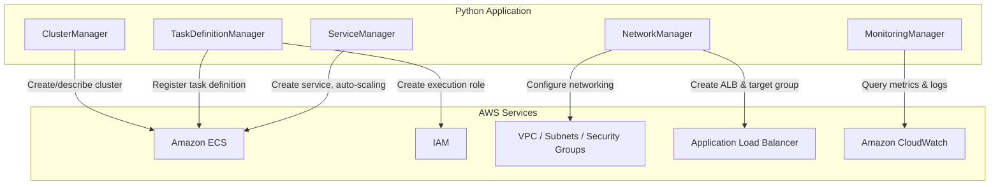

# Design Document: Deploy a Containerized Application on Amazon ECS with Fargate

## Overview

This project guides learners through the end-to-end process of deploying a containerized application on Amazon ECS using AWS Fargate. The learner will create an ECS cluster, define a task definition, configure VPC networking and an Application Load Balancer, deploy a service, configure auto-scaling, and set up CloudWatch monitoring. The container image used will be a simple public image from Docker Hub (e.g., `nginx` or `httpd`) so the learner can focus on infrastructure rather than application code.

The architecture uses Python scripts with boto3 to programmatically provision and configure all required AWS resources. Each component maps to a logical grouping of related AWS services: cluster management, task definitions, networking/load balancing, service deployment with auto-scaling, and monitoring. This approach gives the learner hands-on experience with the ECS APIs while building a complete, publicly accessible deployment.

### Learning Scope
- **Goal**: Deploy a containerized web application on ECS Fargate behind an ALB with auto-scaling and CloudWatch monitoring
- **Out of Scope**: Amazon ECR (using public Docker Hub images), blue/green deployments, CI/CD pipelines, custom domains/HTTPS, service mesh, ECS Exec
- **Prerequisites**: AWS account, Python 3.12, Docker Hub public image (nginx), basic understanding of containers, VPC, and HTTP

### Technology Stack
- Language/Runtime: Python 3.12
- AWS Services: Amazon ECS (Fargate), Elastic Load Balancing (ALB), Amazon CloudWatch, IAM, Amazon VPC
- SDK/Libraries: boto3
- Infrastructure: Programmatic provisioning via boto3

## Architecture

The application consists of five components that build up the deployment stack sequentially. ClusterManager creates the ECS cluster. TaskDefinitionManager registers the task definition with container, logging, and IAM configuration. NetworkManager provisions VPC networking (subnets, security groups) and the Application Load Balancer with target group. ServiceManager deploys the ECS service linking the cluster, task definition, and load balancer, and configures auto-scaling. MonitoringManager retrieves CloudWatch metrics and container logs for observability.



## Components and Interfaces

### Component 1: ClusterManager
Module: `components/cluster_manager.py`
Uses: `boto3.client('ecs')`

Handles ECS cluster lifecycle — creation with Fargate and Fargate Spot capacity providers, status checking, description, and deletion.

```python
INTERFACE ClusterManager:
    FUNCTION create_cluster(cluster_name: string) -> Dictionary
    FUNCTION describe_cluster(cluster_name: string) -> Dictionary
    FUNCTION delete_cluster(cluster_name: string) -> None
    FUNCTION list_clusters() -> List[string]
```

### Component 2: TaskDefinitionManager
Module: `components/task_definition_manager.py`
Uses: `boto3.client('ecs')`, `boto3.client('iam')`, `boto3.client('logs')`

Registers ECS task definitions with Fargate compatibility, awsvpc network mode, container definitions with port mappings and awslogs log driver. Also creates the task execution IAM role required for image pulls and log delivery, and creates the CloudWatch Logs log group.

```python
INTERFACE TaskDefinitionManager:
    FUNCTION create_execution_role(role_name: string) -> string
    FUNCTION create_log_group(log_group_name: string) -> None
    FUNCTION register_task_definition(family: string, container_name: string, image: string, cpu: string, memory: string, container_port: integer, execution_role_arn: string, log_group_name: string, region: string) -> Dictionary
    FUNCTION describe_task_definition(family: string) -> Dictionary
    FUNCTION deregister_task_definition(task_definition_arn: string) -> None
    FUNCTION delete_execution_role(role_name: string) -> None
    FUNCTION delete_log_group(log_group_name: string) -> None
```

### Component 3: NetworkManager
Module: `components/network_manager.py`
Uses: `boto3.client('ec2')`, `boto3.client('elbv2')`

Configures VPC networking including discovering the default VPC and its public subnets across at least two Availability Zones, creating security groups for the ALB (allowing internet HTTP inbound) and ECS tasks (allowing inbound only from ALB security group on the container port). Also creates the Application Load Balancer, target group (type "ip") with health check configuration, and HTTP listener.

```python
INTERFACE NetworkManager:
    FUNCTION get_default_vpc() -> string
    FUNCTION get_public_subnets(vpc_id: string) -> List[string]
    FUNCTION create_alb_security_group(vpc_id: string, group_name: string, listener_port: integer) -> string
    FUNCTION create_task_security_group(vpc_id: string, group_name: string, container_port: integer, alb_security_group_id: string) -> string
    FUNCTION create_load_balancer(name: string, subnets: List[string], security_group_id: string) -> Dictionary
    FUNCTION create_target_group(name: string, vpc_id: string, port: integer, health_check_path: string) -> string
    FUNCTION create_listener(load_balancer_arn: string, target_group_arn: string, port: integer) -> string
    FUNCTION get_load_balancer_dns(load_balancer_arn: string) -> string
    FUNCTION delete_load_balancer(load_balancer_arn: string) -> None
    FUNCTION delete_target_group(target_group_arn: string) -> None
    FUNCTION delete_security_group(security_group_id: string) -> None
```

### Component 4: ServiceManager
Module: `components/service_manager.py`
Uses: `boto3.client('ecs')`, `boto3.client('application-autoscaling')`

Creates and manages the ECS Fargate service with desired task count, load balancer integration (target group registration), and awsvpc network configuration. Configures Application Auto Scaling with a target tracking policy on average CPU utilization, including minimum and maximum task boundaries. Handles service updates and deletion.

```python
INTERFACE ServiceManager:
    FUNCTION create_service(cluster_name: string, service_name: string, task_definition: string, desired_count: integer, subnets: List[string], security_group_id: string, target_group_arn: string, container_name: string, container_port: integer) -> Dictionary
    FUNCTION describe_service(cluster_name: string, service_name: string) -> Dictionary
    FUNCTION wait_service_stable(cluster_name: string, service_name: string) -> None
    FUNCTION configure_auto_scaling(cluster_name: string, service_name: string, min_count: integer, max_count: integer, target_cpu_percent: float) -> Dictionary
    FUNCTION delete_auto_scaling(cluster_name: string, service_name: string) -> None
    FUNCTION update_service(cluster_name: string, service_name: string, desired_count: integer) -> Dictionary
    FUNCTION delete_service(cluster_name: string, service_name: string) -> None
```

### Component 5: MonitoringManager
Module: `components/monitoring_manager.py`
Uses: `boto3.client('cloudwatch')`, `boto3.client('logs')`, `boto3.client('ecs')`

Retrieves CloudWatch service-level metrics (CPU utilization, memory utilization) for the ECS service. Fetches container logs from the CloudWatch Logs log group with log streams identified by task ID. Describes stopped tasks to inspect failure reasons for troubleshooting.

```python
INTERFACE MonitoringManager:
    FUNCTION get_service_metrics(cluster_name: string, service_name: string, metric_name: string, period_minutes: integer) -> List[Dictionary]
    FUNCTION get_log_streams(log_group_name: string) -> List[Dictionary]
    FUNCTION get_log_events(log_group_name: string, log_stream_name: string, limit: integer) -> List[Dictionary]
    FUNCTION describe_stopped_tasks(cluster_name: string) -> List[Dictionary]
```

## Data Models

```python
TYPE ClusterConfig:
    cluster_name: string              # Name for the ECS cluster
    capacity_providers: List[string]  # ["FARGATE", "FARGATE_SPOT"]

TYPE TaskConfig:
    family: string                    # Task definition family name
    container_name: string            # Name of the container within the task
    image: string                     # Docker Hub image (e.g., "nginx:latest")
    cpu: string                       # CPU units (e.g., "256")
    memory: string                    # Memory in MiB (e.g., "512")
    container_port: integer           # Port the container listens on (e.g., 80)
    execution_role_name: string       # IAM role name for task execution
    log_group_name: string            # CloudWatch Logs log group name
    region: string                    # AWS region (e.g., "us-east-1")

TYPE NetworkConfig:
    vpc_id: string                    # Default VPC ID
    subnet_ids: List[string]          # Public subnets across 2+ AZs
    alb_security_group_id: string     # SG allowing internet HTTP inbound
    task_security_group_id: string    # SG allowing inbound from ALB SG only
    load_balancer_arn: string         # ALB ARN
    target_group_arn: string          # Target group ARN (type "ip")
    listener_port: integer            # HTTP listener port (80)
    health_check_path: string         # Health check path (e.g., "/")

TYPE ServiceConfig:
    cluster_name: string              # ECS cluster name
    service_name: string              # ECS service name
    task_definition: string           # Task definition family or ARN
    desired_count: integer            # Desired number of running tasks
    container_name: string            # Container name for LB registration
    container_port: integer           # Container port for LB registration

TYPE ScalingConfig:
    min_count: integer                # Minimum task count
    max_count: integer                # Maximum task count
    target_cpu_percent: float         # Target CPU utilization percentage
```

## Error Handling

| Error | Description | Learner Action |
|-------|-------------|----------------|
| ClusterNotFoundException | Specified ECS cluster does not exist | Verify cluster name and ensure cluster was created |
| InvalidParameterException | Invalid parameter in ECS API call (e.g., bad CPU/memory combination) | Check Fargate-supported CPU/memory combinations (e.g., 256 CPU supports 512-2048 MiB) |
| ClientException (cluster name exists) | ECS cluster with the specified name already exists | Use a different cluster name or delete the existing cluster first |
| TaskDefinitionNotFoundException | Referenced task definition does not exist | Verify the task definition family name or ARN |
| ServiceNotActiveException | ECS service is not in ACTIVE state | Wait for service to stabilize or check for task failures |
| AccessDeniedException | IAM role or credentials lack required permissions | Verify the task execution role has AmazonECSTaskExecutionRolePolicy and credentials have ECS/ELB/IAM permissions |
| ResourceNotFoundException (ALB/TG) | Load balancer or target group not found | Ensure networking resources were created before service deployment |
| SecurityGroupNotFound | Referenced security group does not exist | Verify security group IDs are correct and belong to the correct VPC |
| ServiceException (task fails to start) | Task stops immediately after launch | Inspect stopped task reason via `describe_stopped_tasks` and review CloudWatch logs |
| ResourceNotFoundException (logs) | CloudWatch log group or stream does not exist | Ensure log group was created and tasks have run to generate log streams |
