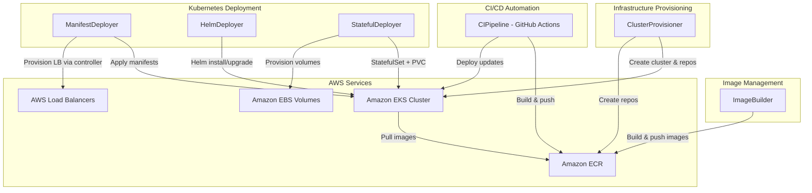

# Design Document: Deploy a Microservices Application on Amazon EKS

## Overview

This project guides learners through deploying a microservices application on Amazon Elastic Kubernetes Service (Amazon EKS). Learners will progress through the complete deployment lifecycle: provisioning an EKS cluster and ECR repositories, containerizing two example microservices, deploying them using raw Kubernetes manifests, exposing them via load balancers, packaging deployments with Helm charts, deploying a stateful application, and finally automating the entire flow with a GitHub Actions CI/CD pipeline.

The architecture centers on two simple example microservices — a frontend API and a backend API — deployed to EKS. Infrastructure provisioning (cluster, ECR repos) is handled via shell scripts wrapping AWS CLI and `eksctl`. Kubernetes manifests and Helm charts are authored as YAML files applied with `kubectl` and `helm`. The CI/CD pipeline is defined as a GitHub Actions workflow that builds images, pushes to ECR, and deploys to EKS.

**Complexity Assessment**: Complex — involves 4+ AWS services (EKS, ECR, EBS CSI, ALB/NLB via Load Balancer Controller) plus Kubernetes resource management and GitHub Actions. Requires 6 components covering infrastructure provisioning, image management, manifest deployment, Helm deployment, stateful workloads, and CI/CD.

### Learning Scope
- **Goal**: Deploy two microservices to EKS using manifests and Helm, expose via load balancers, deploy a stateful app, and automate with GitHub Actions CI/CD
- **Out of Scope**: Production HA, monitoring/observability, service mesh, Terraform/CDK, multi-cluster federation, custom controllers, fine-grained RBAC
- **Prerequisites**: AWS account with admin access, GitHub account, Docker installed, `kubectl`, `eksctl`, `helm`, and AWS CLI v2 installed, basic understanding of containers and Kubernetes concepts

### Technology Stack
- Language/Runtime: Bash scripts, YAML manifests, Python 3.12 (example microservices), GitHub Actions workflows
- AWS Services: Amazon EKS, Amazon ECR, Amazon EBS (via CSI driver), Elastic Load Balancing (ALB/NLB via AWS Load Balancer Controller)
- Tools: `eksctl`, `kubectl`, `helm`, `docker`, AWS CLI v2, GitHub Actions
- Example Microservices: A frontend-api (Flask) and backend-api (Flask) communicating over ClusterIP

## Architecture

The project is organized into six components. ClusterProvisioner handles EKS cluster and ECR repository creation via eksctl and AWS CLI. ImageBuilder handles Docker image builds and ECR pushes. ManifestDeployer applies raw Kubernetes manifests (Deployments, Services, Ingress) to the cluster. HelmDeployer manages Helm chart creation, installation, upgrade, and rollback. StatefulDeployer handles StatefulSet and PersistentVolumeClaim resources for a stateful workload. CIPipeline defines a GitHub Actions workflow that automates build, push, and deploy stages.



## Components and Interfaces

### Component 1: ClusterProvisioner
Module: `infrastructure/cluster_provisioner.sh`
Uses: `eksctl`, `aws cli` (eks, ecr, iam)

Provisions the EKS cluster with worker nodes, creates ECR repositories for both microservices, installs the AWS Load Balancer Controller add-on, and installs the Amazon EBS CSI driver add-on. Verifies cluster readiness and node availability.

```python
INTERFACE ClusterProvisioner:
    FUNCTION create_eks_cluster(cluster_name: string, region: string, node_count: number, node_type: string) -> None
    FUNCTION verify_cluster_ready(cluster_name: string) -> None
    FUNCTION create_ecr_repository(repo_name: string, region: string) -> string
    FUNCTION install_lb_controller(cluster_name: string, region: string) -> None
    FUNCTION install_ebs_csi_driver(cluster_name: string, region: string) -> None
    FUNCTION configure_kubeconfig(cluster_name: string, region: string) -> None
    FUNCTION delete_eks_cluster(cluster_name: string, region: string) -> None
```

### Component 2: ImageBuilder
Module: `images/image_builder.sh`
Uses: `docker`, `aws ecr`

Builds Docker images for the two example microservices from their Dockerfiles, authenticates to ECR, tags images with version identifiers and ECR repository URIs, and pushes them to the corresponding ECR repositories.

```python
INTERFACE ImageBuilder:
    FUNCTION authenticate_ecr(region: string, account_id: string) -> None
    FUNCTION build_image(dockerfile_path: string, image_name: string, tag: string) -> None
    FUNCTION tag_image(image_name: string, tag: string, ecr_uri: string) -> None
    FUNCTION push_image(ecr_uri: string, tag: string) -> None
    FUNCTION verify_image_in_ecr(repo_name: string, tag: string, region: string) -> None
```

### Component 3: ManifestDeployer
Module: `manifests/`
Uses: `kubectl`

Contains raw Kubernetes YAML manifests for deploying both microservices. Includes Deployment manifests (with replica count, image references, rolling update strategy), ClusterIP Service manifests for internal communication, LoadBalancer Service manifest for NLB exposure, and Ingress resource for ALB with path-based routing. Provides a deployment script that applies, verifies, and updates manifests.

```python
INTERFACE ManifestDeployer:
    FUNCTION apply_deployment(manifest_path: string) -> None
    FUNCTION apply_service(manifest_path: string) -> None
    FUNCTION apply_ingress(manifest_path: string) -> None
    FUNCTION verify_pods_ready(deployment_name: string, namespace: string) -> None
    FUNCTION update_image_tag(manifest_path: string, new_tag: string) -> None
    FUNCTION get_load_balancer_endpoint(service_name: string, namespace: string) -> string
    FUNCTION get_ingress_endpoint(ingress_name: string, namespace: string) -> string
    FUNCTION delete_resources(manifest_path: string) -> None
```

### Component 4: HelmDeployer
Module: `helm-charts/`
Uses: `helm`, `kubectl`

Contains Helm chart templates for both microservices with parameterized values (image repo, tag, replica count, service type). Provides scripts for chart creation, installation, upgrade with new values, rollback to previous revisions, and release history inspection.

```python
INTERFACE HelmDeployer:
    FUNCTION create_chart(chart_name: string, output_dir: string) -> None
    FUNCTION install_release(release_name: string, chart_path: string, values: Dictionary) -> None
    FUNCTION upgrade_release(release_name: string, chart_path: string, values: Dictionary) -> None
    FUNCTION rollback_release(release_name: string, revision: number) -> None
    FUNCTION get_release_history(release_name: string) -> List[Dictionary]
    FUNCTION uninstall_release(release_name: string) -> None
    FUNCTION verify_release_status(release_name: string) -> string
```

### Component 5: StatefulDeployer
Module: `manifests/stateful/`
Uses: `kubectl`

Contains Kubernetes manifests for deploying a stateful application (e.g., a simple database or key-value store) using a StatefulSet with PersistentVolumeClaim templates. Includes a StorageClass definition for EBS-backed volumes and scripts to deploy, verify data persistence across pod restarts, and clean up.

```python
INTERFACE StatefulDeployer:
    FUNCTION apply_storage_class(manifest_path: string) -> None
    FUNCTION apply_statefulset(manifest_path: string) -> None
    FUNCTION verify_pvc_bound(statefulset_name: string, namespace: string) -> None
    FUNCTION verify_data_persistence(pod_name: string, namespace: string, test_data: string) -> boolean
    FUNCTION restart_pod(pod_name: string, namespace: string) -> None
    FUNCTION delete_statefulset(manifest_path: string) -> None
```

### Component 6: CIPipeline
Module: `.github/workflows/deploy.yml`
Uses: GitHub Actions, `aws-actions/configure-aws-credentials`, `aws-actions/amazon-ecr-login`, `kubectl`

Defines a GitHub Actions workflow triggered on push to the main branch. The workflow authenticates to AWS, builds and tags a Docker image with the commit SHA, pushes it to ECR, updates the Kubernetes Deployment with the new image, and verifies pod readiness. Fails fast if the build step fails.

```python
INTERFACE CIPipeline:
    FUNCTION trigger_on_push(branch: string) -> None
    FUNCTION step_configure_aws(region: string, role_arn: string) -> None
    FUNCTION step_login_ecr(region: string) -> None
    FUNCTION step_build_and_push(dockerfile_path: string, ecr_uri: string, tag: string) -> None
    FUNCTION step_deploy_to_eks(cluster_name: string, deployment_name: string, ecr_uri: string, tag: string) -> None
    FUNCTION step_verify_deployment(deployment_name: string, namespace: string) -> None
```

## Data Models

```python
TYPE ClusterConfig:
    cluster_name: string        # e.g., "eks-microservices-lab"
    region: string              # e.g., "us-east-1"
    node_count: number          # e.g., 2
    node_instance_type: string  # e.g., "t3.medium"
    kubernetes_version: string  # e.g., "1.29"

TYPE MicroserviceConfig:
    name: string                # e.g., "frontend-api" or "backend-api"
    ecr_repo_name: string       # e.g., "eks-lab/frontend-api"
    ecr_uri: string             # e.g., "123456789012.dkr.ecr.us-east-1.amazonaws.com/eks-lab/frontend-api"
    dockerfile_path: string     # e.g., "./services/frontend-api/Dockerfile"
    image_tag: string           # e.g., "v1.0.0" or commit SHA
    replicas: number            # e.g., 2
    port: number                # e.g., 8080

TYPE HelmValues:
    image_repository: string    # ECR URI without tag
    image_tag: string           # e.g., "v1.0.0"
    replica_count: number       # e.g., 2
    service_type: string        # "ClusterIP", "LoadBalancer"
    service_port: number        # e.g., 80
    container_port: number      # e.g., 8080

TYPE StatefulAppConfig:
    name: string                # e.g., "redis" or "postgres"
    storage_class: string       # e.g., "ebs-sc"
    storage_size: string        # e.g., "5Gi"
    replicas: number            # e.g., 1
    volume_mount_path: string   # e.g., "/data"

TYPE PipelineConfig:
    branch: string              # e.g., "main"
    aws_region: string
    cluster_name: string
    ecr_repo_uri: string
    deployment_name: string
    namespace: string           # e.g., "default"
```

## Error Handling

| Error | Description | Learner Action |
|-------|-------------|----------------|
| ResourceInUseException (eksctl) | Cluster with the same name already exists | Delete existing cluster or choose a different name |
| RepositoryAlreadyExistsException | ECR repo name already taken in the account | Use existing repo or choose a different name |
| ImageBuildFailure | Docker build fails due to Dockerfile errors | Check Dockerfile syntax and base image availability |
| ECR AuthorizationError | Docker push rejected by ECR | Re-run ECR login command; verify IAM permissions |
| ImagePullBackOff | EKS pods cannot pull image from ECR | Verify ECR URI and tag; check node IAM role has ECR pull permissions |
| CrashLoopBackOff | Pod starts but crashes repeatedly | Check pod logs with `kubectl logs`; verify app config and port |
| CreateContainerConfigError | Missing ConfigMap, Secret, or invalid env var reference | Verify all referenced ConfigMaps/Secrets exist |
| PVC Pending | PersistentVolumeClaim stuck in Pending state | Verify EBS CSI driver is installed and StorageClass exists |
| LoadBalancer Pending | Service stuck with no external IP | Verify AWS Load Balancer Controller is installed; check subnet tags |
| Ingress No Address | Ingress has no ALB address assigned | Verify annotations; check LB controller logs with `kubectl logs` |
| Helm Release Failed | Helm install/upgrade fails | Run `helm status <release>` and check Kubernetes events |
| GitHub Actions Auth Failure | Workflow cannot authenticate to AWS | Verify GitHub secrets for AWS credentials or OIDC role ARN |
| Rollout Timeout | Deployment update exceeds deadline | Check pod events and resource limits; verify image exists in ECR |
