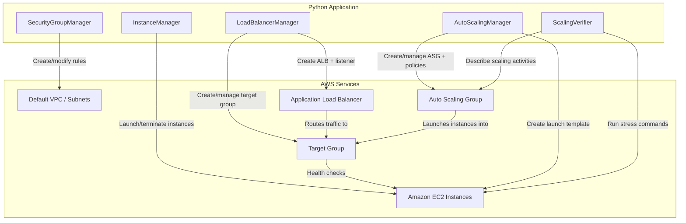

# Design Document: Deploy and Scale a Web Application on Amazon EC2

## Overview

This project teaches learners how to deploy a web application on Amazon EC2 and progressively build a scalable, load-balanced architecture. Starting with a single EC2 instance running a web server, the learner expands to a multi-AZ deployment behind an Application Load Balancer, then adds Auto Scaling to dynamically adjust capacity based on CPU utilization.

The implementation uses Python with boto3 to programmatically create and manage all AWS resources. This approach gives learners direct visibility into each API call involved in building a scalable web hosting architecture — from launching instances and configuring security groups, to creating load balancers and Auto Scaling groups. A simple HTTP "Hello World" page serves as the application, keeping the focus on infrastructure rather than application logic.

### Learning Scope
- **Goal**: Launch EC2 instances with a web server, configure security groups, set up an Application Load Balancer, and configure Auto Scaling with dynamic scaling policies
- **Out of Scope**: HTTPS/TLS certificates, Route 53 DNS, CloudFront CDN, CI/CD pipelines, monitoring dashboards, multi-region deployments
- **Prerequisites**: AWS account (free-tier eligible), Python 3.12, boto3 installed, an EC2 key pair created in the target region, basic understanding of networking concepts (ports, IP addresses, HTTP)

### Technology Stack
- Language/Runtime: Python 3.12
- AWS Services: Amazon EC2, Elastic Load Balancing (ALB), EC2 Auto Scaling, Amazon VPC (default VPC)
- SDK/Libraries: boto3
- Infrastructure: Programmatic via boto3 (default VPC assumed)

## Architecture

The architecture follows a progressive build: a SecurityGroupManager configures network access rules, an InstanceManager launches EC2 instances with user data scripts, a LoadBalancerManager creates an ALB with a target group and health checks, and an AutoScalingManager configures launch templates, Auto Scaling groups, and dynamic scaling policies. A ScalingVerifier provides utility functions to simulate load and observe scaling behavior. All components operate within the default VPC across at least two Availability Zones.



## Components and Interfaces

### Component 1: SecurityGroupManager
Module: `components/security_group_manager.py`
Uses: `boto3.client('ec2')`

Manages security group lifecycle and inbound rules for web traffic (HTTP port 80) and administrative access (SSH port 22). Supports adding and removing individual rules to demonstrate how security group changes take effect immediately without instance restarts.

```python
INTERFACE SecurityGroupManager:
    FUNCTION create_security_group(group_name: string, description: string, vpc_id: string) -> string
    FUNCTION add_inbound_rule(group_id: string, protocol: string, port: integer, cidr: string) -> None
    FUNCTION remove_inbound_rule(group_id: string, protocol: string, port: integer, cidr: string) -> None
    FUNCTION describe_security_group(group_id: string) -> Dictionary
    FUNCTION delete_security_group(group_id: string) -> None
```

### Component 2: InstanceManager
Module: `components/instance_manager.py`
Uses: `boto3.resource('ec2')`, `boto3.client('ec2')`

Launches EC2 instances with user data scripts that install and start a web server, queries instance status, and handles termination. Supports launching into specific subnets/AZs for multi-AZ deployments.

```python
INTERFACE InstanceManager:
    FUNCTION launch_instance(ami_id: string, instance_type: string, key_name: string, security_group_id: string, subnet_id: string, user_data: string) -> string
    FUNCTION wait_until_running(instance_id: string) -> None
    FUNCTION get_instance_info(instance_id: string) -> InstanceInfo
    FUNCTION list_instances_by_tag(tag_key: string, tag_value: string) -> List[InstanceInfo]
    FUNCTION terminate_instance(instance_id: string) -> None
    FUNCTION get_default_vpc_subnets() -> List[SubnetInfo]
```

### Component 3: LoadBalancerManager
Module: `components/load_balancer_manager.py`
Uses: `boto3.client('elbv2')`

Creates and manages an internet-facing Application Load Balancer spanning multiple AZs, a target group with HTTP health checks, an HTTP listener, and target registration. Provides target health status for observing health check behavior.

```python
INTERFACE LoadBalancerManager:
    FUNCTION create_target_group(name: string, vpc_id: string, port: integer, health_check_path: string) -> string
    FUNCTION create_load_balancer(name: string, subnet_ids: List[string], security_group_id: string) -> LoadBalancerInfo
    FUNCTION create_listener(load_balancer_arn: string, target_group_arn: string, port: integer) -> string
    FUNCTION register_targets(target_group_arn: string, instance_ids: List[string]) -> None
    FUNCTION deregister_targets(target_group_arn: string, instance_ids: List[string]) -> None
    FUNCTION get_target_health(target_group_arn: string) -> List[TargetHealthInfo]
    FUNCTION delete_load_balancer(load_balancer_arn: string) -> None
    FUNCTION delete_target_group(target_group_arn: string) -> None
    FUNCTION wait_until_available(load_balancer_arn: string) -> None
```

### Component 4: AutoScalingManager
Module: `components/auto_scaling_manager.py`
Uses: `boto3.client('autoscaling')`, `boto3.client('ec2')`

Creates launch templates and Auto Scaling groups with multi-AZ placement. Configures target tracking scaling policies based on average CPU utilization. Manages ASG lifecycle including capacity updates and deletion.

```python
INTERFACE AutoScalingManager:
    FUNCTION create_launch_template(name: string, ami_id: string, instance_type: string, key_name: string, security_group_id: string, user_data: string) -> string
    FUNCTION create_auto_scaling_group(name: string, launch_template_id: string, min_size: integer, max_size: integer, desired_capacity: integer, subnet_ids: List[string], target_group_arn: string) -> None
    FUNCTION set_target_tracking_policy(asg_name: string, policy_name: string, target_cpu_percent: number) -> None
    FUNCTION describe_auto_scaling_group(asg_name: string) -> AutoScalingGroupInfo
    FUNCTION get_scaling_activities(asg_name: string) -> List[ScalingActivity]
    FUNCTION update_capacity(asg_name: string, min_size: integer, max_size: integer, desired: integer) -> None
    FUNCTION delete_auto_scaling_group(asg_name: string, force_delete: boolean) -> None
    FUNCTION delete_launch_template(template_id: string) -> None
```

### Component 5: ScalingVerifier
Module: `components/scaling_verifier.py`
Uses: `boto3.client('ssm')`, `boto3.client('autoscaling')`

Provides utility functions to simulate CPU load on instances via SSM Run Command (avoiding direct SSH), observe scaling activity history, and poll ASG instance counts to verify that scaling policies respond correctly to load changes.

```python
INTERFACE ScalingVerifier:
    FUNCTION simulate_cpu_load(instance_ids: List[string], duration_seconds: integer) -> List[string]
    FUNCTION poll_instance_count(asg_name: string, interval_seconds: integer, max_polls: integer) -> List[CapacitySnapshot]
    FUNCTION get_recent_scaling_activities(asg_name: string, max_results: integer) -> List[ScalingActivity]
    FUNCTION wait_for_capacity_change(asg_name: string, expected_count: integer, timeout_seconds: integer) -> boolean
```

## Data Models

```python
TYPE InstanceInfo:
    instance_id: string
    public_ip: string
    public_dns: string
    availability_zone: string
    state: string
    instance_type: string

TYPE SubnetInfo:
    subnet_id: string
    availability_zone: string
    vpc_id: string

TYPE LoadBalancerInfo:
    arn: string
    dns_name: string
    hosted_zone_id: string

TYPE TargetHealthInfo:
    instance_id: string
    port: integer
    health_state: string
    reason: string

TYPE AutoScalingGroupInfo:
    name: string
    min_size: integer
    max_size: integer
    desired_capacity: integer
    instances: List[InstanceInfo]
    availability_zones: List[string]

TYPE ScalingActivity:
    activity_id: string
    description: string
    cause: string
    status: string
    start_time: string
    end_time: string

TYPE CapacitySnapshot:
    timestamp: string
    instance_count: integer
    desired_capacity: integer
```

## Error Handling

| Error | Description | Learner Action |
|-------|-------------|----------------|
| InvalidKeyPair.NotFound | Specified key pair does not exist in the region | Create a key pair in the AWS Console or via CLI before running |
| InvalidAMIID.NotFound | AMI ID is invalid or not available in the region | Use the latest Amazon Linux 2023 AMI ID for your region |
| InvalidGroup.Duplicate | Security group with that name already exists in the VPC | Delete the existing group or choose a different name |
| InvalidPermission.Duplicate | Inbound rule already exists on the security group | Skip adding the rule or verify existing rules with describe |
| DryRunOperation | Insufficient permissions for the EC2 API call | Check IAM user/role has EC2, ELB, and Auto Scaling permissions |
| ValidationError (ASG) | Launch template, subnet, or target group ARN is invalid | Verify all referenced resources exist and ARNs are correct |
| ResourceInUse | Cannot delete a security group or target group still in use | Remove dependencies (ASG, ALB, instances) before deleting |
| LoadBalancerNotFound | ALB ARN does not match an existing load balancer | Verify the load balancer was created and use the correct ARN |
| InstanceLimitExceeded | Account has reached the EC2 instance limit for the region | Set a lower max capacity or request a limit increase via AWS Support |
| InvalidParameterValue (stress) | SSM Run Command failed on target instance | Ensure SSM Agent is running and instance has SSM IAM role attached |
