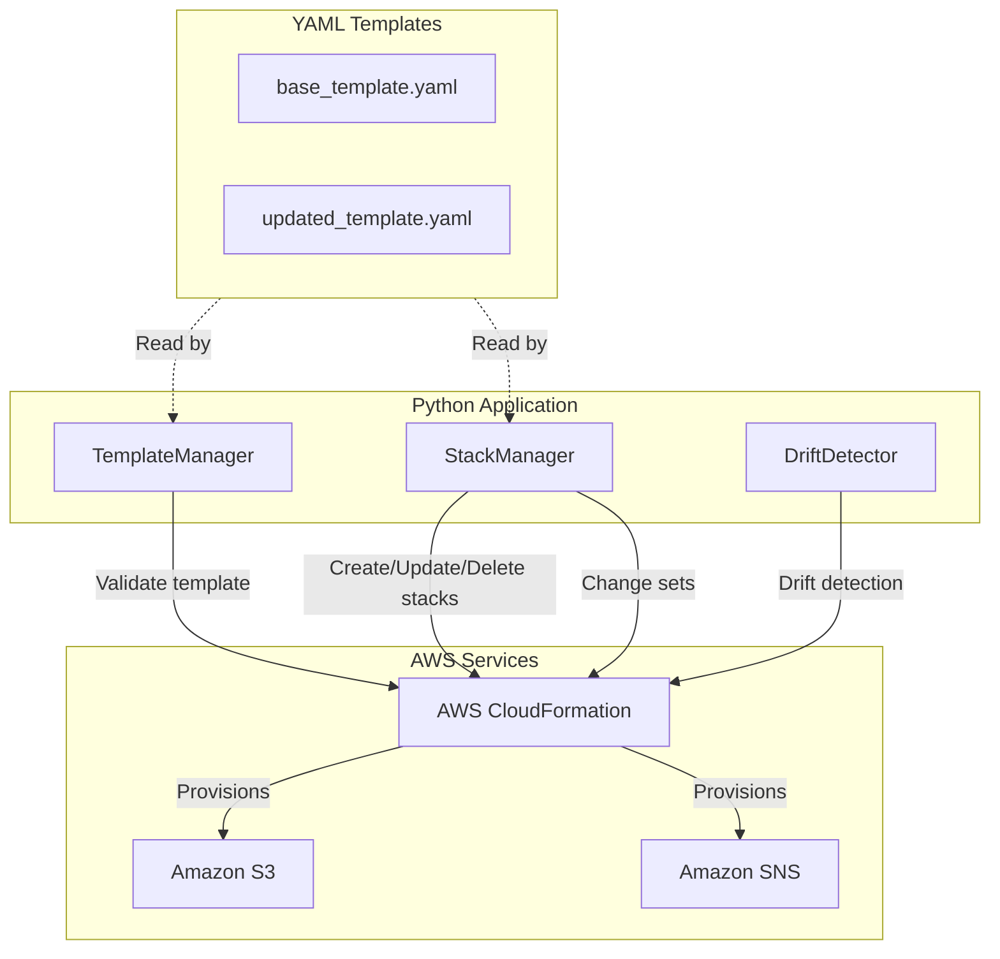

# Design Document: Deploy Infrastructure as Code with AWS CloudFormation

## Overview

This project guides learners through the full lifecycle of AWS CloudFormation: authoring YAML templates, deploying stacks, updating infrastructure via change sets, detecting drift, and cleaning up resources. The learner will build and manage a simple infrastructure stack (S3 bucket + SNS topic) to experience how declarative templates translate into real AWS resources.

The approach uses Python scripts with boto3 to drive CloudFormation operations programmatically. Templates themselves are authored as YAML files. This gives the learner hands-on experience with both the template authoring side (YAML structure, parameters, intrinsic functions, outputs) and the operational side (deploy, update, drift detect, delete) of Infrastructure as Code.

### Learning Scope
- **Goal**: Author CloudFormation templates with parameters and intrinsic functions, deploy/update stacks via change sets, detect drift, and delete stacks
- **Out of Scope**: Nested stacks, StackSets, cross-account deployment, CI/CD pipelines, CDK, custom resources, SAM
- **Prerequisites**: AWS account, Python 3.12, AWS CLI configured, basic YAML familiarity

### Technology Stack
- Language/Runtime: Python 3.12
- AWS Services: AWS CloudFormation, Amazon S3, Amazon SNS
- SDK/Libraries: boto3
- Template Format: YAML (hand-authored CloudFormation templates)
- Infrastructure: CloudFormation templates + boto3 scripts

## Architecture

The project has two layers: YAML template files that define infrastructure declaratively, and Python components that interact with the CloudFormation service to validate, deploy, update, inspect, and delete stacks. TemplateManager handles template validation. StackManager handles the full stack lifecycle including deployment, change sets, and deletion. DriftDetector handles drift detection and reporting. All components use the boto3 CloudFormation client.



## Components and Interfaces

### Component 1: TemplateManager
Module: `components/template_manager.py`
Uses: `boto3.client('cloudformation')`

Handles reading YAML template files from disk and validating them against the CloudFormation service. Reports validation errors so the learner can fix template syntax or structure issues before deployment.

```python
INTERFACE TemplateManager:
    FUNCTION read_template(file_path: string) -> string
    FUNCTION validate_template(template_body: string) -> Dictionary
    FUNCTION get_template_parameters(template_body: string) -> List[Dictionary]
```

### Component 2: StackManager
Module: `components/stack_manager.py`
Uses: `boto3.client('cloudformation')`

Handles the full stack lifecycle: creating stacks with parameters, describing stack status and outputs, creating and executing change sets, and deleting stacks. Supports waiting for stack operations to complete.

```python
INTERFACE StackManager:
    FUNCTION create_stack(stack_name: string, template_body: string, parameters: List[Dictionary]) -> string
    FUNCTION wait_for_stack(stack_name: string, target_status: string) -> string
    FUNCTION describe_stack(stack_name: string) -> Dictionary
    FUNCTION get_stack_outputs(stack_name: string) -> List[Dictionary]
    FUNCTION get_stack_events(stack_name: string) -> List[Dictionary]
    FUNCTION create_change_set(stack_name: string, template_body: string, parameters: List[Dictionary], change_set_name: string) -> string
    FUNCTION describe_change_set(stack_name: string, change_set_name: string) -> Dictionary
    FUNCTION execute_change_set(stack_name: string, change_set_name: string) -> None
    FUNCTION delete_stack(stack_name: string) -> None
    FUNCTION list_stack_resources(stack_name: string) -> List[Dictionary]
```

### Component 3: DriftDetector
Module: `components/drift_detector.py`
Uses: `boto3.client('cloudformation')`

Handles initiating drift detection on a deployed stack, polling for detection completion, and retrieving detailed drift results showing expected versus actual property values for each resource.

```python
INTERFACE DriftDetector:
    FUNCTION initiate_drift_detection(stack_name: string) -> string
    FUNCTION wait_for_drift_detection(detection_id: string) -> string
    FUNCTION get_stack_drift_status(stack_name: string) -> Dictionary
    FUNCTION get_resource_drift_details(stack_name: string) -> List[Dictionary]
```

## Data Models

```yaml
TYPE StackParameter:
    parameter_key: string       # Parameter name as defined in template
    parameter_value: string     # Value to supply at deployment time

TYPE StackOutput:
    output_key: string          # Logical name of the output
    output_value: string        # Resolved value after deployment
    description?: string        # Human-readable description

TYPE StackInfo:
    stack_name: string
    stack_id: string
    stack_status: string        # e.g., CREATE_COMPLETE, UPDATE_COMPLETE
    parameters: List[StackParameter]
    outputs: List[StackOutput]
    creation_time: string

TYPE ChangeSetDetail:
    change_set_name: string
    status: string              # e.g., CREATE_COMPLETE, FAILED
    changes: List[ResourceChange]

TYPE ResourceChange:
    action: string              # Add, Modify, Remove
    logical_resource_id: string
    resource_type: string
    replacement: string         # True, False, Conditional

TYPE DriftResult:
    stack_drift_status: string  # IN_SYNC, DRIFTED
    drifted_resources: List[ResourceDrift]

TYPE ResourceDrift:
    logical_resource_id: string
    resource_type: string
    drift_status: string        # IN_SYNC, MODIFIED, DELETED
    expected_properties: Dictionary
    actual_properties: Dictionary
    property_differences: List[PropertyDifference]

TYPE PropertyDifference:
    property_path: string
    expected_value: string
    actual_value: string
    difference_type: string     # ADD, REMOVE, NOT_EQUAL
```

### Template Structure (YAML files, not Python)

```yaml
# base_template.yaml structure
TYPE BaseTemplate:
    AWSTemplateFormatVersion: string    # "2010-09-09"
    Description: string
    Parameters:
        EnvironmentName:
            Type: string                # "String"
            Default: string             # "dev"
            AllowedValues: List[string] # ["dev", "staging", "prod"]
            Description: string
        BucketRetentionDays:
            Type: string                # "Number"
            Default: number             # 7
            Description: string
    Resources:
        AppBucket:
            Type: string                # "AWS::S3::Bucket"
        NotificationTopic:
            Type: string                # "AWS::SNS::Topic"
    Outputs:
        BucketName:
            Value: string               # Uses !Ref intrinsic function
        BucketArn:
            Value: string               # Uses !GetAtt intrinsic function
        TopicArn:
            Value: string               # Uses !Ref intrinsic function
        StackRegion:
            Value: string               # Uses !Sub or !Join intrinsic function
```

## Error Handling

| Error | Description | Learner Action |
|-------|-------------|----------------|
| ValidationError (template) | Template has syntax errors, invalid resource types, or circular dependencies | Review template YAML syntax and resource type spelling; check for circular Ref chains |
| ValidationError (parameter) | Parameter value violates AllowedValues, AllowedPattern, or type constraint | Supply a parameter value that matches the defined constraints |
| AlreadyExistsException | Stack name is already in use in the account/region | Choose a different stack name or delete the existing stack first |
| ResourceNotReady | Stack operation has not yet completed | Wait for the operation to finish; use wait_for_stack with appropriate status |
| CREATE_FAILED / ROLLBACK_COMPLETE | A resource in the stack failed to create, triggering automatic rollback | Check get_stack_events for the failure reason; fix the template and retry |
| UPDATE_ROLLBACK_COMPLETE | Stack update failed and CloudFormation rolled back to previous state | Review change set details and stack events; fix the template issue and retry |
| DELETE_FAILED | A resource could not be deleted due to dependencies or protection | Check stack events for the specific resource; resolve dependencies manually and retry deletion |
| ChangeSetNotFound | Referenced change set does not exist | Verify the change set name; create a new change set if needed |
| FAILED change set status (no changes) | Change set created but no differences detected between current and new template | Confirm the template was actually modified before creating the change set |
