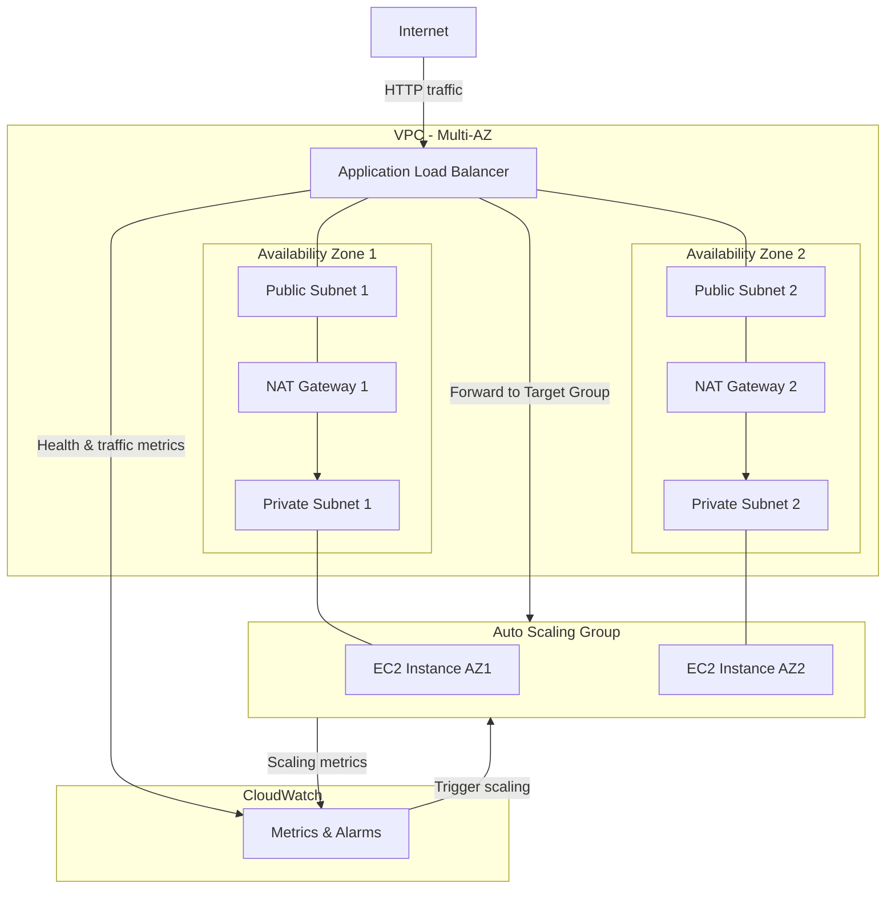

# Design Document: Highly Available Architecture with Auto Scaling

## Overview

This project guides learners through designing and deploying a highly available architecture on AWS using an Application Load Balancer and EC2 Auto Scaling. The learner will build a multi-AZ VPC, configure an ALB to distribute traffic, create a launch template and Auto Scaling group that spans Availability Zones, set up health checks for automated healing, configure dynamic scaling policies, and validate resilience by simulating failures.

The architecture follows an infrastructure-as-code approach using Python with boto3. The learner provisions networking, load balancing, compute, scaling, and monitoring components through scripts. A simple web application is bootstrapped via user data to verify traffic routing, health checks, and self-healing behavior.

### Learning Scope
- **Goal**: Build a multi-AZ VPC with ALB, Auto Scaling group, health checks, scaling policies, CloudWatch monitoring, and validate resilience through failure simulation
- **Out of Scope**: Multi-region deployments, RDS databases, ElastiCache, CI/CD pipelines, WAF, CloudFront, container-based workloads, production IAM policies
- **Prerequisites**: AWS account, Python 3.12, basic understanding of VPC networking, EC2 instances, and load balancing concepts

### Technology Stack
- Language/Runtime: Python 3.12
- AWS Services: VPC, EC2, Elastic Load Balancing (ALB), EC2 Auto Scaling, CloudWatch
- SDK/Libraries: boto3
- Infrastructure: SDK-provisioned via Python scripts

## Architecture

The architecture deploys a VPC spanning two Availability Zones, each with a public and private subnet. An Application Load Balancer in the public subnets distributes traffic to EC2 instances managed by an Auto Scaling group in the private subnets. A NAT gateway in each public subnet provides outbound internet access for private instances. CloudWatch monitors ALB and ASG metrics, and scaling policies adjust capacity based on demand.



## Components and Interfaces

### Component 1: NetworkManager
Module: `components/network_manager.py`
Uses: `boto3.client('ec2')`

Handles VPC lifecycle including creation of the VPC, internet gateway, public and private subnets across two AZs, NAT gateways with Elastic IPs, and route table configuration. Public route tables route to the internet gateway; private route tables route to NAT gateways.

```python
INTERFACE NetworkManager:
    FUNCTION create_vpc(cidr_block: string, name: string) -> string
    FUNCTION create_internet_gateway(vpc_id: string) -> string
    FUNCTION create_subnet(vpc_id: string, cidr_block: string, az: string, public: boolean, name: string) -> string
    FUNCTION create_nat_gateway(subnet_id: string) -> string
    FUNCTION configure_route_table(vpc_id: string, subnet_id: string, gateway_id: string, is_nat: boolean) -> string
    FUNCTION get_availability_zones(region: string) -> List[string]
    FUNCTION delete_vpc_resources(vpc_id: string) -> None
```

### Component 2: SecurityGroupManager
Module: `components/security_group_manager.py`
Uses: `boto3.client('ec2')`

Creates and configures security groups for the ALB and application instances. The ALB security group allows inbound HTTP from the internet. The instance security group allows inbound traffic only from the ALB security group.

```python
INTERFACE SecurityGroupManager:
    FUNCTION create_alb_security_group(vpc_id: string, name: string, ingress_port: integer) -> string
    FUNCTION create_instance_security_group(vpc_id: string, name: string, alb_sg_id: string, app_port: integer) -> string
    FUNCTION delete_security_group(sg_id: string) -> None
```

### Component 3: LoadBalancerManager
Module: `components/load_balancer_manager.py`
Uses: `boto3.client('elbv2')`

Creates and configures the Application Load Balancer across public subnets, a target group with HTTP health checks, and a listener that forwards traffic to the target group. Supports enabling cross-zone load balancing and querying ALB/target group state.

```python
INTERFACE LoadBalancerManager:
    FUNCTION create_load_balancer(name: string, subnet_ids: List[string], sg_id: string) -> Dictionary
    FUNCTION create_target_group(name: string, vpc_id: string, port: integer, health_check_path: string) -> string
    FUNCTION create_listener(alb_arn: string, target_group_arn: string, port: integer) -> string
    FUNCTION enable_cross_zone_load_balancing(target_group_arn: string) -> None
    FUNCTION get_target_health(target_group_arn: string) -> List[Dictionary]
    FUNCTION delete_load_balancer(alb_arn: string) -> None
    FUNCTION delete_target_group(target_group_arn: string) -> None
```

### Component 4: AutoScalingManager
Module: `components/auto_scaling_manager.py`
Uses: `boto3.client('autoscaling')`, `boto3.client('ec2')`

Creates the launch template with user data for bootstrapping a web application, and the Auto Scaling group spanning private subnets in multiple AZs. Configures the ASG with ELB health checks, health check grace period, and target group attachment. Provides scaling policy creation (target tracking on CPU utilization) and functions to view scaling activities.

```python
INTERFACE AutoScalingManager:
    FUNCTION create_launch_template(name: string, ami_id: string, instance_type: string, sg_id: string, user_data: string) -> string
    FUNCTION create_auto_scaling_group(name: string, launch_template_id: string, subnet_ids: List[string], min_size: integer, max_size: integer, desired_capacity: integer, target_group_arn: string, health_check_grace_period: integer) -> None
    FUNCTION create_target_tracking_policy(asg_name: string, policy_name: string, target_cpu: number) -> Dictionary
    FUNCTION get_scaling_activities(asg_name: string) -> List[Dictionary]
    FUNCTION get_group_details(asg_name: string) -> Dictionary
    FUNCTION delete_auto_scaling_group(asg_name: string, force: boolean) -> None
    FUNCTION delete_launch_template(template_id: string) -> None
```

### Component 5: MonitoringManager
Module: `components/monitoring_manager.py`
Uses: `boto3.client('cloudwatch')`

Queries CloudWatch metrics for the ALB and Auto Scaling group including healthy/unhealthy host counts, request count per AZ, and group size. Creates CloudWatch alarms for unhealthy host count thresholds and retrieves alarm state.

```python
INTERFACE MonitoringManager:
    FUNCTION get_alb_metrics(alb_arn: string, metric_name: string, period: integer) -> List[Dictionary]
    FUNCTION get_asg_metrics(asg_name: string, metric_name: string, period: integer) -> List[Dictionary]
    FUNCTION create_unhealthy_host_alarm(alarm_name: string, target_group_arn: string, alb_arn: string, threshold: integer) -> None
    FUNCTION get_alarm_state(alarm_name: string) -> Dictionary
    FUNCTION delete_alarm(alarm_name: string) -> None
```

### Component 6: ResilienceTester
Module: `components/resilience_tester.py`
Uses: `boto3.client('ec2')`, `boto3.client('ssm')`

Provides functions to simulate failures for resilience validation. Terminates instances to test ASG self-healing, stops the application process on an instance to trigger ALB health check failure, generates CPU load to trigger scaling policies, and waits for the architecture to recover to a target healthy host count.

```python
INTERFACE ResilienceTester:
    FUNCTION terminate_instance(instance_id: string) -> None
    FUNCTION stop_application_on_instance(instance_id: string, process_name: string) -> None
    FUNCTION generate_cpu_load(instance_ids: List[string], duration_seconds: integer) -> None
    FUNCTION wait_for_healthy_host_count(target_group_arn: string, expected_count: integer, timeout: integer) -> boolean
    FUNCTION get_asg_instance_ids(asg_name: string) -> List[string]
```

## Data Models

```python
TYPE VpcConfig:
    vpc_id: string
    internet_gateway_id: string
    public_subnet_ids: List[string]
    private_subnet_ids: List[string]
    nat_gateway_ids: List[string]
    availability_zones: List[string]

TYPE AlbConfig:
    alb_arn: string
    alb_dns_name: string
    target_group_arn: string
    listener_arn: string

TYPE AsgConfig:
    asg_name: string
    launch_template_id: string
    min_size: integer
    max_size: integer
    desired_capacity: integer

TYPE ScalingActivity:
    activity_id: string
    description: string
    cause: string
    status: string
    start_time: string
    end_time?: string

TYPE TargetHealthStatus:
    instance_id: string
    availability_zone: string
    health_state: string          # "healthy", "unhealthy", "unused", "draining", "initial", "unavailable"
    reason?: string
```

## Error Handling

| Error | Description | Learner Action |
|-------|-------------|----------------|
| VpcLimitExceeded | AWS account has reached VPC limit for the region | Delete unused VPCs or request a limit increase |
| SubnetConflict | CIDR block overlaps with existing subnet in the VPC | Choose a non-overlapping CIDR block |
| InvalidAMI | Specified AMI ID does not exist or is not accessible | Verify AMI ID exists in the target region |
| LoadBalancerNotFoundException | ALB was deleted or ARN is invalid | Re-create the load balancer before proceeding |
| ValidationError (ASG) | Launch template or subnet configuration is invalid | Verify launch template ID and subnet IDs exist |
| ResourceInUse | Cannot delete a resource that has active dependencies | Delete dependent resources first (e.g., ASG before launch template) |
| LimitExceededException | Scaling policy or alarm limit reached | Delete unused policies or alarms |
| InstanceNotFound | Target instance was already terminated | Refresh instance list from ASG before retrying |
| NatGatewayLimitExceeded | Account limit for NAT gateways reached | Delete unused NAT gateways or request limit increase |
| HealthCheckTimeout | wait_for_healthy_host_count exceeded timeout | Increase timeout or check instance bootstrap logs for errors |
