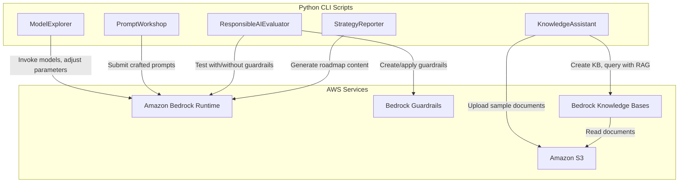

# Design Document: Generative AI for Executives

## Overview

This project provides executive learners with hands-on experience exploring generative AI capabilities through Amazon Bedrock. Rather than building production AI systems, learners interact with foundation models, practice prompt engineering for business scenarios, evaluate outputs against responsible AI criteria, and build a simple knowledge-augmented assistant. The project culminates in strategic planning artifacts — a use case prioritization framework and an adoption roadmap — grounded in firsthand experimentation.

The architecture is intentionally lightweight: a set of Python scripts interact with Amazon Bedrock's runtime and agent APIs via boto3. Learners run scripts from the command line to invoke models, compare outputs, configure guardrails, create a knowledge base, and generate structured reports. The Bedrock console playground supplements the scripted exercises for initial model exploration. No web framework or frontend is required — all outputs are printed to the console or saved as local Markdown/JSON files.

**Complexity Assessment: Moderate** — 2-3 AWS services (Amazon Bedrock foundation models, Bedrock Knowledge Bases, S3 for document storage), with SDK-based scripted interactions.

### Learning Scope
- **Goal**: Explore foundation models, practice prompt engineering, evaluate responsible AI, build a knowledge-augmented assistant, and produce strategic adoption artifacts
- **Out of Scope**: Model fine-tuning, SageMaker, production deployments, CI/CD, custom training, multi-tenant platforms, advanced IAM policies
- **Prerequisites**: AWS account with Amazon Bedrock model access enabled (Claude and Titan), Python 3.12, basic command-line familiarity, S3 bucket for sample documents

### Technology Stack
- Language/Runtime: Python 3.12
- AWS Services: Amazon Bedrock (model invocation, guardrails, knowledge bases), Amazon S3 (document storage)
- SDK/Libraries: boto3, json, pathlib
- Infrastructure: AWS Console (enable Bedrock model access), AWS CLI (S3 bucket creation)

## Architecture

The application consists of five components. ModelExplorer handles direct foundation model invocation and parameter experimentation. PromptWorkshop supports structured prompt engineering exercises across business scenarios. ResponsibleAIEvaluator manages guardrail configuration and output safety assessment. KnowledgeAssistant creates and queries a Bedrock knowledge base backed by S3 documents. StrategyReporter generates use case prioritization and adoption roadmap documents from structured input data.



## Components and Interfaces

### Component 1: ModelExplorer
Module: `components/model_explorer.py`
Uses: `boto3.client('bedrock-runtime')`, `boto3.client('bedrock')`

Handles foundation model discovery, invocation, and parameter experimentation. Allows learners to send the same prompt to different models, adjust inference parameters (temperature, max tokens, top-p), and compare outputs side by side. Tracks token usage for cost awareness.

```python
INTERFACE ModelExplorer:
    FUNCTION list_available_models() -> List[Dictionary]
    FUNCTION invoke_model(model_id: string, prompt: string, parameters: InferenceParameters) -> ModelResponse
    FUNCTION compare_models(model_ids: List[string], prompt: string, parameters: InferenceParameters) -> List[ModelResponse]
    FUNCTION compare_parameters(model_id: string, prompt: string, parameter_variants: List[InferenceParameters]) -> List[ModelResponse]
```

### Component 2: PromptWorkshop
Module: `components/prompt_workshop.py`
Uses: `boto3.client('bedrock-runtime')`

Supports structured prompt engineering exercises for business scenarios. Learners submit vague prompts, then refine them with context, role instructions, format constraints, and few-shot examples. Records prompt-response pairs for comparison and produces a summary of prompt engineering lessons.

```python
INTERFACE PromptWorkshop:
    FUNCTION run_scenario(model_id: string, scenario: BusinessScenario) -> ScenarioResult
    FUNCTION compare_prompt_versions(model_id: string, prompt_versions: List[string], scenario_name: string) -> List[ModelResponse]
    FUNCTION run_few_shot_exercise(model_id: string, examples: List[string], test_prompt: string) -> ModelResponse
    FUNCTION generate_workshop_summary(results: List[ScenarioResult]) -> string
```

### Component 3: ResponsibleAIEvaluator
Module: `components/responsible_ai_evaluator.py`
Uses: `boto3.client('bedrock-runtime')`, `boto3.client('bedrock')`

Manages responsible AI evaluation workflows. Creates and configures Bedrock guardrails with content filtering policies, tests prompts with and without guardrails to demonstrate safety differences, and generates a responsible AI assessment document covering risk categories such as hallucination, bias, and data privacy.

```python
INTERFACE ResponsibleAIEvaluator:
    FUNCTION create_guardrail(config: GuardrailConfig) -> string
    FUNCTION invoke_with_guardrail(model_id: string, prompt: string, guardrail_id: string, guardrail_version: string) -> ModelResponse
    FUNCTION invoke_without_guardrail(model_id: string, prompt: string) -> ModelResponse
    FUNCTION compare_guardrail_impact(model_id: string, prompts: List[string], guardrail_id: string, guardrail_version: string) -> List[GuardrailComparison]
    FUNCTION generate_responsible_ai_assessment(comparisons: List[GuardrailComparison], use_case_name: string) -> string
```

### Component 4: KnowledgeAssistant
Module: `components/knowledge_assistant.py`
Uses: `boto3.client('bedrock-agent')`, `boto3.client('bedrock-agent-runtime')`, `boto3.client('s3')`

Creates a Bedrock knowledge base backed by S3, uploads sample business documents, ingests them into the knowledge base, and queries the assistant. Supports comparison of responses with and without the knowledge base to demonstrate retrieval-augmented generation value.

```python
INTERFACE KnowledgeAssistant:
    FUNCTION upload_documents(bucket_name: string, documents_path: string) -> List[string]
    FUNCTION create_knowledge_base(name: string, bucket_name: string, embedding_model_id: string) -> string
    FUNCTION start_ingestion(knowledge_base_id: string, data_source_id: string) -> string
    FUNCTION query_knowledge_base(knowledge_base_id: string, model_id: string, query: string) -> KBResponse
    FUNCTION query_model_directly(model_id: string, query: string) -> ModelResponse
    FUNCTION compare_with_without_kb(knowledge_base_id: string, model_id: string, queries: List[string]) -> List[KBComparison]
```

### Component 5: StrategyReporter
Module: `components/strategy_reporter.py`
Uses: `boto3.client('bedrock-runtime')`

Generates strategic planning artifacts using foundation model assistance. Produces use case prioritization matrices, readiness assessments, and phased adoption roadmaps as structured Markdown documents. Uses the foundation model to help draft narrative sections while the learner supplies evaluation scores and strategic inputs.

```python
INTERFACE StrategyReporter:
    FUNCTION score_use_cases(use_cases: List[UseCase]) -> List[ScoredUseCase]
    FUNCTION generate_business_case(use_case: ScoredUseCase, model_id: string) -> string
    FUNCTION generate_readiness_assessment(assessment_input: ReadinessInput, model_id: string) -> string
    FUNCTION generate_adoption_roadmap(roadmap_input: RoadmapInput, model_id: string) -> string
    FUNCTION save_report(content: string, filename: string) -> string
```

## Data Models

```python
TYPE InferenceParameters:
    temperature: number         # 0.0 to 1.0, controls randomness
    max_tokens: number          # Maximum response length
    top_p: number               # Nucleus sampling threshold

TYPE ModelResponse:
    model_id: string
    prompt: string
    response_text: string
    input_tokens: number
    output_tokens: number
    parameters: InferenceParameters
    latency_ms: number

TYPE BusinessScenario:
    name: string                # e.g., "customer_communication", "report_summary", "product_ideation"
    description: string
    vague_prompt: string
    refined_prompt: string
    few_shot_examples?: List[string]

TYPE ScenarioResult:
    scenario: BusinessScenario
    vague_response: ModelResponse
    refined_response: ModelResponse
    few_shot_response?: ModelResponse

TYPE GuardrailConfig:
    name: string
    blocked_topics: List[string]
    content_filters: List[Dictionary]
    denied_topics?: List[Dictionary]

TYPE GuardrailComparison:
    prompt: string
    response_with_guardrail: ModelResponse
    response_without_guardrail: ModelResponse
    guardrail_triggered: boolean

TYPE KBResponse:
    response_text: string
    citations: List[Dictionary]
    model_id: string

TYPE KBComparison:
    query: string
    kb_response: KBResponse
    direct_response: ModelResponse

TYPE UseCase:
    name: string
    description: string
    category: string            # "workforce" | "process" | "product"
    business_value: number      # 1-5
    feasibility: number         # 1-5
    data_readiness: number      # 1-5
    risk_level: number          # 1-5

TYPE ScoredUseCase:
    use_case: UseCase
    priority_score: number
    rank: number

TYPE ReadinessInput:
    organization_name: string
    data_readiness: string
    skill_gaps: string
    change_management: string
    ethical_regulatory: string

TYPE RoadmapInput:
    organization_name: string
    readiness_assessment: string
    prioritized_use_case: ScoredUseCase
    prototype_summary: string   # Summary from KB assistant experience
    responsible_ai_findings: string
```

## Error Handling

| Error | Description | Learner Action |
|-------|-------------|----------------|
| AccessDeniedException | Bedrock model access not enabled | Enable model access in Bedrock console for the required models |
| ModelNotReadyException | Model is not ready to serve inference requests (transient state) | Wait and retry; the AWS SDK automatically retries this error up to 5 times |
| ValidationException | Invalid inference parameters or malformed request | Check parameter ranges (e.g., temperature 0-1, max_tokens > 0) |
| ThrottlingException | Too many requests to Bedrock API | Wait and retry; reduce request frequency |
| ResourceNotFoundException | Knowledge base or guardrail ID not found | Verify the resource was created successfully and use correct ID |
| S3 NoSuchBucket | S3 bucket does not exist | Create the S3 bucket before uploading documents |
| ServiceQuotaExceededException | Account quota for Bedrock resources exceeded | Request quota increase or delete unused resources |
| GuardrailBlockedException | Guardrail blocked the request entirely | Expected behavior — document the blocking as part of responsible AI exercise |
