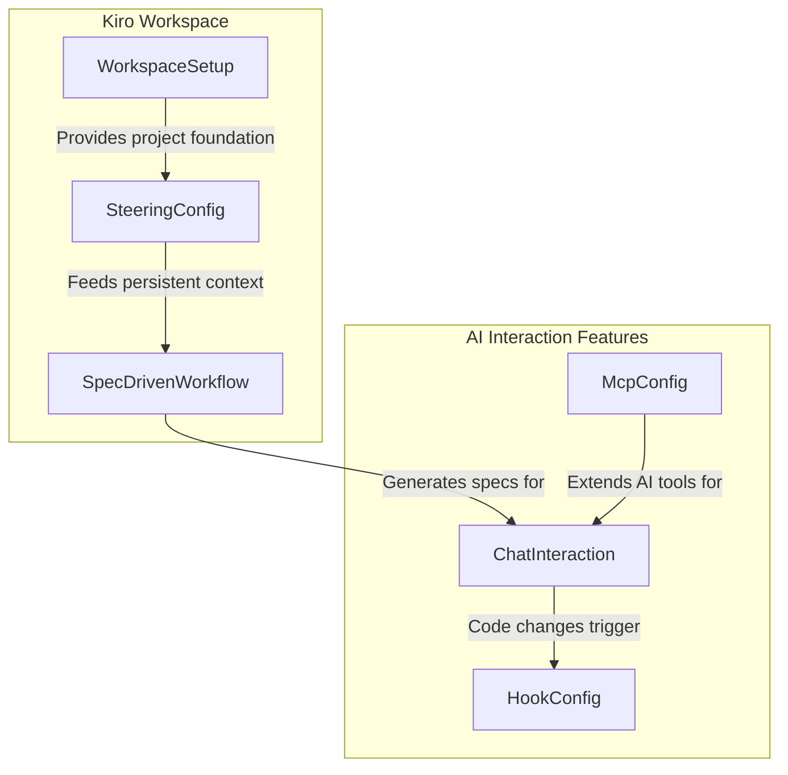

# Design Document: Getting Familiar with Kiro IDE

## Overview

This project guides learners through the core features and capabilities of the Kiro IDE, an AI-powered standalone integrated development environment. Rather than building a traditional application, learners will create a structured sample workspace that exercises each of Kiro's distinguishing features: workspace setup, the steering system, spec-driven development, AI chat modes, agent hooks, and MCP server configuration.

The approach is exploratory and incremental. Learners will create a small demo project (a task tracker) as the vehicle for exercising Kiro's features. Each component represents a set of configuration files, markdown documents, or lightweight scripts that the learner creates to activate and validate a specific Kiro capability. The focus is on understanding the IDE's AI-powered workflow, not on building production software.

### Learning Scope
- **Goal**: Set up a Kiro workspace, configure steering files, use spec-driven development, interact with AI chat in both modes, create agent hooks, and configure an MCP server
- **Out of Scope**: Production application deployment, CI/CD pipelines, monitoring, complex multi-service architectures, advanced MCP server development
- **Prerequisites**: Kiro IDE installed, basic familiarity with VS Code, a project folder for the demo workspace

### Technology Stack
- IDE: Kiro (VS Code-based)
- Language/Runtime: TypeScript/Node.js (demo project vehicle)
- Configuration Formats: Markdown (steering files, specs), JSON (MCP config, hook config)
- Infrastructure: Local development only (no AWS services required for core exercises)

## Architecture

The project is organized around six components, each corresponding to a Kiro feature the learner will configure and validate. The WorkspaceSetup component establishes the project foundation. SteeringConfig creates persistent AI context. SpecDrivenWorkflow generates requirements, design, and tasks. ChatInteraction exercises both AI modes. HookConfig sets up event-driven automation. McpConfig extends AI capabilities with external tools.



## Components and Interfaces

### Component 1: WorkspaceSetup
Module: `workspace/setup.md`
Uses: Kiro IDE, integrated terminal

Handles initial workspace creation, project scaffolding, and verification of core IDE elements including the file explorer, editor pane, terminal panel, chat interface, command palette, and settings access.

```python
INTERFACE WorkspaceSetup:
    FUNCTION create_project_directory(project_name: string) -> DirectoryStructure
    FUNCTION initialize_package_json(project_name: string, description: string) -> ConfigFile
    FUNCTION verify_terminal_access() -> TerminalVerification
    FUNCTION verify_chat_panel_access() -> ChatPanelVerification
    FUNCTION verify_command_palette_access() -> CommandPaletteVerification
    FUNCTION verify_settings_access() -> SettingsVerification
```

### Component 2: SteeringConfig
Module: `workspace/steering_config.md`
Uses: `.kiro/steering/` directory

Creates and manages steering files that provide persistent project context to the AI agent across sessions. Supports separate files for product context, technology choices, and project structure conventions.

```python
INTERFACE SteeringConfig:
    FUNCTION create_steering_directory() -> DirectoryStructure
    FUNCTION create_product_context(product_name: string, description: string, goals: List[string]) -> SteeringFile
    FUNCTION create_tech_context(languages: List[string], frameworks: List[string], conventions: List[string]) -> SteeringFile
    FUNCTION create_structure_context(directory_layout: Dictionary, naming_conventions: Dictionary) -> SteeringFile
    FUNCTION update_steering_file(file_name: string, content: string) -> SteeringFile
    FUNCTION verify_ai_reflects_steering(test_prompt: string) -> VerificationResult
```

### Component 3: SpecDrivenWorkflow
Module: `workspace/spec_driven_workflow.md`
Uses: Kiro spec-driven development feature, `.kiro/specs/` directory

Guides the learner through Kiro's three-phase spec-driven development workflow: generating requirements from a high-level idea, producing a system design, and breaking the design into discrete implementation tasks.

```python
INTERFACE SpecDrivenWorkflow:
    FUNCTION initiate_spec_from_idea(idea_description: string) -> SpecSession
    FUNCTION generate_requirements(spec_session: SpecSession) -> RequirementsDocument
    FUNCTION generate_design(requirements: RequirementsDocument) -> DesignDocument
    FUNCTION generate_tasks(design: DesignDocument) -> List[TaskItem]
    FUNCTION review_spec_artifacts() -> List[SpecArtifact]
    FUNCTION edit_spec_artifact(artifact_path: string, modifications: string) -> SpecArtifact
```

### Component 4: ChatInteraction
Module: `workspace/chat_interaction.md`
Uses: Kiro chat interface panel

Exercises the AI chat interface in both supervised and autopilot modes, demonstrating human-in-the-loop control, autonomous code generation, mode toggling, and iterative prompt refinement.

```python
INTERFACE ChatInteraction:
    FUNCTION send_supervised_prompt(prompt: string) -> ProposedChanges
    FUNCTION approve_proposed_changes(changes: ProposedChanges) -> AppliedResult
    FUNCTION reject_proposed_changes(changes: ProposedChanges) -> RejectionResult
    FUNCTION send_autopilot_prompt(prompt: string) -> AppliedResult
    FUNCTION toggle_mode(target_mode: string) -> ModeConfirmation
    FUNCTION send_followup_prompt(context: string, refinement: string) -> RefinedResult
```

### Component 5: HookConfig
Module: `workspace/hook_config.md`
Uses: `.kiro/hooks/` directory, Kiro agent hooks feature

Creates agent hooks that trigger predefined AI actions in response to IDE events such as file saves and file creations, with custom prompt instructions for each hook.

```python
INTERFACE HookConfig:
    FUNCTION create_on_save_hook(file_pattern: string, prompt_instruction: string) -> HookDefinition
    FUNCTION create_on_create_hook(file_pattern: string, prompt_instruction: string) -> HookDefinition
    FUNCTION trigger_save_hook(file_path: string) -> HookExecutionResult
    FUNCTION trigger_create_hook(file_path: string) -> HookExecutionResult
    FUNCTION verify_hook_feedback(hook_name: string) -> HookFeedback
```

### Component 6: McpConfig
Module: `workspace/mcp_config.md`
Uses: Kiro MCP configuration, `.kiro/settings/` or workspace settings

Configures an MCP server entry within Kiro to extend AI agent capabilities with external tools, and verifies the integration through the chat interface.

```python
INTERFACE McpConfig:
    FUNCTION open_mcp_configuration(scope: string) -> ConfigFile
    FUNCTION add_mcp_server_entry(server_name: string, command: string, args: List[string]) -> McpServerEntry
    FUNCTION reload_workspace() -> ReloadResult
    FUNCTION verify_mcp_tools_available(query_prompt: string) -> ToolAvailabilityResult
```

## Data Models

```python
TYPE DirectoryStructure:
    root_path: string
    directories: List[string]
    files: List[string]

TYPE ConfigFile:
    file_path: string
    content: string
    format: string

TYPE SteeringFile:
    file_path: string
    file_name: string
    category: string              # "product" | "tech" | "structure"
    content: string

TYPE SpecSession:
    session_id: string
    idea_description: string
    status: string                # "initiated" | "requirements" | "design" | "tasks" | "complete"

TYPE RequirementsDocument:
    file_path: string
    requirements: List[string]

TYPE DesignDocument:
    file_path: string
    components: List[string]
    architecture_notes: string

TYPE TaskItem:
    task_id: string
    title: string
    description: string
    status: string                # "pending" | "in_progress" | "complete"

TYPE SpecArtifact:
    artifact_path: string
    artifact_type: string         # "requirements" | "design" | "tasks"
    content: string

TYPE ProposedChanges:
    files_affected: List[string]
    diff_summary: string
    mode: string                  # "supervised"

TYPE AppliedResult:
    files_modified: List[string]
    mode: string                  # "supervised" | "autopilot"
    success: boolean

TYPE RejectionResult:
    reason: string
    files_unchanged: List[string]

TYPE ModeConfirmation:
    previous_mode: string
    current_mode: string          # "autopilot" | "supervised"

TYPE RefinedResult:
    iteration_count: number
    files_modified: List[string]
    improvement_summary: string

TYPE HookDefinition:
    hook_name: string
    event_type: string            # "on_save" | "on_create"
    file_pattern: string
    prompt_instruction: string
    file_path: string

TYPE HookExecutionResult:
    hook_name: string
    triggered_by: string
    actions_performed: List[string]
    success: boolean

TYPE HookFeedback:
    hook_name: string
    status: string                # "success" | "error"
    message: string

TYPE McpServerEntry:
    server_name: string
    command: string
    args: List[string]
    config_path: string

TYPE ToolAvailabilityResult:
    server_name: string
    tools_found: List[string]
    verified: boolean

TYPE TerminalVerification:
    terminal_accessible: boolean
    command_executed: string
    output_received: boolean

TYPE ChatPanelVerification:
    panel_accessible: boolean
    modes_available: List[string]

TYPE CommandPaletteVerification:
    accessible: boolean
    shortcut_used: string

TYPE SettingsVerification:
    accessible: boolean
    shortcut_used: string

TYPE ReloadResult:
    success: boolean
    workspace_reloaded: boolean

TYPE VerificationResult:
    prompt_sent: string
    ai_reflected_context: boolean
    evidence: string
```

## Error Handling

| Error | Description | Learner Action |
|-------|-------------|----------------|
| Steering directory not found | The `.kiro/steering/` directory does not exist in the workspace | Create the directory manually or use Kiro's steering initialization command |
| Steering file not recognized | AI agent does not reflect steering content in responses | Verify file is saved in the correct directory with `.md` extension and restart the session |
| Spec workflow not available | Spec-driven development option is not visible in the IDE | Ensure Kiro is updated to the latest version and the workspace is properly opened |
| Chat mode toggle unresponsive | Switching between autopilot and supervised mode does not take effect | Close and reopen the chat panel, then toggle again |
| Hook not triggering | Agent hook does not fire on the expected file event | Verify the file pattern matches the saved/created file and the hook configuration syntax is correct |
| Hook execution error | Agent hook fires but the AI action fails or produces unexpected results | Check the hook's prompt instruction for clarity and review IDE feedback for diagnostic messages |
| MCP config parse error | MCP configuration file contains invalid JSON syntax | Validate JSON format and ensure all required fields (command, args) are present |
| MCP server not recognized | AI agent does not show tools from the configured MCP server after reload | Verify the MCP server command path is correct, the server is installed, and the workspace was fully reloaded |
| Terminal not accessible | Integrated terminal panel does not open or respond to commands | Use keyboard shortcut (Ctrl+`) or open via the View menu; restart Kiro if needed |
| Command palette not opening | Standard keyboard shortcut does not open the command palette | Try Cmd+Shift+P (Mac) or Ctrl+Shift+P (Windows/Linux); check for keybinding conflicts |
