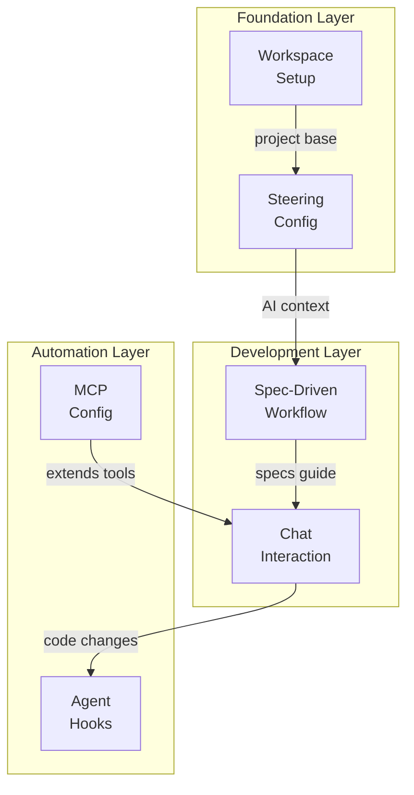
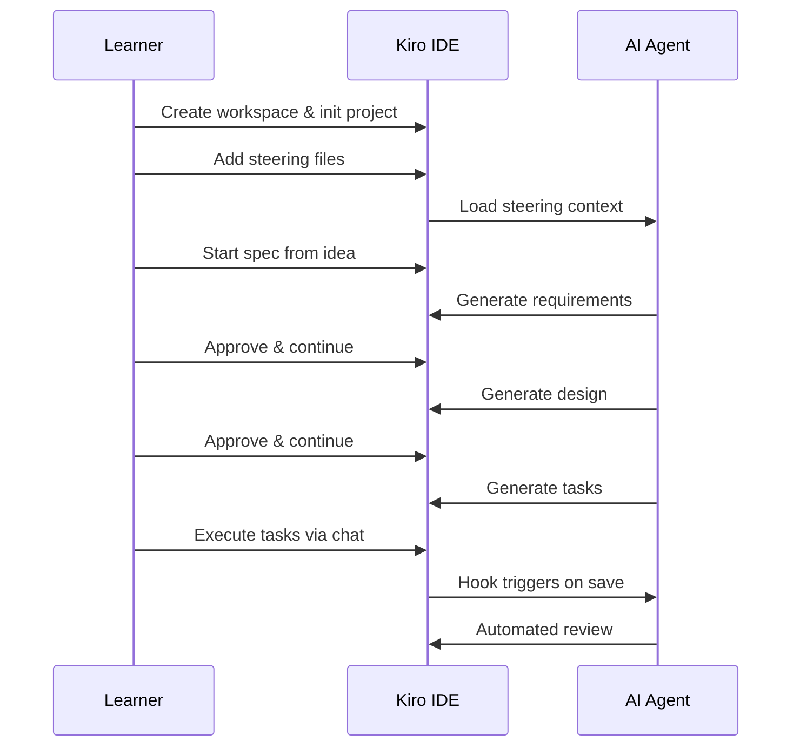

# Getting Familiar with Kiro IDE

- Learn the core features of Kiro, an AI-powered IDE built for spec-driven development
- By the end of this walkthrough, you'll have a fully configured workspace exercising steering, specs, hooks, and MCP

---

# The Problem

- **Before Kiro**: You write code in a regular editor, context-switch to docs, manually track requirements, and hope the AI assistant remembers what your project is about between sessions
- **After Kiro**: Your IDE holds persistent project context (steering), turns rough ideas into structured specs, automates repetitive tasks with hooks, and extends AI capabilities through MCP servers
- Traditional IDEs treat AI as a bolt-on chat window — Kiro makes AI a first-class development partner that understands your project deeply
- The challenge: learning how all these pieces fit together without getting overwhelmed

> **Key Insight:** Kiro isn't just an editor with AI chat — it's a workflow system where steering, specs, hooks, and MCP work together to keep the AI aligned with your project goals.

---

# Key Concept: Steering Files

- **Steering files** are markdown documents that give the AI persistent memory about your project — think of them as a "briefing packet" you hand a new team member on day one
- They live in `.kiro/steering/` and are automatically included in every AI interaction
- You can create separate files for different concerns: product context, tech stack, coding conventions
- Without steering, the AI starts every conversation from scratch; with steering, it already knows your stack, your naming conventions, and your project goals
- Steering files support three inclusion modes: **always** (default), **fileMatch** (conditional on open files), and **manual** (you choose when to include)

> **Key Insight:** Steering is what turns a generic AI assistant into one that feels like it knows your codebase.

---

# Key Concept: Spec-Driven Development

- **Spec-driven development** is Kiro's structured approach to turning a rough idea into working code through three phases: Requirements → Design → Tasks
- Think of it like an architect's process: first you gather what the client wants (requirements), then you draw blueprints (design), then you create a punch list for the builders (tasks)
- Specs live in `.kiro/specs/{feature-name}/` with three files: `requirements.md`, `design.md`, and `tasks.md`
- The AI generates each document iteratively — you review, give feedback, and approve before moving to the next phase
- This prevents the common problem of jumping straight to code and realizing halfway through that you missed a requirement

> **Key Insight:** Specs give you a paper trail from idea to implementation, so you always know *why* code was written, not just *what* it does.

---

# Key Concept: Agent Hooks

- **Agent hooks** are event-driven automations that trigger AI actions when something happens in your IDE — like setting up a trip wire that calls in an expert
- Example: every time you save a TypeScript file, a hook can automatically run the linter and ask the AI to fix any issues
- Hooks are defined as JSON files in `.kiro/hooks/` and respond to events like `fileEdited`, `fileCreated`, `promptSubmit`, and more
- Each hook has a **when** (the trigger event + file patterns) and a **then** (either `askAgent` with a prompt or `runCommand` with a shell command)
- They eliminate the "I forgot to lint" or "I forgot to run tests" problem by making those checks automatic

> **Key Insight:** Hooks turn your IDE into a proactive assistant that acts on events instead of waiting for you to ask.

---

# Architecture Overview



- The workspace is built in layers: **Foundation** (project + steering), **Development** (specs + chat), and **Automation** (hooks + MCP)
- Each layer depends on the one below it — steering feeds context into specs, specs guide chat interactions, and hooks automate the results
- MCP extends the AI's toolbox sideways, giving chat access to external capabilities like documentation servers
- You'll build each layer in order, so every new feature has the context it needs from the previous one

---

# Component Deep Dive: Workspace & Steering

- **WorkspaceSetup** is your starting point — create a project folder, initialize `package.json`, and verify you can access the terminal, chat panel, command palette, and settings
- This isn't just busywork: confirming each UI element ensures your Kiro installation is healthy before you build on top of it
- **SteeringConfig** creates three markdown files in `.kiro/steering/`:
  - `product-context.md` — what the project is, who it's for, what the goals are
  - `tech-context.md` — languages, frameworks, and conventions the AI should follow
  - `structure-context.md` — directory layout and naming rules
- After creating steering files, you verify them by asking the AI a question and checking that its response reflects your project context

> **Key Insight:** If the AI's first response doesn't mention your tech stack or project goals, your steering files aren't being picked up — check the file path and extension.

---

# Component Deep Dive: Specs & Chat

- **SpecDrivenWorkflow** walks you through the full three-phase cycle using a demo feature idea (a task tracker)
- Phase 1 — **Requirements**: describe your idea in plain language, and Kiro generates user stories and acceptance criteria
- Phase 2 — **Design**: Kiro produces an architecture with components, data models, and interfaces based on the approved requirements
- Phase 3 — **Tasks**: the design is broken into discrete, checkable implementation tasks you can execute one by one
- **ChatInteraction** exercises both AI modes:
  - **Supervised mode** — the AI proposes changes and waits for your approval before applying them (human-in-the-loop)
  - **Autopilot mode** — the AI applies changes directly without waiting (faster, but less control)
- You'll practice toggling between modes and using follow-up prompts to iteratively refine AI output

---

# Component Deep Dive: Hooks & MCP

- **HookConfig** creates two hooks to demonstrate event-driven automation:
  - An **on-save hook** that triggers when you save a `.ts` file — e.g., "Review this file for TypeScript best practices"
  - An **on-create hook** that triggers when a new file appears — e.g., "Add standard boilerplate to this file"
- You verify hooks by performing the trigger action and observing the AI's automated response
- **McpConfig** (Model Context Protocol) extends what the AI can do by connecting external tool servers
  - You add a server entry to `.kiro/settings/mcp.json` with a command and arguments
  - After reloading, the AI gains access to that server's tools — like plugging in a new power tool to your workbench
- MCP servers reconnect automatically on config changes, so you don't need to restart Kiro

---

# How It Works: End-to-End Flow



- The flow is linear but iterative — at each spec phase you can give feedback and regenerate before approving
- Steering context is loaded once and persists across all AI interactions in the session
- Hooks fire automatically after the learner starts editing code, creating a feedback loop without manual intervention

---

# Code Snapshot: Steering File

```markdown
<!-- .kiro/steering/product-context.md -->
# Product Context

- Project: Task Tracker Demo
- Goal: Learn Kiro IDE features
- Audience: Solo developer exploring
  AI-powered workflows
```

- Steering files are plain markdown — no special syntax required
- The AI reads these on every interaction, so keep them concise and factual
- Update them as your project evolves; stale steering leads to stale AI suggestions

---

# Code Snapshot: Hook Configuration

```json
{
  "name": "Lint on Save",
  "version": "1.0.0",
  "when": {
    "type": "fileEdited",
    "patterns": ["*.ts"]
  },
  "then": {
    "type": "askAgent",
    "prompt": "Review for best practices"
  }
}
```

- Hook files live in `.kiro/hooks/` as JSON
- The `when.patterns` array accepts glob patterns to filter which files trigger the hook
- The `then.type` can be `askAgent` (send a prompt to the AI) or `runCommand` (execute a shell command)
- Keep hook prompts short and specific — vague prompts produce vague results

---

# Common Pitfalls

| Mistake | What Happens | Fix |
|---------|-------------|-----|
| Steering file outside `.kiro/steering/` | AI ignores your project context entirely | Move the file into the correct directory and use `.md` extension |
| Skipping spec phases | Design doesn't match requirements, tasks are incomplete | Always complete Requirements → Design → Tasks in order |
| Using autopilot mode for unfamiliar code | AI applies changes you don't understand | Start in supervised mode, switch to autopilot only for well-understood tasks |
| Invalid JSON in hook or MCP config | Hook silently fails or MCP server won't connect | Validate JSON syntax before saving — check for trailing commas and missing quotes |

> **Key Insight:** Most "Kiro isn't working" issues come down to file placement or JSON syntax. When in doubt, check the path and validate the format.

---

# Summary

- **Steering files give the AI persistent project context** — set them up first so every interaction is grounded in your project's reality
- **Spec-driven development turns ideas into structured plans** — requirements, design, and tasks create a traceable path from concept to code
- **Hooks and MCP extend the IDE into an automated, tool-rich environment** — hooks react to events, MCP connects external capabilities

**What's Next?** Head to the implementation tasks and work through each component in order — start with workspace setup, layer in steering, build a spec, exercise chat modes, wire up hooks, and connect an MCP server.
