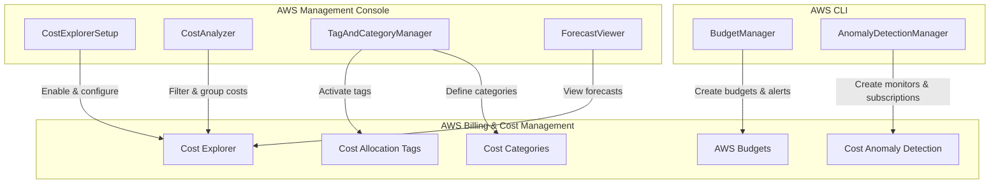

# Design Document: Cloud Cost Management with AWS Cost Explorer

## Overview

This project guides learners through implementing cloud cost management using AWS Cost Explorer and related AWS Billing and Cost Management services. The learner will enable Cost Explorer, analyze spending across multiple dimensions, configure cost allocation tags and categories, generate forecasts, set up budgets with alerts, and configure cost anomaly detection — all through the AWS Management Console and AWS CLI.

The architecture is intentionally console-and-CLI-driven: cost management services are configured and explored through the AWS Billing and Cost Management console, with AWS CLI commands used to automate budget creation, anomaly detection setup, and report generation. No application code or web framework is needed — the learner executes CLI commands and interacts with console dashboards.

### Learning Scope
- **Goal**: Enable Cost Explorer, analyze costs by dimensions, configure cost allocation tags and categories, generate forecasts, set up budgets with alerts, and configure cost anomaly detection
- **Out of Scope**: Cost Explorer API (programmatic SDK), Athena/QuickSight CUR analysis, Cloud Intelligence Dashboards, Savings Plans/Reserved Instance recommendations, IAM fine-grained policies, CI/CD
- **Prerequisites**: AWS account (management account preferred), AWS CLI v2 configured, basic understanding of AWS billing concepts

### Technology Stack
- Tooling: AWS Management Console, AWS CLI v2
- AWS Services: AWS Cost Explorer, AWS Budgets, AWS Cost Anomaly Detection, AWS Cost Categories, AWS Billing and Cost Management
- Infrastructure: Manual provisioning via Console and CLI

## Architecture

The project consists of six components that interact with AWS Billing and Cost Management services. CostExplorerSetup handles enabling and initial configuration. CostAnalyzer covers filtering, grouping, and granularity exploration. TagAndCategoryManager handles cost allocation tags and cost categories. ForecastViewer generates and interprets spending forecasts. BudgetManager creates budgets with alert thresholds. AnomalyDetectionManager configures monitors and alert subscriptions.



## Components and Interfaces

### Component 1: CostExplorerSetup
Module: `components/cost_explorer_setup.md`
Uses: AWS Management Console — Billing and Cost Management

Handles enabling AWS Cost Explorer for the first time, verifying data preparation status, and configuring member account access in Organizations.

```python
INTERFACE CostExplorerSetup:
    FUNCTION enable_cost_explorer() -> None
    FUNCTION verify_data_availability() -> DataStatus
    FUNCTION configure_member_account_access(account_id: string, enabled: boolean) -> None
    FUNCTION view_default_dashboard() -> CostDashboardSummary
```

### Component 2: CostAnalyzer
Module: `components/cost_analyzer.sh`
Uses: AWS Management Console — Cost Explorer, `aws ce get-cost-and-usage`

Handles filtering cost data by dimensions, grouping by service/region/account/tag, applying multiple simultaneous filters, and toggling between daily and monthly granularity.

```python
INTERFACE CostAnalyzer:
    FUNCTION get_cost_by_service(start_date: string, end_date: string, granularity: string) -> CostResult
    FUNCTION get_cost_by_region(start_date: string, end_date: string, granularity: string) -> CostResult
    FUNCTION get_cost_filtered(start_date: string, end_date: string, filters: List[CostFilter], group_by: string, granularity: string) -> CostResult
    FUNCTION get_cost_by_tag(start_date: string, end_date: string, tag_key: string, granularity: string) -> CostResult
```

### Component 3: TagAndCategoryManager
Module: `components/tag_and_category_manager.sh`
Uses: AWS Management Console — Cost Allocation Tags, `aws ce create-cost-category-definition`

Handles activating user-defined cost allocation tags and creating cost category definitions with rule-based mappings for organizing costs by business dimensions.

```python
INTERFACE TagAndCategoryManager:
    FUNCTION activate_cost_allocation_tag(tag_key: string) -> None
    FUNCTION list_cost_allocation_tags() -> List[CostAllocationTag]
    FUNCTION create_cost_category(name: string, rules: List[CostCategoryRule]) -> CostCategory
    FUNCTION list_cost_categories() -> List[CostCategory]
    FUNCTION delete_cost_category(category_arn: string) -> None
```

### Component 4: ForecastViewer
Module: `components/forecast_viewer.sh`
Uses: `aws ce get-cost-forecast`

Handles generating spending forecasts for future time ranges, including confidence intervals, and applying filters to scope forecasts to specific services or tags.

```python
INTERFACE ForecastViewer:
    FUNCTION get_cost_forecast(start_date: string, end_date: string, granularity: string, metric: string) -> ForecastResult
    FUNCTION get_filtered_forecast(start_date: string, end_date: string, filters: List[CostFilter], metric: string) -> ForecastResult
```

### Component 5: BudgetManager
Module: `components/budget_manager.sh`
Uses: `aws budgets create-budget`, `aws budgets describe-budgets`

Handles creating cost budgets with monthly thresholds, configuring alert notifications at percentage thresholds via email or SNS, filtering budgets by service or tag, and viewing budget status.

```python
INTERFACE BudgetManager:
    FUNCTION create_monthly_budget(account_id: string, budget_name: string, amount: number, currency: string) -> None
    FUNCTION add_budget_notification(account_id: string, budget_name: string, threshold_percent: number, email_addresses: List[string]) -> None
    FUNCTION create_filtered_budget(account_id: string, budget_name: string, amount: number, filters: Dictionary) -> None
    FUNCTION describe_budgets(account_id: string) -> List[BudgetStatus]
    FUNCTION delete_budget(account_id: string, budget_name: string) -> None
```

### Component 6: AnomalyDetectionManager
Module: `components/anomaly_detection_manager.sh`
Uses: `aws ce create-anomaly-monitor`, `aws ce create-anomaly-subscription`, `aws ce get-anomalies`

Handles creating cost anomaly detection monitors for AWS services, creating alert subscriptions with notification frequency and delivery channels, and reviewing detected anomalies with root cause details.

```python
INTERFACE AnomalyDetectionManager:
    FUNCTION create_service_monitor(monitor_name: string) -> AnomalyMonitor
    FUNCTION create_alert_subscription(subscription_name: string, monitor_arns: List[string], threshold: number, frequency: string, recipients: List[string]) -> AnomalySubscription
    FUNCTION get_anomalies(start_date: string, end_date: string) -> List[CostAnomaly]
    FUNCTION list_monitors() -> List[AnomalyMonitor]
    FUNCTION delete_monitor(monitor_arn: string) -> None
    FUNCTION delete_subscription(subscription_arn: string) -> None
```

## Data Models

```python
TYPE DataStatus:
    is_available: boolean
    earliest_date: string
    message: string

TYPE CostDashboardSummary:
    time_range: string
    total_cost: number
    currency: string
    top_services: List[Dictionary]

TYPE CostFilter:
    dimension: string          # "SERVICE", "REGION", "LINKED_ACCOUNT", "TAG"
    key: string                # e.g., tag key name when dimension is TAG
    values: List[string]       # e.g., ["Amazon EC2", "Amazon S3"]

TYPE CostResult:
    start_date: string
    end_date: string
    granularity: string        # "DAILY" or "MONTHLY"
    group_by: string
    results: List[Dictionary]  # Each entry: {time_period, groups: [{key, amount, unit}]}

TYPE CostAllocationTag:
    tag_key: string
    type: string               # "UserDefined" or "AWSGenerated"
    status: string             # "Active" or "Inactive"

TYPE CostCategoryRule:
    value: string              # Category value name, e.g., "Production"
    dimension: string          # e.g., "TAG", "SERVICE", "LINKED_ACCOUNT"
    match_key: string          # e.g., tag key name
    match_values: List[string] # e.g., ["prod", "production"]

TYPE CostCategory:
    name: string
    arn: string
    rules: List[CostCategoryRule]
    effective_start: string

TYPE ForecastResult:
    total_forecast: number
    currency: string
    confidence_lower: number
    confidence_upper: number
    time_period: string
    forecast_by_period: List[Dictionary]

TYPE BudgetStatus:
    budget_name: string
    budget_limit: number
    actual_spend: number
    forecasted_spend: number
    percent_consumed: number
    currency: string
    alerts_triggered: List[string]
    filters: Dictionary

TYPE AnomalyMonitor:
    monitor_name: string
    monitor_arn: string
    monitor_type: string       # "DIMENSIONAL" (AWS managed) or "CUSTOM" (customer managed)
    creation_date: string

TYPE AnomalySubscription:
    subscription_name: string
    subscription_arn: string
    monitor_arns: List[string]
    threshold: number
    frequency: string          # "DAILY", "WEEKLY", or "IMMEDIATE"
    recipients: List[string]

TYPE CostAnomaly:
    anomaly_id: string
    start_date: string
    end_date: string
    severity: string           # "HIGH", "MEDIUM", "LOW"
    impact_amount: number
    root_cause_service: string
    root_cause_account: string
    root_cause_region: string
    expected_spend: number
    actual_spend: number
```

## Error Handling

| Error | Description | Learner Action |
|-------|-------------|----------------|
| DataUnavailableException | Cost Explorer data not yet prepared after enabling | Wait 24 hours for initial data preparation to complete |
| BillExpirationException | Requested time range exceeds available billing data | Adjust date range to within the last 13 months |
| LimitExceededException | Maximum number of budgets, monitors, or saved reports reached | Delete unused budgets or monitors before creating new ones |
| DuplicateRecordException | Budget or monitor with the same name already exists | Use a unique name or delete the existing resource first |
| UnresolvableUsageUnitException | Cost forecast cannot be generated for the specified filters | Broaden filters or choose a different metric type |
| InvalidParameterException | Invalid date format, granularity, or filter dimension | Verify date format (YYYY-MM-DD), valid granularity (DAILY/MONTHLY), and supported dimensions |
| AccessDeniedException | IAM user lacks permissions for billing/cost management | Ensure IAM user has ce:*, budgets:*, and billing access enabled in account settings |
| ResourceNotFoundException | Referenced budget, monitor, or subscription does not exist | Verify the resource name or ARN and check it was created successfully |
| TagKeyNotActivated | Cost allocation tag used in filter is not yet active | Activate the tag in Billing console and wait for next data refresh cycle |
