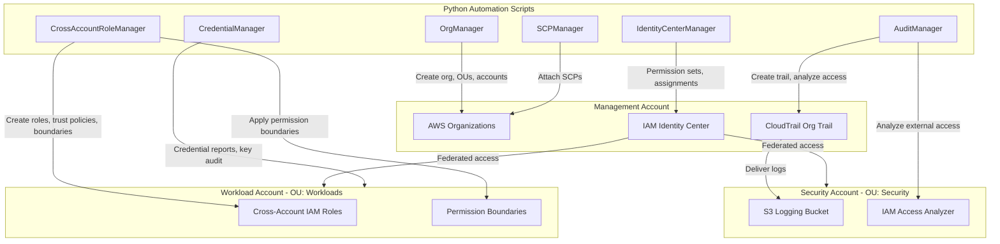

# Design Document: IAM Best Practices for Multi-Account Setup

## Overview

This project guides learners through implementing IAM best practices for a multi-account AWS environment. The learner will set up an AWS Organizations structure with organizational units, apply service control policies as preventive guardrails, configure IAM Identity Center for centralized human access, establish cross-account IAM roles with least-privilege trust policies, implement permission boundaries for delegated administration, enforce MFA for sensitive operations, configure organization-wide CloudTrail logging, and audit credential hygiene across accounts.

The architecture is primarily console and CLI-driven, reflecting the infrastructure/governance nature of IAM and Organizations. A set of Python scripts using boto3 automates the creation and verification of IAM policies, roles, SCPs, and audit reports. The learner works from the management account and interacts with member accounts through cross-account role assumption and IAM Identity Center.

### Learning Scope
- **Goal**: Implement a secure multi-account IAM architecture with Organizations, SCPs, Identity Center, cross-account roles, permission boundaries, MFA enforcement, CloudTrail auditing, and credential hygiene
- **Out of Scope**: AWS Control Tower, SSO with external IdPs (Okta/Azure AD), AWS Config rules, automated remediation, production HA, CI/CD pipelines
- **Prerequisites**: AWS management account with ability to create member accounts, Python 3.12, AWS CLI v2 configured, basic understanding of IAM policies and JSON

### Technology Stack
- Language/Runtime: Python 3.12
- AWS Services: AWS Organizations, IAM, IAM Identity Center, CloudTrail, S3, IAM Access Analyzer
- SDK/Libraries: boto3
- Infrastructure: AWS CLI + boto3 scripts (manual provisioning via console where appropriate)

## Architecture

The management account hosts AWS Organizations, IAM Identity Center, and the organization CloudTrail trail. Member accounts are organized into OUs (Security, Workloads, Sandbox) with SCPs applied at the OU level. A centralized logging S3 bucket resides in the Security account. Cross-account access is achieved through IAM roles with trust policies referencing source account principals. IAM Identity Center provides federated human access with permission sets assigned per account. Python scripts in six modules automate provisioning and verification of all components.



## Components and Interfaces

### Component 1: OrgManager
Module: `components/org_manager.py`
Uses: `boto3.client('organizations')`

Handles AWS Organizations lifecycle — enabling the organization with all features, creating organizational units, creating or inviting member accounts, and moving accounts into OUs.

```python
INTERFACE OrgManager:
    FUNCTION create_organization(feature_set: string) -> Dictionary
    FUNCTION create_organizational_unit(parent_id: string, ou_name: string) -> Dictionary
    FUNCTION list_organizational_units(parent_id: string) -> List[Dictionary]
    FUNCTION create_account(email: string, account_name: string) -> Dictionary
    FUNCTION move_account(account_id: string, source_parent_id: string, dest_ou_id: string) -> None
    FUNCTION list_accounts_for_ou(ou_id: string) -> List[Dictionary]
    FUNCTION get_organization_root_id() -> string
```

### Component 2: SCPManager
Module: `components/scp_manager.py`
Uses: `boto3.client('organizations')`

Manages service control policies — creating SCP documents for region restriction and CloudTrail protection, attaching and detaching SCPs to/from organizational units, and listing effective policies.

```python
INTERFACE SCPManager:
    FUNCTION create_region_restriction_scp(allowed_regions: List[string], policy_name: string) -> Dictionary
    FUNCTION create_cloudtrail_protection_scp(policy_name: string) -> Dictionary
    FUNCTION create_custom_scp(policy_name: string, policy_document: Dictionary) -> Dictionary
    FUNCTION attach_policy_to_target(policy_id: string, target_id: string) -> None
    FUNCTION detach_policy_from_target(policy_id: string, target_id: string) -> None
    FUNCTION list_policies_for_target(target_id: string) -> List[Dictionary]
    FUNCTION enable_policy_type(root_id: string, policy_type: string) -> None
```

### Component 3: IdentityCenterManager
Module: `components/identity_center_manager.py`
Uses: `boto3.client('sso-admin')`, `boto3.client('identitystore')`

Configures IAM Identity Center — creating users and groups in the identity store, defining permission sets with varying privilege levels, assigning permission sets to users/groups for specific accounts, and configuring MFA enforcement settings.

```python
INTERFACE IdentityCenterManager:
    FUNCTION get_identity_center_instance() -> Dictionary
    FUNCTION create_user(identity_store_id: string, user_name: string, display_name: string, email: string) -> string
    FUNCTION create_group(identity_store_id: string, group_name: string) -> string
    FUNCTION add_user_to_group(identity_store_id: string, group_id: string, user_id: string) -> None
    FUNCTION create_permission_set(instance_arn: string, name: string, managed_policies: List[string], session_duration: string) -> Dictionary
    FUNCTION assign_permission_set(instance_arn: string, permission_set_arn: string, target_account_id: string, principal_id: string, principal_type: string) -> None
    FUNCTION remove_permission_set_assignment(instance_arn: string, permission_set_arn: string, target_account_id: string, principal_id: string, principal_type: string) -> None
    FUNCTION configure_mfa_enforcement(instance_arn: string, mfa_mode: string) -> None
```

### Component 4: CrossAccountRoleManager
Module: `components/cross_account_role_manager.py`
Uses: `boto3.client('iam')`, `boto3.client('sts')`

Creates and manages cross-account IAM roles — building trust policies with source account principals, external ID conditions, and MFA requirements; attaching least-privilege inline policies; applying permission boundaries; and assuming roles to verify access.

```python
INTERFACE CrossAccountRoleManager:
    FUNCTION create_cross_account_role(role_name: string, trust_policy: Dictionary, max_session_duration: integer) -> Dictionary
    FUNCTION build_trust_policy(source_account_id: string, source_principal_arn: string, external_id: string, require_mfa: boolean) -> Dictionary
    FUNCTION attach_least_privilege_policy(role_name: string, policy_name: string, policy_document: Dictionary) -> None
    FUNCTION attach_permission_boundary(role_name: string, boundary_policy_arn: string) -> None
    FUNCTION create_permission_boundary_policy(policy_name: string, policy_document: Dictionary) -> string
    FUNCTION assume_role(role_arn: string, session_name: string, external_id: string) -> Dictionary
    FUNCTION create_mfa_enforcement_policy(policy_name: string, protected_actions: List[string]) -> Dictionary
```

### Component 5: AuditManager
Module: `components/audit_manager.py`
Uses: `boto3.client('cloudtrail')`, `boto3.client('s3')`, `boto3.client('accessanalyzer')`

Configures organization-wide CloudTrail logging — creating an organization trail, setting up a centralized S3 bucket with the appropriate bucket policy for cross-account log delivery, enabling IAM Access Analyzer to identify external access findings, and querying trail events for cross-account role assumption activity.

```python
INTERFACE AuditManager:
    FUNCTION create_logging_bucket(bucket_name: string, organization_id: string) -> None
    FUNCTION create_organization_trail(trail_name: string, bucket_name: string) -> Dictionary
    FUNCTION start_logging(trail_name: string) -> None
    FUNCTION create_access_analyzer(analyzer_name: string, analyzer_type: string) -> Dictionary
    FUNCTION list_access_analyzer_findings(analyzer_arn: string) -> List[Dictionary]
    FUNCTION lookup_cross_account_events(trail_name: string, start_time: string, end_time: string) -> List[Dictionary]
```

### Component 6: CredentialManager
Module: `components/credential_manager.py`
Uses: `boto3.client('iam')`

Audits credential hygiene — generating credential reports, identifying stale access keys, deactivating or deleting unused keys, verifying root user MFA status and access key absence, and checking IAM users for MFA enrollment.

```python
INTERFACE CredentialManager:
    FUNCTION generate_credential_report() -> Dictionary
    FUNCTION parse_credential_report() -> List[Dictionary]
    FUNCTION find_stale_access_keys(max_age_days: integer) -> List[Dictionary]
    FUNCTION deactivate_access_key(user_name: string, access_key_id: string) -> None
    FUNCTION delete_access_key(user_name: string, access_key_id: string) -> None
    FUNCTION check_root_user_security() -> Dictionary
    FUNCTION list_users_without_mfa() -> List[string]
```

## Data Models

```python
TYPE OrganizationStructure:
    organization_id: string
    root_id: string
    management_account_id: string
    organizational_units: List[OrgUnit]

TYPE OrgUnit:
    ou_id: string
    ou_name: string
    parent_id: string
    attached_policies: List[string]
    accounts: List[string]

TYPE ServiceControlPolicy:
    policy_id: string
    policy_name: string
    policy_document: Dictionary
    target_ids: List[string]

TYPE PermissionSetConfig:
    permission_set_arn: string
    name: string
    managed_policy_arns: List[string]
    session_duration: string

TYPE CrossAccountRole:
    role_name: string
    role_arn: string
    trust_policy: Dictionary
    permission_policy: Dictionary
    permission_boundary_arn: string
    max_session_duration: integer

TYPE CredentialReportEntry:
    user_name: string
    arn: string
    access_key_1_active: boolean
    access_key_1_last_used: string
    access_key_1_age_days: integer
    access_key_2_active: boolean
    access_key_2_last_used: string
    access_key_2_age_days: integer
    mfa_active: boolean
    password_enabled: boolean

TYPE AccessAnalyzerFinding:
    finding_id: string
    resource_arn: string
    resource_type: string
    principal: Dictionary
    condition: Dictionary
    status: string
```

## Error Handling

| Error | Description | Learner Action |
|-------|-------------|----------------|
| AlreadyInOrganizationException | Account is already part of an organization | Use existing organization or remove account first |
| DuplicateOrganizationalUnitException | OU with the same name already exists under parent | Choose a unique OU name or use the existing OU |
| PolicyTypeNotEnabledException | SCP policy type not enabled for the organization root | Call `enable_policy_type` before creating/attaching SCPs |
| PolicyInUseException | Attempting to delete an SCP still attached to targets | Detach the policy from all targets before deleting |
| MalformedPolicyDocumentException | IAM or SCP policy JSON is invalid | Validate JSON syntax and policy grammar; use IAM Access Analyzer |
| EntityAlreadyExistsException | IAM role or policy name already in use | Use a unique name or delete the existing entity |
| AccessDeniedException | Caller lacks permissions for the operation | Verify the caller's IAM policies and SCP constraints |
| NoSuchEntityException | Referenced IAM role, user, or policy does not exist | Verify resource name and account context |
| ConflictException | Identity Center resource conflict (e.g., duplicate user) | Check for existing user/group with the same name |
| InvalidIdentityTokenException | MFA token invalid or expired during role assumption | Re-authenticate with a fresh MFA code |
| BucketAlreadyExists | S3 bucket name is globally taken | Choose a unique bucket name with account/org prefix |
| InsufficientS3BucketPolicyException | CloudTrail cannot deliver logs to S3 bucket | Update bucket policy to allow CloudTrail service principal |
| CredentialReportNotReadyException | Credential report generation still in progress | Wait and retry `parse_credential_report` after a few seconds |
