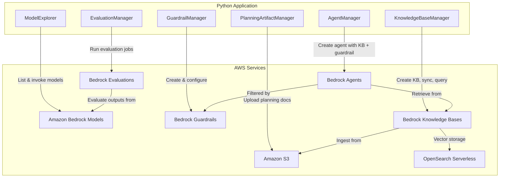

# Design Document: Planning a Generative AI Project

## Overview

This project guides learners through the end-to-end process of planning and implementing a proof-of-concept generative AI application on AWS. The learner follows a structured planning methodology — defining project scope, selecting foundation models, configuring responsible AI guardrails, building a knowledge base for grounded responses, creating a conversational agent, and evaluating output quality. The exercise culminates in a structured implementation roadmap artifact.

The architecture uses Amazon Bedrock as the central service, with S3 for document storage and the Bedrock console/SDK for all AI operations. The learner creates planning documents (scope, governance, roadmap) as structured data, uploads them to S3 as the knowledge base source, then builds a Bedrock-powered agent that can answer questions about the project plan. A Python SDK layer automates the configuration and evaluation steps that complement console-based exploration.

### Learning Scope
- **Goal**: Plan a generative AI project end-to-end — from scoping through model selection, guardrails, knowledge base creation, agent building, and evaluation — producing a comprehensive implementation roadmap
- **Out of Scope**: Model fine-tuning, custom model training, SageMaker pipelines, production deployment, CI/CD, monitoring, multi-account governance
- **Prerequisites**: AWS account with Bedrock access, Python 3.12, basic understanding of generative AI concepts, familiarity with AWS console

### Technology Stack
- Language/Runtime: Python 3.12
- AWS Services: Amazon Bedrock (Models, Guardrails, Knowledge Bases, Agents, Evaluations), Amazon S3, Amazon OpenSearch Serverless (managed by Bedrock)
- SDK/Libraries: boto3 (bedrock, bedrock-runtime, bedrock-agent, bedrock-agent-runtime, s3)
- Infrastructure: AWS Console (model access enablement) + boto3 SDK (programmatic configuration)

## Architecture

The application consists of five components. PlanningArtifactManager generates and uploads structured planning documents to S3. ModelExplorer handles foundation model discovery and comparison. GuardrailManager configures responsible AI guardrails. KnowledgeBaseManager creates and queries knowledge bases backed by the S3 documents. AgentManager builds a conversational agent wired to the knowledge base and guardrails. EvaluationManager runs model evaluation jobs and collects quality scores.



## Components and Interfaces

### Component 1: PlanningArtifactManager
Module: `components/planning_artifact_manager.py`
Uses: `boto3.client('s3')`

Generates structured planning documents (project scope, use case assessment, organizational readiness, implementation roadmap) and manages their storage in S3. These documents serve as both the project deliverable and the data source for the knowledge base.

```python
INTERFACE PlanningArtifactManager:
    FUNCTION create_project_scope(customer_problem: string, target_audience: string, business_outcome: string, use_case_type: string, constraints: List[string], compliance_notes: List[string]) -> ProjectScope
    FUNCTION create_readiness_assessment(data_availability: string, required_skills: List[string], estimated_effort: string, recommendation: string) -> ReadinessAssessment
    FUNCTION create_implementation_roadmap(scope: ProjectScope, model_rationale: string, guardrail_decisions: string, kb_design: string, agent_architecture: string, evaluation_results: Dictionary, risks: List[Risk], milestones: List[Milestone], effort_estimation: EffortEstimation) -> ImplementationRoadmap
    FUNCTION upload_artifact_to_s3(bucket_name: string, key: string, content: string) -> None
    FUNCTION create_s3_bucket(bucket_name: string) -> None
    FUNCTION list_artifacts(bucket_name: string, prefix: string) -> List[string]
```

### Component 2: ModelExplorer
Module: `components/model_explorer.py`
Uses: `boto3.client('bedrock'), boto3.client('bedrock-runtime')`

Discovers available foundation models in Amazon Bedrock, retrieves model details, and invokes models for side-by-side comparison. Supports the learner's model selection rationale by comparing outputs from multiple models against the same prompt.

```python
INTERFACE ModelExplorer:
    FUNCTION list_foundation_models(provider: string, output_modality: string) -> List[ModelSummary]
    FUNCTION get_model_details(model_id: string) -> ModelDetails
    FUNCTION invoke_model(model_id: string, prompt: string, max_tokens: int) -> ModelResponse
    FUNCTION compare_models(model_ids: List[string], prompt: string, max_tokens: int) -> List[ModelResponse]
```

### Component 3: GuardrailManager
Module: `components/guardrail_manager.py`
Uses: `boto3.client('bedrock')`

Creates and configures Amazon Bedrock Guardrails with content filters and denied topics. Tests guardrail behavior by applying it to model invocations and inspecting trace information for policy violations.

```python
INTERFACE GuardrailManager:
    FUNCTION create_guardrail(name: string, description: string, content_filters: List[ContentFilter], denied_topics: List[DeniedTopic], blocked_message: string) -> GuardrailResponse
    FUNCTION get_guardrail(guardrail_id: string) -> GuardrailDetails
    FUNCTION invoke_model_with_guardrail(model_id: string, guardrail_id: string, guardrail_version: string, prompt: string) -> GuardedModelResponse
    FUNCTION delete_guardrail(guardrail_id: string) -> None
```

### Component 4: KnowledgeBaseManager
Module: `components/knowledge_base_manager.py`
Uses: `boto3.client('bedrock-agent'), boto3.client('bedrock-agent-runtime')`

Creates Amazon Bedrock Knowledge Bases backed by S3 data sources, triggers document ingestion and sync, and queries the knowledge base for grounded responses with source attribution.

```python
INTERFACE KnowledgeBaseManager:
    FUNCTION create_knowledge_base(name: string, description: string, embedding_model_arn: string, role_arn: string, storage_config: Dictionary) -> KnowledgeBaseResponse
    FUNCTION add_s3_data_source(knowledge_base_id: string, bucket_arn: string, data_source_name: string) -> DataSourceResponse
    FUNCTION sync_data_source(knowledge_base_id: string, data_source_id: string) -> None
    FUNCTION query_knowledge_base(knowledge_base_id: string, query_text: string, model_arn: string) -> KnowledgeBaseQueryResult
    FUNCTION delete_knowledge_base(knowledge_base_id: string) -> None
```

### Component 5: AgentManager
Module: `components/agent_manager.py`
Uses: `boto3.client('bedrock-agent'), boto3.client('bedrock-agent-runtime')`

Creates and configures Amazon Bedrock Agents with a planning-assistant persona, associates them with knowledge bases and guardrails, prepares agents for testing, and manages conversational sessions.

```python
INTERFACE AgentManager:
    FUNCTION create_agent(name: string, foundation_model_id: string, instruction: string, role_arn: string, guardrail_id: string, guardrail_version: string) -> AgentResponse
    FUNCTION associate_knowledge_base(agent_id: string, knowledge_base_id: string, description: string) -> None
    FUNCTION prepare_agent(agent_id: string) -> None
    FUNCTION create_agent_alias(agent_id: string, alias_name: string) -> AgentAliasResponse
    FUNCTION invoke_agent(agent_id: string, agent_alias_id: string, session_id: string, input_text: string) -> AgentInvokeResponse
    FUNCTION delete_agent(agent_id: string) -> None
```

### Component 6: EvaluationManager
Module: `components/evaluation_manager.py`
Uses: `boto3.client('bedrock'), boto3.client('s3')`

Creates and manages Amazon Bedrock model evaluation jobs. Uploads test datasets, configures evaluation criteria across quality dimensions, retrieves evaluation results, and produces summary reports for the implementation roadmap.

```python
INTERFACE EvaluationManager:
    FUNCTION upload_test_dataset(bucket_name: string, key: string, test_cases: List[TestCase]) -> string
    FUNCTION create_evaluation_job(job_name: string, model_id: string, dataset_s3_uri: string, output_s3_uri: string, evaluation_metrics: List[string], role_arn: string) -> EvaluationJobResponse
    FUNCTION get_evaluation_status(job_name: string) -> string
    FUNCTION get_evaluation_results(output_s3_uri: string) -> EvaluationResults
    FUNCTION generate_quality_report(results: EvaluationResults, quality_thresholds: Dictionary) -> QualityReport
```

## Data Models

```python
TYPE ProjectScope:
    customer_problem: string
    target_audience: string
    business_outcome: string
    use_case_type: string           # "text_generation" | "summarization" | "question_answering" | "conversation"
    constraints: List[string]
    compliance_notes: List[string]

TYPE ReadinessAssessment:
    data_availability: string
    required_skills: List[string]
    estimated_effort: string
    recommendation: string          # "proceed" | "defer" | "investigate"

TYPE Risk:
    description: string
    likelihood: string              # "high" | "medium" | "low"
    impact: string                  # "high" | "medium" | "low"
    mitigation: string

TYPE Milestone:
    name: string
    phase: string                   # "proof_of_concept" | "pilot" | "production_readiness"
    deliverables: List[string]
    target_date: string

TYPE EffortEstimation:
    resource_requirements: List[string]
    skill_gaps: List[string]
    enablement_activities: List[string]
    budget_considerations: Dictionary

TYPE ImplementationRoadmap:
    scope: ProjectScope
    model_rationale: string
    guardrail_decisions: string
    kb_design: string
    agent_architecture: string
    evaluation_results: Dictionary
    risks: List[Risk]
    milestones: List[Milestone]
    effort_estimation: EffortEstimation

TYPE ModelSummary:
    model_id: string
    model_name: string
    provider: string
    input_modalities: List[string]
    output_modalities: List[string]

TYPE ModelDetails:
    model_id: string
    model_name: string
    provider: string
    capabilities: List[string]
    region_availability: List[string]

TYPE ModelResponse:
    model_id: string
    prompt: string
    output_text: string
    latency_ms: number

TYPE ContentFilter:
    type: string                    # "SEXUAL" | "VIOLENCE" | "HATE" | "INSULTS" | "MISCONDUCT" | "PROMPT_ATTACK"
    input_strength: string          # "NONE" | "LOW" | "MEDIUM" | "HIGH"
    output_strength: string         # "NONE" | "LOW" | "MEDIUM" | "HIGH"

TYPE DeniedTopic:
    name: string
    definition: string
    examples: List[string]

TYPE GuardrailResponse:
    guardrail_id: string
    guardrail_arn: string
    version: string

TYPE GuardrailDetails:
    guardrail_id: string
    name: string
    content_filters: List[ContentFilter]
    denied_topics: List[DeniedTopic]
    status: string

TYPE GuardedModelResponse:
    output_text: string
    guardrail_action: string        # "NONE" | "INTERVENED"
    trace: Dictionary

TYPE KnowledgeBaseResponse:
    knowledge_base_id: string
    knowledge_base_arn: string

TYPE DataSourceResponse:
    data_source_id: string

TYPE KnowledgeBaseQueryResult:
    generated_response: string
    citations: List[Citation]

TYPE Citation:
    text: string
    source_uri: string

TYPE AgentResponse:
    agent_id: string
    agent_arn: string

TYPE AgentAliasResponse:
    agent_alias_id: string

TYPE AgentInvokeResponse:
    output_text: string
    session_id: string

TYPE TestCase:
    prompt: string
    reference_response: string

TYPE EvaluationJobResponse:
    job_arn: string
    job_name: string

TYPE EvaluationResults:
    scores: Dictionary              # metric_name -> score
    per_item_results: List[Dictionary]

TYPE QualityReport:
    overall_scores: Dictionary
    gaps: List[string]
    recommended_mitigations: List[string]
```

## Error Handling

| Error | Description | Learner Action |
|-------|-------------|----------------|
| AccessDeniedException | Model access not enabled or IAM permissions insufficient | Enable model access in Bedrock console; verify IAM role policies |
| ResourceNotFoundException | Guardrail, knowledge base, or agent does not exist | Verify resource ID; ensure resource was created successfully |
| ValidationException | Invalid configuration parameters (e.g., bad filter strength, missing required fields) | Review parameter values against Bedrock API documentation |
| ConflictException | Resource name already exists or resource in conflicting state | Use a unique name or wait for resource to reach stable state |
| ThrottlingException | API rate limit exceeded during model invocation or evaluation | Add exponential backoff retry logic; reduce request frequency |
| ServiceQuotaExceededException | Account limit reached for Bedrock resources (e.g., max guardrails, knowledge bases) | Delete unused resources or request quota increase via AWS console |
| S3 NoSuchBucket | Referenced S3 bucket does not exist | Create the bucket using PlanningArtifactManager.create_s3_bucket first |
| KnowledgeBase SyncFailure | Data source sync failed due to document format or permissions | Verify S3 bucket policy grants Bedrock access; check document formats |
| EvaluationJob Failed | Evaluation job failed due to invalid dataset format or model errors | Verify test dataset JSON Lines format; check model availability |
| RegionNotAvailable | Selected foundation model not available in current region | Document as constraint; select alternate model or switch region |
